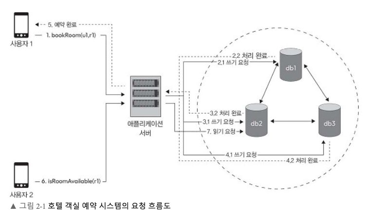
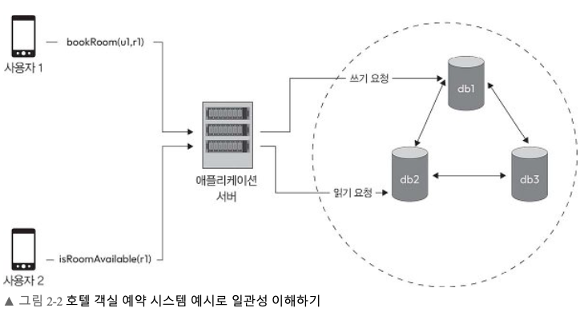
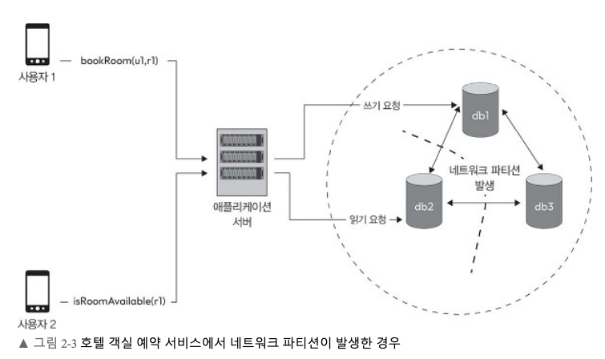

# 2장. 분산 시스템의 속성

분산 시스템은 여러 노드가 네트워크로 통신하며 하나의 서비스를 제공한다. 노드를 늘리면 처리량과 장애 대응 능력을 높일 수 있지만, 복제본 사이의 데이터 차이와 네트워크 지연을 관리해야 한다.

## 2.1 호텔 객실 예약 시스템으로 살펴보는 분산 시스템 예시

 
사용자 `u1`이 객실 `r1`을 예약하는 동안 사용자 `u2`가 같은 객실의 예약 가능 여부를 확인한다고 가정하자. 예약 데이터는 `db1`, `db2`, `db3`에 복제되어 있다.  
`u1`의 쓰기가 `db1`에만 반영된 순간 `u2`가 `db2`를 읽으면, `u2`에게는 이미 예약된 방이 여전히 예약 가능하게 보일 수 있다. 따라서 복제본이 몇 개인지만으로 정확성을 판단할 수 없다.  
**언제 쓰기 성공을 알리고, 어느 복제본에서 어떤 조건으로 읽는지**가 중요하다.

| 방식 | 클라이언트에 응답하는 시점 | 장점과 비용 |
| --- | --- | --- |
| 직렬 동기 쓰기 | 복제본을 순서대로 모두 갱신한 뒤 | 완료 시 여러 복제본에 반영된 상태를 기대할 수 있지만, 느린 복제본이 전체 응답을 지연시킨다. |
| 직렬 비동기 쓰기 | 첫 복제본에 기록한 뒤 | 빨리 응답할 수 있지만 나머지 복제본이 뒤처질 수 있다. |
| 병렬 비동기 쓰기 | 복제본에 동시에 요청하고 필요한 수의 응답을 받은 뒤 | 대기 시간을 줄일 수 있지만 동시에 수행하는 쓰기와 복제 실패를 관리해야 한다. |
| 메시지 큐를 통한 쓰기 | 큐가 요청을 받아들인 뒤 | 쓰기 요청을 흡수하고 후속 처리를 분리할 수 있다. 큐의 수락과 객실 예약의 최종 확정은 다른 상태다. |

메시지 큐 방식을 쓴다면 사용자에게 보여 줄 상태를 구분해야 한다.  
큐에 기록했다는 이유만으로 “예약 완료”라고 응답하면 이후 처리 실패나 재고 경쟁이 발생했을 때 사용자에게 잘못된 약속을 한 셈이 된다.  
예약 요청 접수, 처리 중, 확정 또는 실패를 분리하면 이런 차이를 표현할 수 있다.

예약 확정의 흐름을 시간 순서로 적어 보면 차이가 더 분명해진다.

1. `u1`이 객실 `r1` 예약을 요청한다.
2. 서버는 예약이 가능한지 확인하고 예약 기록을 저장한다.
3. 서버가 `u1`에게 성공을 알릴 시점을 선택한다. 이 시점 전에 저장이 실패하면 다시 시도하거나 실패를 반환할 수 있다.
4. 저장된 변경이 다른 복제본으로 전파된다.
5. `u2`가 `r1`을 조회하거나 예약하려고 한다. 3단계와 4단계 사이의 조회 결과가 일관성 모델의 차이를 드러낸다.

이 흐름에서는 **사용자에게 성공을 알린 시점**과 **모든 복제본이 같은 값을 가진 시점**이 일치하지 않을 수 있다. 설계 문서에는 각 시점의 의미를 분명히 적어야 한다.

### 읽기 요청을 처리하는 방법

`u2`가 객실 `r1`의 예약 가능 여부를 요청하면 애플리케이션 서버는 `db1`, `db2`, `db3` 중 몇 개를 조회할지 결정한다. 원문은 읽기에 참여하는 복제본 수에 따라 세 가지 방법을 제시한다.

| 방법 | `db1`·`db2`·`db3` 예시 | 응답과 고려할 점 |
| --- | --- | --- |
| 하나의 복제본에서 읽기 | `db2` 한 곳에서 `r1`의 상태를 읽는다. | 요청과 응답이 적어 빠르다. 하지만 `u1`의 예약이 `db1`에만 기록되고 아직 `db2`로 복제되지 않았다면 `u2`에게 `r1`이 예약 가능하다고 잘못 보일 수 있다. |
| 일부 복제본에서 읽기 | 세 곳 중 과반수인 두 곳을 조회한다. | 두 복제본의 결과를 비교해 일치 여부를 확인한다. 단일 복제본 조회보다 통신과 대기가 늘지만, 전체 복제본을 기다리는 방식보다 속도와 일관성 요구를 조절하기 쉽다. 결과가 다르면 어느 값을 반환할지 정하는 규칙이 필요하다. |
| 모든 복제본에서 읽기 | `db1`, `db2`, `db3`을 모두 조회한다. | 세 결과를 비교하여 변경이 반영되지 않은 복제본을 확인할 수 있다. 모든 응답을 기다려야 하므로 지연 시간이 길어지고, 응답하지 않는 복제본이 있을 때 어떻게 처리할지도 정해야 한다. |

예를 들어 `db1`에는 `u1`의 예약이 반영되어 **예약 불가**, `db2`와 `db3`에는 아직 반영되지 않아 **예약 가능**으로 저장되어 있다고 하자. `db2`만 읽으면 오래된 상태를 그대로 반환한다. 두 곳 이상을 읽으면 복제본 간 차이를 발견할 수 있지만, 단순히 다수결로 답하거나 모든 값을 읽는 것만으로 최신 상태가 자동으로 결정되지는 않는다. 원문이 말하는 “일관성 확인”과 “최신 값 찾기”를 실제로 구현하려면 변경 순서나 버전을 비교하는 방법도 필요하다.

결국 조회 대상을 늘릴수록 복제 지연을 발견할 기회는 커지지만 읽기 비용도 증가한다. 객실 조회 화면과 예약 확정 작업에서 허용할 수 있는 오래된 정보의 범위가 다르므로, **읽기 방식은 작업의 정확성 요구와 응답 시간에 맞춰 선택**해야 한다.

 

## 2.2 일관성

호텔 예약 데이터가 `db1`, `db2`, `db3`에 복제되어 있다면, `db1`에 기록된 예약이 나머지 복제본에 도착하기 전까지 세 노드의 값은 다를 수 있다. 이때 일관성 모델은 **쓰기 이후 읽기에서 어떤 값을 돌려줄 것인가**를 정한다. 책은 강한 일관성과 최종 일관성을 비교하고, 두 방식 사이에서 읽기·쓰기 대상을 어떻게 조절할 수 있는지 설명한다.

### 2.2.1 강한 일관성

강한 일관성에서는 완료된 쓰기 이후의 읽기가 그 쓰기를 반영한 최신 값을 반환한다. 여러 노드에서 처리하는 업데이트의 순서를 맞추므로, 사용자는 분산된 저장소를 하나의 일관된 저장소처럼 다룰 수 있다. 예를 들어 `u1`의 객실 `r1` 예약이 완료된 다음 `u2`가 예약 가능 여부를 조회한다면, `u2`는 ‘예약 불가’를 받아야 한다. 어느 복제본에 요청이 도착했는지에 따라 ‘예약 가능’과 ‘예약 불가’가 달라져서는 안 된다.

이를 구현하려면 쓰기와 읽기가 따르는 순서를 조율해야 한다. 책은 분산 트랜잭션, 분산 잠금, 팩소스와 래프트 같은 합의 알고리즘을 방법으로 든다. 핵심은 여러 노드가 같은 데이터에 대한 결정을 서로 다르게 내리지 않도록 하는 것이다. 동시에 두 사용자가 마지막 객실 하나를 예약하려 할 때도 어느 요청이 먼저 확정되었는지 정해야 한다.

이 방식은 상태를 예측하기 쉽다는 장점이 있다. 계좌 잔액이나 거래 내역처럼 오래된 값을 근거로 다음 작업을 수행하면 손실이 발생할 수 있는 데이터에 적합하다. 다만 노드 간 확인이나 순서 결정이 끝날 때까지 기다려야 하므로 응답 시간이 길어질 수 있다. 필요한 노드와 통신할 수 없는 동안 일부 요청을 처리하지 못하면 가용성도 낮아진다. **정확한 최신 값에 대한 요구가 얼마나 강한지**에 따라 이 비용을 받아들일지 판단해야 한다.

### 2.2.2 최종 일관성

최종 일관성은 복제본이 일시적으로 서로 다른 값을 가진다는 사실을 허용한다. 한 노드에 변경을 기록한 뒤 다른 노드에 비동기적으로 전파할 수 있으므로, 전파가 끝나기 전의 읽기에서는 오래된 값이 반환될 수 있다. 다만 **새 업데이트가 더 이상 없고 전파와 조정에 충분한 시간이 주어지면** 복제본이 같은 상태로 수렴해야 한다. 따라서 ‘쓰기 직후의 모든 읽기가 최신 값을 반환한다’는 설명은 최종 일관성이 아니라 앞 절의 강한 일관성에 해당한다.

호텔 사례에서는 `u1`의 예약을 `db1`에 먼저 기록하고 나중에 `db2`, `db3`으로 복제할 수 있다. 그 사이 `u2`가 `db2`에 물으면 이미 예약된 `r1`이 아직 ‘예약 가능’으로 보인다. 이는 최종 일관성에서 허용하는 일시적 불일치다. 옮긴이의 소스 재고 예시도 같다. 마지막 소스를 한 사람이 주문했는데 다른 사람의 화면에는 재고가 남아 있을 수 있고, 실제 주문 확정 단계에서 후자의 요청을 취소해야 할 수 있다. 이 예시가 보여 주는 것은 **조회 화면의 정보와 주문 확정 결과를 분리해야 한다**는 점이다.

| 기법 | 하는 일 |
| --- | --- |
| 데이터 복제 | 한 노드의 변경을 다른 복제본으로 전파한다. 비동기 복제에서는 도착 시간이 달라질 수 있다. |
| 가십 프로토콜 | 노드들이 서로 변경 정보를 주고받아 시스템 전체에 서서히 퍼뜨린다. |
| 충돌 해결 | 서로 다른 노드가 같은 데이터를 동시에 갱신했을 때 최종적으로 채택할 값을 정한다. |
| 버전 관리와 조정 | 복제본 사이에 어떤 변경이 누락되었거나 앞서 있는지 식별하고 차이를 맞춘다. |

복제본이 같은 상태에 도달하는 데 걸리는 시간은 네트워크 지연, 업데이트 빈도, 충돌 해결 방식에 따라 달라진다. 최종 일관성은 모든 복제본의 완료를 기다리지 않고 응답하므로 대기 시간을 줄이고, 일부 노드가 고립되어도 요청을 계속 받는 데 유리하다. 작업을 여러 복제본에 나누므로 확장성에도 도움이 된다.  
반대로 애플리케이션은 오래된 읽기, 서로 다른 버전, 동시 쓰기의 충돌을 다뤄야 한다. ‘나중에 같아진다’는 것만으로 사용자에게 즉시 정확한 결과를 약속할 수는 없다.

### 읽기·쓰기 복제본 수로 조절하기

 
전체 복제본 수를 `n`, 읽기에 참여하는 복제본 수를 `r`, 쓰기 완료를 판단할 때 참여하는 복제본 수를 `w`로 둔다. 호텔 사례처럼 `n = 3`이면 다음 조합이 가능하다.

| 설정 | 쓰기·읽기의 경향 | 호텔 예약 예시에서 확인할 점 |
| --- | --- | --- |
| `w = 1, r = 3` | 한 곳의 쓰기만 기다리므로 쓰기는 빠르지만, 읽기는 세 곳을 확인하므로 느리다. | 읽기에서 다른 값을 발견하면 버전을 비교해야 한다. |
| `w = 3, r = 1` | 세 곳에 쓰기를 완료한 뒤 응답하므로 쓰기는 느리지만, 읽기는 한 곳만 확인할 수 있다. | 복제본 하나가 응답하지 않을 때 쓰기를 어떻게 처리할지 정해야 한다. |
| `w = 2, r = 2` | 읽기와 쓰기 모두 두 곳의 응답을 기다린다. | 서로 다른 두 값이 나왔을 때 최신 값을 고르는 규칙이 필요하다. |
| `w = 1, r = 1` | 양쪽 모두 빨리 응답할 수 있다. | 쓰기와 읽기가 서로 다른 복제본을 만나면 이전 상태를 볼 수 있다. |

`r + w > n`은 강한 일관성을 위한 기준이다. 이 조건에서는 읽기 집합과 쓰기 집합이 적어도 하나의 복제본에서 겹친다. 그렇지 않을 때는 최종 일관성이 적용된다.  
예를 들어 `n = 3, w = 2, r = 2`라면 각 집합에 속하는 노드가 최소 한 개 공통이다. 다만 집합의 교차 자체가 곧 최신 값의 자동 선택이나 동시 예약의 방지를 뜻하지는 않는다.  
복제본의 버전과 쓰기 순서, 동시 요청, 장애 상황을 처리하는 규칙도 필요하다. 이 구분을 둔 뒤에 읽기/쓰기 대기 시간을 조절할 수 있다.

일관성의 선택은 기능마다 다를 수 있다. 객실 목록은 잠시 낡은 정보가 보여도 확정 단계에서 다시 검증할 수 있지만, 실제 예약 확정은 동일 객실을 두 번 판매하지 않도록 더 엄격한 판단이 필요하다.  
예약 서비스라도 가용성을 위해 최종 일관성을 택하는 경우가 있을 수 있다. 그때는 사용자에게 언제 ‘예약 요청 접수’이고 언제 ‘예약 확정’인지 분명하게 알려야 한다.

 

## 2.3 가용성

가용성은 장애나 오류가 있어도 사용자의 요청을 계속 처리하고 서비스를 제공하는 능력이다. 예약 서비스에서 데이터베이스가 한 대뿐이면 그 노드의 장애가 곧 읽기와 쓰기의 중단으로 이어진다. 복제본을 여럿 두고 일부 노드만으로도 요청을 처리하도록 하면 한 노드가 고장 나더라도 서비스를 이어 갈 수 있다. 그러나 웹 서버가 응답한다는 사실만으로 예약 기능이 가용하다고 할 수는 없다. 사용자가 필요한 예약 조회나 확정을 수행할 수 있는지가 기준이다.

1. **다중화:** 전원 장치와 네트워크 연결 같은 하드웨어를 중복하거나, 프로세스와 서비스를 여러 개 실행한다. 한 구성 요소가 멈춰도 다른 구성 요소가 이어받을 수 있게 한다.
2. **데이터 복제:** 같은 데이터를 여러 노드에 둔다. 액티브-패시브 방식은 주 노드가 요청을 처리하고 대기 노드가 장애 시 역할을 맡는다. 액티브-액티브 방식은 여러 노드가 동시에 요청을 처리해 동시 변경을 조정하는 문제가 더 중요해진다.
3. **로드 밸런싱:** 사용 가능한 노드로 요청을 분산한다. 특정 서버의 CPU, 메모리, 입출력 자원이 과부하 상태가 되지 않게 하고, 비정상 노드에는 새 요청을 보내지 않는다.
4. **장애 감지와 복구:** 하트비팅, 모니터링, 헬스 체크로 이상 노드를 찾고 재시작하거나 교체한다. 감지가 없으면 복제본이 있어도 오래 고장 난 노드에 요청을 보낼 수 있다.
5. **장애 전환과 복귀:** 문제가 생긴 노드의 작업을 정상 노드로 옮기고, 복구된 노드를 다시 사용한다. 전환 중 진행 중이던 요청과 복제 지연도 고려해야 한다.

이 수단들은 장애의 영향을 줄이지만 복제본과 대기 장비의 자원 비용, 상태 감시와 자동 복구의 운영 복잡성, 동시 쓰기에서의 일관성 문제가 늘어난다.
따라서 **어느 기능을 어떤 장애 중에도 제공할지**를 구체화한 뒤 필요한 다중화 수준을 정해야 한다.

 

## 2.4 파티션 허용성

### 2.4.1 네트워크 파티션

네트워크 파티션은 시스템의 일부 노드가 나머지 노드와 통신하지 못해 서로 고립된 상태다. 네트워크 장비나 하드웨어의 고장, 소프트웨어 오류, 잘못된 설정, 공격 등으로 발생할 수 있다. 노드 자체는 살아 있어도 그룹 사이의 메시지가 전달되지 않을 수 있다는 점이 중요하다.

 
그림에서는 `db2`가 `db1`, `db3`에서 고립된다. 이때 `db1`에 들어온 객실 예약은 `db2`로 전달되지 않는다. `db2`가 요청을 계속 받는다면 이용자는 오래된 예약 가능 상태를 읽을 수 있다.  
고립된 양쪽에서 같은 객실에 대한 쓰기를 각각 받아들이면 연결이 복구된 후 두 결과가 충돌할 수도 있다.  
반대로 최신 상태를 확인하기 전에는 쓰기를 거부하도록 만들면 그쪽 사용자는 일시적으로 예약할 수 없다.

파티션이 몇 초 후 해소되는 경우와 오랫동안 지속되는 경우의 영향은 다르다. 전자에서는 재시도와 복제로 불일치가 짧게 끝날 수 있다. 후자에서는 복제본의 차이가 쌓이고, 어느 그룹이 읽기나 쓰기를 계속할 수 있는지 결정해야 한다. 네트워크 분리는 노드 간 조율을 막기 때문에 일관성, 가용성, 장애 허용성에 동시에 영향을 준다.

### 2.4.2 파티션 허용성

파티션 허용성은 노드 간 통신이 일부 끊겨도 시스템이 정한 방식으로 작동을 계속하는 능력이다. 통신이 가능한 노드끼리는 계속 동작하도록 할 수 있지만, 고립된 노드가 모든 요청에 최신 값으로 응답하지는 못한다.  
네트워크가 분리된 동안 어떤 요청은 계속 처리하고 어떤 요청은 중단할지 정해야 한다.

호텔 사례에서 `db2`가 혼자 고립되었을 때도 `db2`에 예약 쓰기를 허용하면 요청을 계속 받을 수 있지만 중복 예약 위험을 안는다. 강한 일관성을 우선한다면 `db2`가 다른 복제본과 합의할 수 없을 때 해당 쓰기를 거부할 수 있다. 다음 장의 CAP 정리는 바로 이 상황에서 일관성과 가용성의 선택을 설명한다.  
파티션 허용성이 클라우드 서비스와 분산 데이터베이스에서 중요하며, 장애가 시스템 전체 중단으로 번지기보다 기능이나 성능이 점진적으로 낮아지도록 설계할 수 있다.

 

## 2.5 지연 시간

지연 시간은 요청을 보낸 뒤 응답을 받기까지 걸리는 시간이다. 분산 시스템에서는 클라이언트와 서버 사이의 네트워크 이동 시간뿐 아니라, 서버 내부 처리와 다른 노드에 대한 호출까지 응답 시간에 더해진다.  
물리적 거리, 네트워크 혼잡과 홉 수, 각 노드의 처리 시간, 전달할 데이터의 크기와 복잡성이 지연에 영향을 준다.

개선 방법은 다음과 같다.

| 방법 | 지연 시간이 줄어드는 이유 | 적용 시 살펴볼 점 |
| --- | --- | --- |
| 네트워크 최적화 | 빠른 연결을 사용하고 불필요한 중간 경유 지점과 혼잡을 줄인다. | 여러 노드를 거치는 호출 구조 자체도 점검해야 한다. |
| 캐싱 | 자주 쓰는 데이터를 메모리, 데이터베이스 캐시, CDN 등에서 반환한다. | 원본 변경 후 캐시가 언제 갱신되는지 정해야 한다. |
| 데이터 지역화 | 데이터 복제, 에지 컴퓨팅, 콘텐츠 분산으로 사용자 가까이에 데이터를 둔다. | 가까운 복제본의 데이터가 늦게 갱신될 수 있다. |
| 비동기 통신 | 메시지 큐 등을 사용해 오래 걸리는 작업을 요청 응답 경로에서 분리한다. | 빠른 ‘접수’ 응답과 실제 작업 ‘완료’를 구분해야 한다. |
| 성능 최적화 | 코드, 데이터베이스 질의, 자원 사용을 개선해 처리 시간을 줄인다. | 어느 구간이 병목인지 측정한 뒤 최적화한다. |

호텔 예약에서 객실 이미지나 검색 목록은 캐시와 지역 복제본으로 빨리 보여 줄 수 있다. 그러나 마지막 객실의 확정 결과는 오래된 캐시만 보고 결정할 수 없다.  
중요한 것은 지연 시간만 단독으로 낮추는 것이 아니라 일관성/가용성/장애 대응과 함께 목표를 정해야 한다. 여러 복제본의 동의를 기다리면 일관성을 높이는 대신 응답이 느려질 수 있다.

 

## 2.6 내구성

내구성은 성공적으로 저장한 데이터가 이후 장애나 오류가 생겨도 사라지지 않는 성질이다.  
호텔에서 ‘예약 완료’를 알린 뒤 서버가 재시작되더라도 예약 기록을 다시 찾을 수 있어야 한다. 은행 거래, 의료 기록, 온라인 서비스의 사용자 데이터도 같은 이유로 내구성이 중요하다.

여러 노드에 데이터를 복제하고 백업을 보관하는 방법이 좋다. 복제하면 한 노드가 고장 나도 다른 노드에 데이터가 남는다.  
백업은 복제된 데이터까지 잘못 변경되거나 손상된 경우 과거의 안전한 사본에서 복구할 근거가 된다.  
장애 후 데이터를 되살리는 절차까지 있어야 실제 내구성을 기대할 수 있다.

언제 사용자에게 쓰기 성공을 알리는지도 내구성과 관련된다. 한 노드에만 저장한 직후 응답하면 빠르지만, 그 노드가 고장 났고 복제가 아직 이루어지지 않았다면 기록을 잃을 수 있다.  
더 많은 저장 위치의 확인을 기다리면 손실 위험을 낮추는 대신 지연이 늘어난다. 따라서 내구성은 복제본 수만이 아니라 **완료 응답의 기준과 복구 방법**을 포함해 설계해야 한다.

 

## 2.7 신뢰성

신뢰성은 하드웨어, 소프트웨어, 네트워크, 사람의 실수 같은 문제 속에서도 시스템이 의도한 기능을 안정적으로 수행하는 성질이다. 한 번 요청에 응답했다는 사실보다, 반복되는 요청과 장애 상황에서 기대한 결과를 계속 제공할 수 있는지가 중요하다. 예를 들어 객실 조회는 자주 성공하지만 예약 확정 결과가 가끔 사라진다면 예약 서비스는 신뢰하기 어렵다.

신뢰성을 위해 중복 구성, 복제, 로드 밸런싱, 자동 장애 감지와 수정 같은 수단이 있다. 중복 구성은 한 장치에 의존하지 않게 하고, 복제는 데이터와 처리 능력을 여러 노드에 남긴다. 로드 밸런싱은 과부하를 줄이며, 모니터링과 자동 복구는 문제를 빨리 발견하고 정상 서비스로 돌려놓는다. 이들은 서로 보완적이다.  
서버를 복제했더라도 잘못된 데이터를 모든 서버에 똑같이 복제하면 의도한 기능을 정확히 수행하지 못한다.

내구성이 **저장한 데이터가 남는가**에 초점을 둔다면, 신뢰성은 **서비스가 정해진 기능을 올바르고 안정적으로 수행하는가**를 폭넓게 본다.  
데이터 보존, 지속적인 서비스 제공, 예상하지 못한 오류에 대한 대응을 모두 신뢰성의 중요한 조건으로 연결한다.

 

## 2.8 장애 허용성

장애 허용성은 시스템의 일부가 실패해도 전체 서비스가 필요한 기능을 계속 제공하는 능력이다. 장애가 전혀 생기지 않게 하는 능력이 아니라, **장애를 감지하고 다른 구성 요소로 작업을 넘겨 영향 범위를 줄이는 능력**이다. 호텔 예약 서버 여러 대 중 한 대가 중단되어도 남은 서버가 조회 요청을 처리한다면 그 장애를 허용한 셈이다.

다중화와 복제, 하트비트·헬스 체크 같은 장애 감지, 장애 전환, 복구를 통해 장애 허용성을 높일 수 있다.  
대기 노드가 있는 경우에는 주 노드 장애를 감지한 다음 대기 노드를 활성화한다. 여러 노드가 동시에 일하는 경우에는 고장 난 노드를 요청 대상에서 빼고 나머지 노드로 트래픽을 분산한다. 복구된 노드는 데이터 상태를 맞춘 뒤 다시 투입한다.

장애 허용성을 평가할 때는 단순히 서버가 남아 있는지보다 사용자가 어떤 기능을 계속 쓸 수 있는지 확인해야 한다. 한 데이터베이스 복제본이 고립되었을 때 객실 목록 조회는 이어 가더라도, 중복 판매를 막기 위해 예약 확정은 잠시 제한할 수 있다. 이는 장애 중 기능별로 허용 가능한 결과가 다르다는 뜻이다.  
장애 허용성은 앞 절의 신뢰성과 가용성을 실현하는 구체적인 설계 능력으로 볼 수 있다.

 

## 2.9 확장성

확장성은 사용자 수, 요청량, 데이터량이 늘어도 필요한 처리 능력을 확보하는 성질이다. 작은 규모에서 빠른 시스템이라도 요청이 늘어날 때 자원을 늘릴 방법이 없으면 확장성이 낮다. 

### 2.9.1 수직 확장성

수직 확장, 즉 스케일 업은 현재 서버의 CPU, 메모리, 저장 공간 같은 자원을 키우는 방법이다. 예를 들어 예약 데이터베이스가 메모리 부족으로 느려졌다면 더 큰 메모리를 가진 장비로 옮겨 한 노드의 처리 능력을 높일 수 있다. 시스템의 기본 구조를 크게 바꾸지 않아도 되므로 구현과 운영이 비교적 단순하다. 작업량이 작은 동안에는 여러 노드를 관리하는 것보다 비용 측면에서 유리할 수 있다.

한계도 분명하다. 한 장비에 추가할 수 있는 자원에는 상한이 있고, 상위 사양으로 갈수록 비용이 커진다. 서버를 한 대만 두면 그 서버가 단일 장애점이 된다. 따라서 트래픽이 계속 증가하거나 높은 장애 허용성이 필요한 시스템에서는 수직 확장만으로 목표를 달성하기 어렵다.

### 2.9.2 수평 확장성

수평 확장, 즉 스케일 아웃은 서버나 인스턴스를 추가해 작업을 여러 곳에서 병렬로 처리하는 방법이다. 예약 서비스의 애플리케이션 서버를 더 배치하고 로드 밸런서로 요청을 나누면 총 처리량을 늘릴 수 있다. 한 노드가 실패해도 다른 노드가 일을 이어받을 수 있다는 점도 장점이다. 책은 이를 용량·성능 향상과 장애 허용성의 두 측면에서 설명한다.

대신 여러 노드가 서로 협력할 방법을 정해야 한다. 동일한 객실이나 상품의 재고를 각 노드가 동시에 변경한다면 서로 다른 결과가 생길 수 있다. 데이터가 여러 노드에 나뉘거나 복제되면 업데이트 순서, 복제 지연, 충돌 해결이 문제가 된다. 부하 분산, 노드 간 조율, 데이터 일관성 관리가 수평 확장의 주요 과제다. 예를 들어 두 서버가 마지막 객실을 각각 판매하지 않도록 확정 작업을 조정해야 한다.

두 방식 중 하나만 고집할 필요는 없다. 데이터베이스 서버의 사양을 높이면서 애플리케이션 서버의 수를 늘릴 수 있다. 책은 작업 부하의 형태, 비용, 성능 목표, 노드 간 작업 분배 가능성을 보고 방식을 선택하라고 설명한다. 아키텍처를 기능별 모듈로 나누고 느슨하게 연결하면 인증, 파일 저장, 데이터베이스처럼 부하 특성이 다른 부분을 각각 확장하기 쉽다. 한 부분의 변경이나 증설이 전체 시스템에 미치는 영향도 줄일 수 있다.
