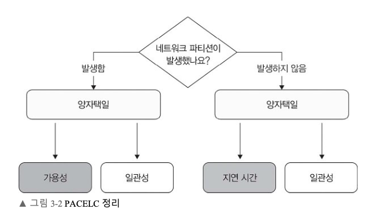
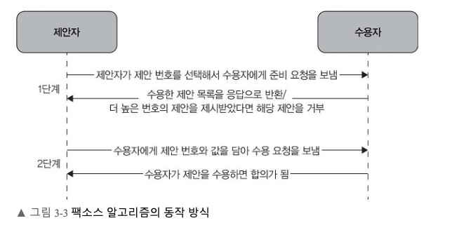
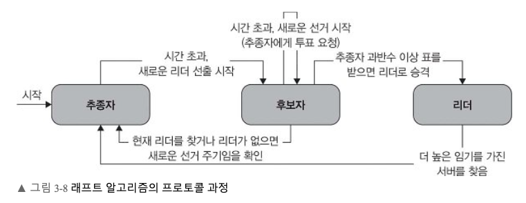
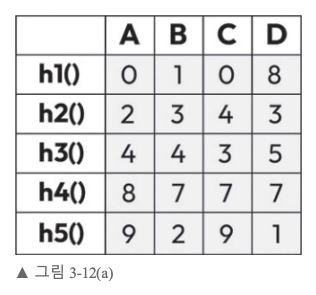
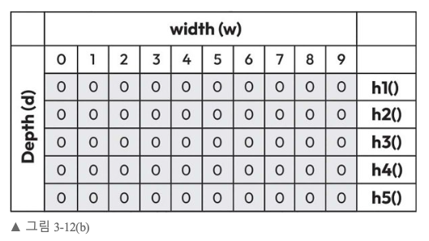

# 3장. 분산 시스템의 이론과 데이터 구조

분산 시스템에는 한 노드의 값만 보면 답을 낼 수 없는 문제가 많다. 복제본이 서로 다른 값을 갖거나, 노드 일부가 응답하지 않거나, 데이터를 여러 서버로 나누어야 하기 때문이다. 이 장의 앞부분은 **무엇을 보장할 수 있는지**를 설명하는 정리와 합의 알고리즘을 다룬다. 뒷부분은 **많은 데이터와 노드를 효율적으로 다루는 방법**으로 일관된 해싱과 확률적 자료구조를 소개한다.

## 3.1 CAP 정리

CAP는 일관성(Consistency), 가용성(Availability), 파티션 허용성(Partition tolerance)의 첫 글자다. 여기에서 중요한 조건은 **네트워크 파티션이 발생했다는 상황**이다. 서로 통신할 수 없는 두 그룹이 동시에 요청을 받는다면, 양쪽이 모두 최신 데이터를 확인할 수는 없다.

일관성은 같은 데이터에 대한 읽기가 이미 확정된 쓰기와 모순되지 않는다는 뜻이다. 가용성은 각 요청을 처리할 수 있는 노드가 응답을 돌려주는 성질이며, 파티션 허용성은 노드 사이의 통신이 끊긴 상황을 시스템이 견디는 성질이다. 네트워크가 정상일 때는 복제본끼리 결과를 조율할 수 있지만, 분리되면 서로의 최근 변경을 확인할 수 없다. 이때 CAP의 선택이 드러난다. 네트워크 분리 자체를 설계만으로 완전히 없앨 수는 없으므로, 파티션이 생겼을 때 각 기능을 어떻게 동작시킬지가 실질적인 결정이다.

호텔 예약 예시에서 `db1`과 `db2`의 연결이 끊긴 동안 `db1`에서 마지막 객실을 예약했다고 하자. `db2`가 모든 요청에 계속 응답하면 객실을 예약 가능하다고 잘못 판단할 수 있다. 반대로 잘못된 결과를 피하려고 `db2`의 예약 요청을 중단하면 해당 사용자에게는 서비스를 제공하지 못한다.

| 파티션 중 우선순위 | 동작 | 감수하는 비용 |
| --- | --- | --- |
| 일관성 우선(CP) | 확실한 최신 상태를 판단할 수 없는 노드의 일부 요청을 거부하거나 대기시킨다. | 단절된 쪽의 사용자는 작업을 완료하지 못할 수 있다. |
| 가용성 우선(AP) | 분리된 노드가 각자 요청을 처리한다. | 서로 다른 상태가 생기며 복구 후 충돌 조정이 필요하다. |

실제 서비스는 읽기와 쓰기, 데이터 종류에 따라 다른 정책을 사용할 수 있다. 객실 소개 화면은 잠시 오래된 값을 허용하더라도 계속 보여 주고, 최종 예약 확정은 중복 판매를 막기 위해 중단할 수 있다. CAP를 “세 가지 중 언제나 둘만 고른다”는 문장으로만 기억하면 이런 작업별 선택을 놓치기 쉽다.

책은 CP 쪽 선택을 금융 거래처럼 최신 상태의 정확성이 중요한 작업에, AP 쪽 선택을 일시적 불일치를 견디면서 응답을 유지해야 하는 작업에 연결한다. AP를 택했다면 분리된 그룹에서 만들어진 변경을 나중에 합치기 위한 규칙이 필요하다. CP를 택했다면 조율할 수 없는 쪽에서 어떤 요청을 거부하고 언제 재개할지 정해야 한다. 어느 쪽이든 장애가 끝난 뒤 복제본을 다시 동기화하는 과정까지 설계 범위에 들어간다.

 

## 3.2 PACELC 정리

CAP가 네트워크가 분리되었을 때의 선택을 설명한다면, PACELC는 평상시의 선택도 다룬다.

 

- **P → A 또는 C:** 파티션이 발생하면 계속 응답할지, 일관된 결과를 위해 일부 요청을 중단할지 결정한다.
- **E → L 또는 C:** 파티션이 없는 그 밖의 상황에서도 낮은 지연 시간과 더 강한 일관성 보장 사이의 비용을 따진다.

예를 들어 지리적으로 떨어진 모든 복제본의 확인을 기다린 뒤 쓰기 성공을 반환하면 최신 상태에 대한 보장을 강화할 수 있다. 하지만 왕복 통신 시간이 사용자 응답에 더해진다. 가까운 복제본의 응답만 기다리면 빠르지만 다른 지역에서 직후에 읽은 값이 다를 수 있다. PACELC는 장애가 없을 때도 복제 방식과 응답 시점을 설계해야 한다는 점을 강조한다.

`P`는 파티션, `A`는 가용성, `C`는 일관성, `E`는 그 밖의 정상 상황, `L`은 지연 시간을 나타낸다. 따라서 이름을 문장처럼 읽으면 “파티션이 있으면 가용성과 일관성 사이를, 그렇지 않으면 지연 시간과 일관성 사이를 선택한다”가 된다.  
여기에서 정상 상황의 `L/C`도 구체적인 구현에 따라 달라진다.원격 복제본의 수신을 기다리는 동기 복제는 변경의 가시성을 조율하지만, 원격 왕복 시간이 응답 경로에 추가된다. 비동기 복제는 응답을 앞당기지만 복제본 간 차이를 잠시 허용한다.

### 3.2.1 팩소스 알고리즘

팩소스는 분산된 노드가 하나의 값에 합의하기 위한 프로토콜이다. 노드가 일시적으로 응답하지 않거나 여러 제안이 경쟁하더라도, 서로 모순된 두 값을 동시에 최종 결정하지 않도록 하는 데 초점을 둔다. 책은 역할, 프로토콜, 운영상 고려 사항을 차례로 설명한다.

 

**합의에 참여하는 역할**

- **제안자(proposer):** 합의할 값과 고유한 제안 번호를 제시하고 다른 참여자에게 전파한다. 점심 메뉴 예시에서는 메뉴를 먼저 제안한 친구, 은행 예시에서는 잔액 변경을 제안한 노드 `A`에 해당한다.
- **수용자(acceptor):** 제안 번호와 이전에 수용한 제안을 기억하며 준비·수용 요청에 응답한다. 한 값이 선택되려면 필요한 수의 수용자가 이를 받아들여야 한다.
- **학습자(learner):** 수용자들이 선택한 결과를 전달받아 후속 작업에 사용한다. 제안·수용·학습은 합의 과정의 역할이지 반드시 서로 다른 종류의 서버를 뜻하지 않는다.

**프로토콜의 단계**

- **준비 단계:** 제안자가 다른 제안과 구별되는 번호로 준비 요청을 보낸다. 수용자는 더 낮은 번호의 제안을 수용하지 않겠다고 약속하고, 이미 수용한 제안이 있으면 그 번호와 값을 알려 준다.
- **수용 단계:** 제안자가 필요한 수의 준비 응답을 모으면 번호와 값을 담아 수용 요청을 보낸다. 이전에 수용된 값이 확인되었다면 그 값을 무시하고 임의의 새 값을 고를 수 없다.
- **합의점 도달:** 정족수의 수용자가 같은 제안을 받아들이면 그 값이 선택된다. 학습자는 선택된 값을 전달받는다. 준비 응답과 최종 수용은 서로 다른 단계이므로, 준비에 응답했다는 사실만으로 값이 확정된 것은 아니다.

정족수들이 서로 겹치므로, 이미 선택된 값에 관한 정보가 이후 제안자에게 전달될 수 있다. 이 교차와 이전 값 확인 규칙이 안전성의 핵심이다. 일부 노드가 응답하지 않아도 정족수를 만들 수 있으면 계속 진행하지만, 경쟁 제안이나 불안정한 통신이 이어지면 재시도 시간이 늘어난다.

**책에서 제시한 운영상 고려 사항**

- **장애 허용성:** 일부 노드의 중단이나 네트워크 분리가 있어도 필요한 수의 수용자가 남아 있으면 합의를 진행할 수 있다.
- **확장성:** 참여 노드가 늘면 준비·수용 단계의 통신과 조율 비용이 증가할 수 있다.
- **복잡성:** 제안 번호, 이전에 수용한 값, 재시도 규칙을 모두 정확하게 구현해야 한다.

책의 은행 예시는 현재 잔액 5,000달러에서 1,000달러를 출금해 4,000달러로 바꾸려는 상황을 사용한다. 이 예시의 전개를 단계별로 정리하면 다음과 같다.

1. **출금 요청과 제안 시작**
   - 고객이 1,000달러 출금을 요청하고 노드 `A`가 제안자가 된다.
   - `A`는 제안 번호 `1001`과 출금 후 잔액 4,000달러를 제시한다.
2. **수용자의 준비 응답**
   - `B`, `C`, `D`가 수용자 역할을 맡아 각자 지금까지 본 높은 제안 번호와 수용 정보를 확인한다.
   - `B`와 `C`는 `1001`에 응답하지만 `D`는 네트워크 오류로 응답하지 못한다고 가정한다.
   - 필요한 수의 응답을 얻었다면 `A`는 `D`가 복구되기를 무조건 기다릴 필요는 없다.
3. **수용 요청**
   - `A`는 번호 `1001`과 값 4,000달러를 담은 수용 요청을 보낸다.
   - 필요한 수의 수용자가 받아들여야 값이 선택된다. 준비 응답과 수용 응답을 구분해야 한다.
4. **결정 전파**
   - `A`는 값이 선택되었음을 학습자에게 알린다.
   - 응답하지 못했던 `D`는 통신이 회복된 뒤 결정된 결과를 전달받아 상태를 맞춘다.

경쟁 상황도 책에 나온다. `A`가 `1001`로 4,000달러를 제안한 뒤 확정하기 전에 `B`가 `1002`로 3,500달러를 제안할 수 있다. 수용자는 높은 번호의 준비 요청을 본 뒤 낮은 번호의 수용 요청을 거절할 수 있으므로 `A`는 재시도해야 할 수 있다. 다만 번호가 높은 제안이 무조건 자기 값을 확정하는 것은 아니다. 이전에 수용한 값에 관한 정보를 확인해 이미 선택된 값을 보존해야 한다.

**팩소스의 변형**

- **멀티 팩소스:** 여러 값을 연속으로 결정할 때 매번 준비 절차를 반복하는 비용을 줄인다.
- **패스트 팩소스:** 빠른 경로에서 메시지 교환을 줄여 결정 지연을 낮추려 한다.
- **심플 팩소스:** 프로토콜의 구조를 단순화하려는 방향으로 책에서 소개한다.

**팩소스 알고리즘을 사용한 사례**

서버 일부가 고장 나더라도 여러 복제본이 같은 변경을 받아들이도록 하는 데 팩소스를 사용할 수 있다고 설명한다. 세 항목에서 각 노드가 **무엇에 합의하는지**를 구분하면 다음과 같다.

- **분산 데이터베이스:** 같은 데이터를 여러 데이터베이스 노드에 복제해 둔다. 각 노드가 성공한 트랜잭션을 서로 다른 순서로 반영하면 저장된 결과가 달라질 수 있다. 팩소스로 **성공적으로 수행된 트랜잭션의 순서**를 정해 복제본의 일관성과 데이터의 내구성을 확보하고, 일부 노드의 장애에도 대응한다.
- **분산 파일 시스템:** 파일의 이름과 위치 같은 메타데이터를 여러 노드가 함께 관리한다. GFS와 HDFS를 예로 들며, 팩소스를 통해 장애 중에도 복제본이 **같은 명령에 합의**하면 파일 시스템의 상태를 일관되게 유지할 수 있다고 설명한다. 예를 들어 파일을 만들고 삭제하는 명령의 순서가 복제본마다 다르면 파일의 존재 여부도 달라질 수 있다.
- **상태 기계 복제:** 데이터베이스나 파일 시스템에 한정된 제품명이 아니라, **같은 초기 상태의 복제본에 같은 작업을 같은 순서로 적용**하는 방식이다. 팩소스로 노드 클러스터가 작업 순서에 합의하면 각 복제본의 상태를 일치시킬 수 있다고 설명한다. 분산 키-값 저장소에서 여러 노드가 같은 변경 명령을 처리하도록 하는 경우가 예다.

앞의 두 항목은 팩소스가 쓰일 수 있는 **시스템의 종류**이고, 상태 기계 복제는 복제본을 일관되게 유지하는 **구현 방식**이다.

### 3.2.2 래프트 알고리즘

래프트는 합의 문제를 리더 선출, 로그 복제, 안전성으로 나누어 설명한다. 정상 상태에서는 리더가 클라이언트의 변경 요청을 받아 로그를 다른 노드로 복제한다. 리더가 사라지면 새 리더를 선출한다는 점이 동작의 중심이다.

**노드의 역할**

- **리더(leader):** 변경 요청을 받아 로그에 추가하고 추종자에게 복제를 지시한다.
- **추종자(follower):** 리더의 로그를 받아 저장하고 리더와의 통신 상태를 관찰한다.
- **후보자(candidate):** 리더가 없다고 판단할 때 선거를 시작하고 다른 노드에 투표를 요청한다.

**프로토콜의 단계**

 
- **리더 선출:** 노드가 리더의 신호를 받지 못하면 후보자가 되어 `RequestVote` 메시지를 보낸다. 과반수의 표를 얻으면 리더가 된다.
- **로그 복제:** 리더가 클라이언트 명령을 자신의 로그에 넣고 추종자에게 전파한다. 필요한 수의 노드에 저장되면 항목을 커밋하고, 커밋 정보를 받은 노드는 정해진 순서대로 상태 기계에 적용한다.
- **안전성과 일관성:** 투표와 로그 비교 규칙으로 새 리더가 이전에 확정된 항목을 잃지 않도록 한다. 리더가 바뀌어도 커밋된 명령의 순서가 뒤집혀서는 안 된다.

세 노드가 있을 때 리더와 추종자 한 대가 예약 변경 로그를 저장하면 과반수를 채울 수 있다. 나머지 추종자 한 대가 응답하지 않더라도 변경을 커밋할 수 있다.  
반면 리더만 살아 있으면 과반수를 얻지 못해 새 변경을 확정할 수 없다. 로그를 저장했다는 사실, 항목이 커밋되었다는 사실, 상태 기계에 적용했다는 사실은 구분해야 한다.

**고려 사항**

- **리더 가용성:** 리더가 중단되면 새 리더를 선출할 때까지 새 쓰기가 지연될 수 있다.
- **확장성:** 복제본이 늘수록 리더가 처리할 로그 전파와 조율 통신이 많아진다.
- **장애 허용성:** 추종자가 리더 장애를 감지해 선거를 시작한다. 다만 안전하게 새 결정을 확정하려면 정족수가 필요하다.

**활용 분야**

- **분산 데이터베이스:** 모든 노드가 커밋된 트랜잭션 순서에 동의하고 장애를 원활하게 처리할 수 있도록 복제본 사이의 커밋 순서와 장애 대응에 합의가 필요하다.
- **분산 파일 시스템:** 장애가 발생해도 모든 레플리카가 파일 시스템 상태에 대해 동일한 상태를 유지해야 한다. 분산 파일 시스템은 래프트 등 합의 알고리즘을 활용하여 장애 허용성, 데이터 일관성, 복제 같은 기능을 수행한다.
- **클러스터 관리와 서비스 디스커버리:** 리더 선출과 서비스 디스커버리 같은 작업을 위해 노드 간 협력과 합의가 필요하다. 이때 래프트 알고리즘을 사용하여 시스템을 일관된 방식으로 관리한다.
- **합의 기반 알고리즘:** 강력한 일관성 보장이 필요한 분산 시스템을 구축하는 데는 여러 지역의 복제본 간 일관성과 장애 허용성을 보장해야 하므로 래프트 알고리즘을 사용한다.
- **클라우드 인프라 관리:** 넷플릭스의 ChAP 같은 클라우드 인프라 관리 플랫폼에서 자원 할당, 장애 허용, 오토스케일링 등을 작업하기 위해 분산된 구성 요소들이 협력하고 합의하는 과정에 사용된다.

 

## 3.3 비잔티움 장군 문제

도시를 에워싼 장군들이 동시에 공격하거나 동시에 철수해야 한다. 서로 다른 결정을 내리면 작전이 실패한다. 장군들은 직접 만날 수 없어 전령으로 지시를 교환하는데, 한 장군이나 전령이 거짓 메시지를 보낼 수 있다. 정상 장군이 받은 내용은 서로 다를 수 있으므로 단순히 한 사람의 응답만 믿을 수 없다.

**조건**

- 장군들은 전령으로만 통신하며, 메시지가 중간에 가로채이거나 전달되지 않을 수 있다.
- 일부 장군은 배신자로서 의도적으로 잘못된 정보를 퍼뜨린다.
- 정상 장군은 누가 배신자인지 미리 구별할 수 없다.
- 배신자들이 서로 공모해 정상 장군의 합의를 방해할 수 있다.

**합의에서 요구하는 성질**

- 정상 참여자들은 배신자가 있어도 동일한 결정을 내려야 한다.
- 전체 장군 수를 N, 배신자 수를 F라고 할 때, 배신자가 있더라도 합의할 수 있어야 힌다. (단, F < (N - 1) / 2)
- 결정을 내리는 데는 메시지를 교환하고 검증하는 시간이 필요하다.

### 3.3.1 비잔티움 장애

비잔티움 장군 문제는 일부 참여자가 거짓 또는 모순된 정보를 보내는 상황에서 정상 참여자들이 같은 결정을 내릴 수 있는지를 묻는다. 서버가 멈춰서 응답하지 않는 장애보다 어렵다. 문제가 있는 서버가 A에게는 “공격”이라고, B에게는 “대기”라고 말하면 각 참여자가 본 정보 자체가 달라지기 때문이다.

이런 행동을 **비잔티움 장애**라고 한다. 악의적인 공격뿐 아니라 버그나 하드웨어 오류가 잘못된 정보를 내보내는 상황도 이 모델로 볼 수 있다. 비잔티움 장애 허용(BFT) 프로토콜은 참여자의 메시지를 검증하고, 여러 참여자의 일치된 응답을 모으며, 일부가 잘못 행동해도 정상 참여자 사이의 결정이 갈라지지 않도록 한다.

### 3.3.2 비잔티움 장애 해결

- **투표 알고리즘:** 여러 참여자가 제안에 투표하고, 정해 둔 수의 동의가 모이면 선택한다.
- **반복 서명 방식:** 참여자가 제안에 서명한 증거를 여러 차례 교환하며 어느 제안에 동의했는지 확인한다.
- **쿼럼 방식:** 결정을 내릴 때 필요한 최소 동의 인원(=쿼럼)의 집합을 정하고, 서로 겹치는 집합의 동의를 활용한다.
- **타임아웃과 확인 절차:** 응답이 없거나 서로 다른 내용을 보낸 참여자를 찾아내기 위해 시간 제한과 메시지 확인을 사용한다.
- **무작위 선택 방식:** 예측하기 어려운 값을 절차에 넣어 악의적인 참여자가 결과를 조작하기 어렵게 하는 방향으로 소개한다.

각 방법은 메시지의 진위와 참여자 간 불일치를 다루는 수단이다. 한 기법만 적용해 합의가 자동으로 성립하지는 않는다. 어떤 증거를 교환하고 몇 개의 일치된 응답을 얻어야 할지까지 프로토콜로 정해야 한다.

얼마나 많은 잘못된 노드를 견딜 수 있는지는 프로토콜과 통신에 대한 가정에 달려 있다. 예를 들어 PBFT 계열의 전형적인 구성에서는 `f`개의 비잔티움 장애를 다루기 위해 `3f + 1`개 이상의 복제본을 둔다. 일반적인 다수결만으로는 모순된 메시지나 통신 지연을 모두 해결할 수 없으므로, 장애 모델을 먼저 정해야 한다. 강한 BFT 보장은 복제본 수와 메시지 교환 비용도 증가시킨다.

### 3.3.3 최신 비잔티움 장애 허용성

초기 비잔티움 장애 허용 방식은 각 노드가 자신의 값을 다른 모든 노드에 보내고 다수결로 최종 값을 정했다. 고장 난 노드가 전체의 3분의 1 미만이어야 하고, 모든 노드가 서로 통신해야 해서 계산과 통신 비용이 크다.

이 방식을 개선한 알고리즘으로 **실용적 비잔티움 장애 허용(Practical Byzantine Fault Tolerance, PBFT)**이 있다. 기존 방식에서 문제가 되었던 통신 비용을 줄이고, 더 큰 네트워크에서 효율적으로 합의하기 위한 메커니즘이라고 설명한다. 핵심 과제는 일부 노드가 거짓 정보나 서로 모순되는 정보를 보내더라도 나머지 노드가 같은 결정을 내리고 시스템을 계속 운영하는 것이다.

비잔티움 장애 허용은 현대 분산 시스템에서 중요한 문제다. 디지털 화폐뿐 아니라 분산 데이터베이스와 대규모 컴퓨팅 클러스터에서도 예측할 수 없거나 악의적으로 행동하는 노드가 있을 수 있으므로, 신뢰성과 장애 복원력을 높이기 위한 알고리즘 연구가 계속 필요하다.

 

## 3.4 FLP 불가능성 정리

FLP 정리는 메시지가 언제 도착할지 제한이 없는 **완전 비동기 시스템**에서 프로세스 하나가 멈출 수 있다면, 결정적 합의 알고리즘이 모든 실행에서 안전한 합의와 종료를 함께 보장할 수 없다는 결과다.  
응답이 없는 노드가 실제로 고장 났는지 단지 메시지가 매우 늦게 도착하는지 다른 노드가 확실히 알 수 없기 때문이다.

**전제**

- **비동기성:** 메시지 전달 시간과 프로세스 실행 속도에 알려진 상한이 없다.
- **프로세스 장애:** 전체 프로세스 수가 n일 때 프로세스가 최대 f개 고장 날 수 있다. (0 < f < n)
- **유한한 단계:** 각 프로세스가 유한한 계산 단계와 제한된 메시지로 동작한다.

예를 들어 서로 다른 제안을 전달하는 두 노드 중 하나의 메시지가 한없이 늦어진다고 하자. 다른 노드가 그 메시지를 계속 기다리면 결정을 못 내릴 수 있다. 기다리지 않고 결정을 내리려면 늦게 도착한 메시지와 충돌하지 않도록 해야 한다. FLP는 모든 가능한 지연과 장애를 포함하면 종료를 무조건 보장할 수 없음을 보여 준다.

이 정리는 실제 시스템이 합의에 도달하지 못한다는 뜻이 아니다. 모든 가능한 지연과 장애 상황에서 **반드시 일정 과정 끝에 결정한다는 보장**을 할 수 없다는 뜻이다.  
실제 프로토콜은 타임아웃, 리더 선출, 네트워크가 결국 안정된다는 가정, 무작위화 등을 사용해 정상적인 상황에서 진행할 수 있도록 만든다.  
시스템의 합의 설명을 읽을 때는 어떤 시간과 장애 가정을 두었는지 확인해야 한다.

아래 방법을 통해 한계를 극복할 수 있다.

- 메시지 지연에 시간 범위를 둬 동기적인 조건을 일부 가정한다.
- 높은 확률로 합의에 도달하는 확률적 알고리즘을 사용한다.
- 무작위 요소나 시간 동기화를 도입한다.
- 리더를 선출하거나 조정자를 둔다.

FLP 불가능성 정리는 특정 조건 아래 분산 시스템에서 가능한 것과 불가능한 것의 한계를 명확히 제시해 주는 이론적 기준이다.  
완전히 비동기적인 분산 시스템에서는 프로세스가 하나라도 고장 나면 합의에 도달할 수 없다. 이 이론은 시스템을 설계할 때 반드시 고려해야 할 필수 요소로, 이런 한계를 넘어서려면 다양한 방법을 모색해야 한
다.

 

## 3.5 일관된 해싱

데이터 키의 해시 값을 서버 수로 나눈 나머지에 따라 저장 서버를 정하면 구현이 단순하다. 그러나 서버 수가 바뀌면 나누는 수 자체가 달라져 많은 키가 다른 서버로 이동한다. 서버를 추가할 때마다 대량의 데이터를 옮겨야 한다면 확장 작업이 비싸고 서비스에도 영향을 준다.

예를 들어 서버 네 대일 때 `hash(key) % 4`로 저장 위치를 정하다 한 대를 추가해 `% 5`로 바꾸면, 원래 추가한 서버와 관계없던 키도 나머지가 달라질 수 있다. 대량의 데이터 재배치는 저장소와 네트워크에 부하를 준다. 일관된 해싱은 서버 수를 계산식의 분모로 쓰지 않고, 해시 공간 안에서 서버와 키의 상대 위치를 사용한다.

일관된 해싱은 키와 서버를 **같은 원형 해시 공간**에 배치한다. 키의 위치에서 정해진 방향으로 이동할 때 처음 만나는 서버가 담당 서버다. 서버가 추가되면 그 서버가 맡는 구간의 키만 주로 이동하고, 제거되면 해당 구간을 이웃 서버가 이어받는다. 노드 변경 시 데이터 이동 범위를 제한할 수 있어 분산 저장소와 CDN 같은 시스템에 적합하다.

원형 공간에서는 가장 큰 해시 값을 지나면 다시 처음으로 돌아온다. 서버가 링 위 네 곳에 있고 키가 두 서버 사이에 놓였다면, 그 키에서 시계 방향으로 처음 만나는 서버에 저장한다. 새로운 서버가 그 사이에 들어오면 새 서버 직전 구간에 있던 키들만 담당자가 바뀐다. 서버가 사라지면 그 서버의 구간을 다음 서버가 맡는다. 다른 구간의 키는 대부분 기존 위치에 남는다.

다만 서버를 링에 하나씩만 놓으면 간격이 고르지 않아 어떤 서버에는 키가 몰릴 수 있다. 서버 하나를 여러 **가상 노드**로 표현해 링 곳곳에 배치하면 부하가 더 고르게 나뉘고, 서버 장애 시에도 작업이 여러 서버로 분산된다. 가상 노드를 쓰더라도 실제 요청량이나 데이터 크기가 키별로 다르면 별도의 부하 관찰이 필요하다.

가상 노드는 실제 서버 한 대를 링의 여러 위치에 대응시키는 방법이다. 서버가 맡는 영역이 여러 조각으로 나뉘면 키 분포의 편차가 줄어든다. 서버 하나가 실패했을 때도 여러 조각을 각기 다른 다음 서버가 받아, 특정 한 서버로 모든 키가 몰리는 현상을 완화한다. 다만 해시가 키의 개수를 고르게 나눠도 키별 요청량이나 데이터 크기가 같다는 뜻은 아니다.

 

## 3.6 블룸 필터

블룸 필터는 **어떤 값이 집합에 이미 들어 있는지 빠르게 검사**할 때 쓰는 자료구조다. 값 자체를 모두 저장하는 대신 작은 비트 배열을 사용하므로 메모리를 적게 쓴다. 대신 답은 두 가지뿐이다. **“없다”는 확정할 수 있지만 “있다”는 확정하지 못하고 “있을 수 있다”까지만 말할 수 있다.** 책은 이 차이를 사용자 이름의 중복 검사로 설명한다.

**비트 배열과 해시 함수의 동작**

처음에는 크기가 `m`인 비트 배열의 모든 값을 `0`으로 둔다. 이름 하나를 추가할 때는 `k`개의 해시 함수에 같은 이름을 넣는다. 각 함수는 배열에서 한 위치를 반환하며, 그 위치의 비트를 `1`로 바꾼다. 이름을 조회할 때도 **추가할 때 사용한 것과 동일한 해시 함수**로 위치를 계산한다.

- 계산한 위치 중 하나라도 `0`이면 그 이름은 **추가된 적이 없다**. 추가했다면 그 위치를 `1`로 바꾸었어야 하기 때문이다.
- 모든 위치가 `1`이면 이름이 **추가되었을 수 있다**. 다른 이름들이 우연히 같은 위치의 비트를 켰을 수도 있으므로 실제 집합에서 다시 확인해야 한다.

**책의 사용자 이름 예시: `john`, `dave`, `peter` 삽입**

책은 구조를 눈으로 확인할 수 있도록 다음처럼 작은 배열을 사용한다.

- **해시 함수 수:** `k = 2`이며, `h1()`과 `h2()`는 각각 0부터 9까지의 배열 위치를 반환한다.
- **비트 배열 크기:** `m = 10`이다. 시작 상태는 `[0, 0, 0, 0, 0, 0, 0, 0, 0, 0]`이다. 배열 위치는 왼쪽부터 0, 1, …, 9로 센다.

각 이름을 넣을 때 배열은 다음 순서로 바뀐다. **비트가 누구 때문에 `1`이 되었는지는 저장하지 않는다.**

- **`john` 삽입:** `h1(john) = 5`, `h2(john) = 8`이다. 5번과 8번을 켜면 `[0, 0, 0, 0, 0, 1, 0, 0, 1, 0]`이 된다.
- **`dave` 삽입:** `h1(dave) = 3`, `h2(dave) = 5`이다. 5번은 이미 `1`이므로 3번만 새로 켜져 `[0, 0, 0, 1, 0, 1, 0, 0, 1, 0]`이 된다. 서로 다른 이름이 같은 비트 위치를 공유하는 첫 사례다.
- **`peter` 삽입:** `h1(peter) = 2`, `h2(peter) = 9`이다. 2번과 9번을 켜면 최종 배열은 `[0, 0, 1, 1, 0, 1, 0, 0, 1, 1]`이 된다.

**책의 조회 예시: `donald`와 `sarah`**

- **`donald`:** 해시 결과가 3번과 7번이다. 최종 배열에서 3번은 `1`이지만 7번은 `0`이다. 따라서 `donald`는 집합에 **없다고 확정**할 수 있다. 3번이 켜져 있다는 사실은 7번의 `0`을 뒤집지 못한다.
- **`sarah`:** 해시 결과가 3번과 8번이고 두 비트는 모두 `1`이다. 그러나 3번은 `dave`, 8번은 `john` 때문에 켜졌을 수 있다. 실제로 이 예시에서 삽입한 이름은 세 개뿐이므로 `sarah`는 등록되지 않았다. 필터가 “있을 수 있다”고 판단한 **거짓 양성(false positive)** 사례다.

이 때문에 사용자 이름 검사에 블룸 필터를 사용한다면 `donald`처럼 “없음”이 나온 이름은 빠르게 다음 단계로 진행할 수 있다. `sarah`처럼 “있을 수 있음”이 나온 이름은 **실제 사용자 이름 저장소를 조회**해야 한다. 블룸 필터의 응답만 보고 가입을 거절하면 사용 가능한 이름을 잘못 거부할 수 있다.

**거짓 양성과 거짓 음성**

거짓 양성은 **실제로 없는 값에 대해 “있을 수 있다”가 나오는 것**이다. 서로 다른 값의 해시 결과가 같은 비트를 공유할 때 생긴다. 반면 이 책에서 설명한 일반적인 블룸 필터는 이미 삽입한 값이 가리키는 비트를 `1`로 유지하므로, **실제로 있는 값을 “없다”고 하는 거짓 음성(false negative)은 발생하지 않는다.** 이 보장은 비트를 임의로 지우지 않고, 조회에도 삽입 때와 동일한 해시 함수를 사용한다는 전제에서 이해해야 한다.

거짓 양성을 줄이려면 비트 배열을 크게 만들어 충돌을 줄일 수 있지만 메모리를 더 쓴다. 해시 함수의 수를 조정하면 판별력을 높일 수 있지만 삽입·조회 때 계산할 해시도 많아진다. 책의 핵심은 **적은 메모리와 빠른 검사**를 얻는 대신, “있을 수 있음”에 따른 추가 확인과 작은 거짓 양성 가능성을 감수한다는 것이다.

**활용 사례**

- **포함 여부 검사:** 웹 크롤러는 URL을 이미 수집했을 가능성이 있는지, 맞춤법 검사기는 단어가 사전에 있을 가능성이 있는지 검사한다. “없음”이면 전체 집합을 조회하지 않아도 된다.
- **캐싱:** 요청한 데이터가 캐시에 없다고 판단되면 불필요한 캐시 조회를 건너뛸 수 있다. “있을 수 있음”이면 실제 캐시를 확인한다.
- **데이터베이스 최적화:** 저장소에 없는 것으로 판단된 키에 대해서는 디스크 읽기를 피할 수 있다. “있을 수 있음”인 키만 실제 저장소에서 확인한다.
- **네트워크 라우팅:** 패킷이나 메시지의 목적지가 될 가능성이 있는 경로를 빠르게 추려 낼 때 사용할 수 있다.
- **중복 제거:** 많은 항목 중 이미 본 적이 있을 가능성이 있는 항목을 먼저 가려낸다. 거짓 양성이 있으므로 정확한 중복 판정이 필요하다면 원본 데이터와 대조해야 한다.

 

## 3.7 카운트-민 스케치

카운트-민 스케치는 대규모 데이터 스트림에서 특정 원소가 몇 번 나타났는지 **근사적으로** 계산한다. 여러 행의 카운터 배열과 행마다 다른 해시 함수를 둔다. 원소가 들어오면 각 행에서 해당 원소의 해시 위치에 있는 카운터를 올린다. 빈도를 물으면 여러 카운터 중 가장 작은 값을 답으로 사용한다.

| (a) | (b) |
|:---:|:---:|
|  |  |

그림은 가로 폭 10인 카운터 배열을 다섯 행으로 둔다. `A`가 들어오면 다섯 해시 함수가 계산한 위치의 카운터가 각각 증가한다. 다음에 `B`, `D`가 들어올 때 어느 행에서는 `A`와 같은 칸을 사용할 수 있다. 카운터는 원소별로 따로 만들어지지 않으므로, 원소 종류가 아주 많아도 표의 메모리 크기는 처음 정한 폭과 행 수로 제한된다.

예를 들어 `A`가 두 번 들어왔다면 `A`에 대응하는 각 행의 카운터는 적어도 두 번 증가한다. 다른 원소가 같은 칸에 해시되면 일부 카운터는 더 커질 수 있다. **최솟값**을 택하는 이유는 충돌 때문에 커진 값을 최대한 피하기 위해서다. 그럼에도 충돌이 모든 행에서 일어나면 실제 빈도보다 크게 추정한다.

배열을 넓히거나 해시 함수의 수를 조정하면 오차를 줄일 수 있지만 메모리와 계산량이 늘어난다. 정확한 원소별 카운터를 모두 저장하기 어려운 네트워크 트래픽, 클릭, 이벤트 스트림의 빈도 추정에 알맞다.

해시 충돌은 다른 원소의 등장 횟수를 같은 카운터에 더하므로, 추가 전용 스트림에서는 추정치가 실제 횟수보다 커질 수 있다. 여러 행 중 최솟값을 쓰는 까닭은 충돌이 적었던 행의 값이 실제 빈도에 가장 가까울 것이라고 기대하기 때문이다. 폭을 넓히면 같은 칸에 모일 가능성을 줄일 수 있고, 행을 늘리면 여러 해시 결과를 비교할 수 있다. 그 대신 메모리와 입력 한 건당 업데이트 작업이 늘어난다.

예를 들어 해시 함수가 다섯 개라면 `A`의 빈도를 물을 때 다섯 행에서 `A`가 가리키는 칸의 값을 읽는다. 값이 `2, 2, 3, 2, 2`라면 세 번째 행은 다른 원소와 충돌했을 수 있으므로 최솟값 `2`를 추정치로 택한다. 모든 행에서 충돌이 일어날 가능성을 없애지는 못하지만, 원소마다 별도 카운터를 두지 않고도 유용한 근삿값을 얻는다.

**활용 사례**

- **빈도 추정:** 글에서 단어가 나온 횟수나 상점의 인기 상품을 근사적으로 파악한다.
- **트래픽 분석:** 특정 프로토콜이나 주소와 관련된 패킷·흐름의 빈도를 추정한다.
- **웹 분석:** 방문, 클릭, 사용자 상호 작용의 빈도를 집계한다.
- **분산 시스템:** 여러 노드에서 발생한 요청의 빈도와 주요 지표를 관찰한다.
- **데이터 스트림 처리:** 모든 항목별 카운터를 메모리에 저장하기 어려운 실시간 스트림에서 근삿값을 유지한다.

 

## 3.8 하이퍼로그로그

하이퍼로그로그(HyperLogLog)는 데이터 중 **서로 다른 원소가 몇 개인지** 추정하는 알고리즘이다. 방문 기록이 수억 건일 때 방문자 ID를 모두 집합에 보관하면 데이터양에 따라 메모리도 계속 증가한다. 하이퍼로그로그는 해시 값을 이용해 고정된 수의 작은 레지스터만 유지하면서 고유 방문자 수를 근사한다.

방문자 `A`가 페이지를 수십 번 열어도 고유 방문자 수에는 한 명으로만 반영되어야 한다. 요청 수를 세거나 카운트-민 스케치로 `A`의 방문 빈도를 추정하는 것과는 다른 질문이다. 정확한 고유 방문자를 계산하려면 이미 등장한 ID 전체를 기억해야 하지만, 하이퍼로그로그는 해시 결과의 통계적 특징만 남긴다.

원소를 해싱해 여러 레지스터에 나누고, 해시 값에 드물게 나타나는 연속된 `0`의 길이를 기록한다. 긴 `0` 패턴이 관찰되었다는 사실은 그만큼 많은 서로 다른 값이 들어왔을 가능성을 나타낸다. 한 번의 극단적인 값에 추정치가 좌우되지 않도록 여러 레지스터의 결과를 결합한다. 책은 이 결합에 조화 평균을 사용하는 이유를 설명한다.

해시 비트의 일부로 레지스터를 고르고 나머지에서 연속된 `0` 패턴의 길이를 측정한다고 생각하면 된다. 긴 패턴은 드물기 때문에 서로 다른 입력을 많이 관찰할수록 만날 가능성이 높아진다. 각 레지스터에는 그동안 관찰한 최대 길이를 기록한다. 드물게 나온 긴 패턴 하나가 전체 결과를 지나치게 끌어올리지 않도록 여러 레지스터의 값을 조합한다. 책은 이 과정에서 조화 평균을 언급한다.

결과는 정확한 정수가 아닌 **오차가 있는 추정치**다. 사용자 수 대시보드나 대규모 로그 분석에는 유용하지만, 정확한 청구·정산처럼 한 건의 차이도 허용할 수 없는 작업에는 원본 데이터나 정확한 집계가 필요하다.

방문자 수나 대규모 로그에서 서로 다른 항목의 수를 빠르게 파악할 때 유용하다. 레지스터 수를 늘리면 일반적으로 추정 오차를 줄이는 대신 메모리를 더 쓴다. 아주 적은 원소나 특이한 해시 패턴에 대한 보정도 실제 구현에서 중요한 주제다. 이 장에서는 정확한 집합 저장보다 훨씬 적은 메모리로 **기수(cardinality)를 근사한다**는 목적을 중심으로 이해하면 된다.

| 기법 | 알고 싶은 값 | 절약하는 비용 | 허용해야 하는 한계 |
| --- | --- | --- | --- |
| 일관된 해싱 | 키를 어느 노드에 둘 것인가? | 노드 변경 시 데이터 이동량 | 불균등한 부하를 별도로 관리해야 한다. |
| 블룸 필터 | 원소가 집합에 있을 가능성이 있는가? | 집합 검사에 필요한 메모리와 저장소 조회 | 거짓 양성이 가능하다. |
| 카운트-민 스케치 | 원소가 몇 번 등장했는가? | 모든 원소별 카운터를 저장하는 메모리 | 충돌로 빈도를 과대 추정할 수 있다. |
| 하이퍼로그로그 | 서로 다른 원소가 몇 개인가? | 모든 고유 원소를 저장하는 메모리 | 결과가 근삿값이다. |