# 5장. 시스템 구성 요소의 설계 및 구현: 데이터베이스와 스토리지

데이터베이스를 설계할 때는 데이터를 어떤 형태로 저장할지와 함께, 데이터가 늘어나거나 서버에 장애가 생겼을 때 어떻게 읽기와 쓰기를 계속할지도 정해야 한다.

## 5.1 데이터베이스

데이터베이스는 데이터를 체계적으로 저장하고 관리하며, 필요한 데이터를 조회하고 수정할 수 있게 하는 시스템이다. 데이터의 양이 많아지거나 여러 사용자가 동시에 접근하면 단순히 파일에 값을 저장하는 것만으로는 충분하지 않다. 데이터베이스는 데이터의 구조, 접근 방법, 변경 규칙과 복구 방법을 함께 제공한다.

데이터베이스가 필요한 이유는 다음과 같다.

- **데이터 구성:** 데이터를 정해진 구조로 정리해 저장한다. 데이터가 어디에 있으며 어떤 의미를 갖는지 파악하고 관리하기 쉬워진다.
- **데이터 검색:** 쿼리와 인덱스를 이용해 필요한 데이터를 찾는다. 모든 데이터를 매번 직접 확인하지 않아도 조건에 맞는 정보를 조회할 수 있다.
- **데이터 무결성:** 제약 조건, 데이터 사이의 관계, 유효성 검사를 통해 잘못된 데이터가 저장되는 것을 막는다. 데이터가 정해진 규칙을 따르도록 관리한다.
- **데이터 보안:** 인증으로 사용자를 확인하고, 권한에 따라 데이터 접근을 제한한다. 암호화를 활용해 데이터를 보호할 수도 있다.
- **데이터 일관성:** 여러 작업이 함께 수행될 때 데이터가 유효한 상태를 유지하도록 한다. 트랜잭션과 ACID 특성이 이를 뒷받침한다.
- **확장성:** 데이터와 요청이 늘어나면 서버의 성능을 높이는 수직적 확장이나 서버 수를 늘리는 수평적 확장을 고려할 수 있다.
- **데이터 중복성과 백업:** 데이터 사본과 백업을 유지해 장비 장애나 데이터 손실에 대비한다. 문제가 발생하면 저장된 사본을 이용해 복구한다.
- **복잡한 쿼리와 분석:** 여러 조건을 결합해 검색하거나 데이터를 집계한다. 단순한 값 조회를 넘어 통계와 분석에 필요한 결과를 얻는다.
- **데이터 관계 관리:** 고객, 주문, 제품, 재고처럼 서로 관련된 데이터를 연결해 관리한다. 개별 데이터뿐 아니라 데이터 사이의 연관성도 조회에 활용한다.
- **이력 데이터 관리:** 시간에 따라 데이터가 어떻게 달라졌는지 추적할 수 있도록 이력을 보관한다. 과거 상태를 확인하거나 변화 과정을 분석하는 데 활용한다.
- **데이터 분석과 보고:** 저장한 데이터를 분석하고 보고서로 만들어 의사 결정을 지원한다.
- **데이터 공유:** 여러 사용자와 애플리케이션이 같은 데이터를 활용할 수 있게 한다. 동시에 접근하는 상황에서도 정해진 규칙에 따라 데이터를 처리한다.

### 5.1.1 데이터베이스 유형

데이터베이스는 크게 **관계형 데이터베이스**와 **비관계형 데이터베이스**로 나눌 수 있다. 관계형 데이터베이스는 행과 열로 구성된 테이블을 사용하고, 비관계형 데이터베이스는 키-값, 문서, 컬럼 패밀리, 그래프 등 여러 데이터 모델을 사용한다.

선택 기준은 저장할 데이터의 구조, 필요한 쿼리, 데이터 사이의 관계, 확장 방식과 성능 요구 사항이다. 데이터베이스의 이름이나 분류만으로 적합성을 결정하기보다 애플리케이션이 데이터를 어떻게 읽고 쓰는지 함께 살펴봐야 한다.

### 5.1.2 관계형 데이터베이스

관계형 데이터베이스는 데이터를 테이블에 저장하고, 키를 통해 테이블 사이의 관계를 표현한다. 각 테이블은 특정 종류의 데이터를 담으며, 행은 개별 레코드, 열은 레코드의 속성을 나타낸다.

관계형 데이터베이스를 이해하는 데 필요한 개념은 다음과 같다.

- **테이블:** 고객, 제품, 주문처럼 관련 데이터를 행과 열로 구성해 저장하는 단위다. 테이블마다 저장할 데이터의 구조를 정의한다.
- **행:** 하나의 개체나 레코드를 나타내며 튜플이라고도 한다. 고객 테이블에서는 한 행이 고객 한 명을 나타내고, 그 행에 이름·주소·전화번호 등의 속성 값이 들어간다.
- **열:** 레코드의 특정 속성을 나타내며 필드라고도 한다. 각 열에는 이름과 데이터 유형이 있어 텍스트, 숫자, 날짜, 바이너리 등 어떤 종류의 값을 저장할지 정할 수 있다.
- **키:** 기본 키는 테이블 안의 각 행을 고유하게 식별한다. 외래 키는 다른 테이블의 행을 참조해 테이블 사이의 관계를 만든다.
- **정규화:** 데이터를 여러 테이블로 나누고 관계를 정리해 불필요한 중복을 줄이는 과정이다. 같은 사실을 여러 곳에서 따로 수정하면서 생기는 불일치를 줄이는 데 도움이 된다.
- **SQL:** 데이터를 조회·추가·수정·삭제하고 데이터베이스 구조를 정의하는 언어다. 조건 검색과 여러 테이블의 조인에도 사용한다.
- **v 특성:** 원자성(Atomicity), 일관성(Consistency), 격리성(Isolation), 지속성(Durability)을 통해 트랜잭션을 처리한다. 여러 작업을 하나의 단위로 묶고, 동시 실행이나 장애가 발생해도 정해진 보장 수준에 맞게 데이터를 관리한다.
- **트랜잭션:** 함께 성공하거나 실패해야 하는 작업의 묶음이다. 모든 작업이 성공하면 커밋하고, 실패하면 롤백해 중간 변경이 남지 않도록 한다.

대표적인 관계형 데이터베이스는 MySQL, PostgreSQL, Oracle Database, SQLite 등이 있다.

관계형 데이터베이스는 데이터의 구조와 관계가 명확하고, 무결성과 트랜잭션 처리가 중요한 환경에 적합하다. 금융 거래, 재고 관리, 고객 관계 관리(CRM) 등이 대표적인 적용 분야다.

### 5.1.3 비관계형 데이터베이스

비관계형 데이터베이스는 관계형 테이블 모델 이외의 방식으로 데이터를 저장한다. NoSQL 데이터베이스라고도 하며, 데이터 구조의 유연성이나 분산 처리가 필요한 환경에서 활용한다.

- **키-값 저장소:** 고유한 키에 값을 연결해 저장한다. 키를 알고 있을 때 해당 값을 빠르게 읽고 쓰는 작업에 적합하지만 복잡한 쿼리에는 제약이 있다. Redis, DynamoDB, Riak 등이 있다.
- **문서형 데이터베이스:** JSON이나 XML과 같은 문서 형태로 데이터를 저장한다. 문서 안에 여러 속성과 중첩 구조를 담을 수 있으며, 문서마다 구조가 달라도 저장할 수 있다. 웹 애플리케이션 등에서 활용하며 MongoDB, CouchDB, RavenDB 등이 있다.
- **컬럼 패밀리 데이터베이스:** 관련 컬럼을 컬럼 패밀리로 묶어 관리한다. 많은 데이터를 여러 서버에 분산하고 높은 읽기·쓰기 처리량을 확보하는 데 활용한다. Cassandra, HBase, ScyllaDB 등이 있다.
- **그래프 데이터베이스:** 개체를 노드로, 개체 사이의 연결을 관계로 저장한다. 관계를 여러 단계 따라가거나 연결 패턴을 찾는 작업에 적합하다. Neo4j, Amazon Neptune, OrientDB 등이 있다.

비관계형 데이터베이스는 콘텐츠 관리 시스템, 실시간 분석, IoT, 소셜 미디어 플랫폼 등에서 활용한다.

### 5.1.4 관계형 데이터베이스와 비관계형 데이터베이스의 장단점

**관계형 데이터베이스의 장점**

- **데이터 중복 최소화:** 정규화와 테이블 관계를 활용하면 같은 데이터를 여러 위치에 반복해서 저장하는 일을 줄일 수 있다. 수정할 위치가 줄어 데이터 관리도 쉬워진다.
- **보안:** 사용자와 역할에 따라 접근 권한을 관리하고 데이터 접근을 통제할 수 있다.
- **ACID 특성:** 트랜잭션을 통해 데이터의 무결성과 신뢰성을 유지할 수 있다. 따라서 여러 변경을 함께 처리해야 하는 업무에 유용하다.

**관계형 데이터베이스의 단점**

- **성능 저하 가능성:** 여러 테이블을 조인하거나 복잡한 쿼리를 실행하면 처리 비용이 커질 수 있다. 데이터가 많아질수록 테이블 구조와 쿼리 설계가 성능에 영향을 준다.
- **메모리와 저장 공간 사용:** 고정된 구조를 관리하는 데 자원이 필요하다. 책은 값이 없는 필드와 `NULL` 처리도 공간 사용을 고려할 요소로 든다.
- **복잡성:** 테이블, 관계, 제약 조건과 쿼리를 함께 설계해야 한다. 데이터 구조가 복잡해지면 설계와 유지 보수 부담도 커질 수 있다.
- **수평적 확장의 어려움:** 여러 서버에 데이터를 나누면서 테이블 사이의 관계와 트랜잭션을 유지하려면 추가 설계가 필요하다.

**비관계형 데이터베이스의 장점**

- **유연한 데이터 모델:** 데이터의 특성에 따라 키-값, 문서, 컬럼 패밀리, 그래프 모델을 선택할 수 있어 구조가 일정하지 않은 데이터도 다루기 쉽다.
- **스키마 변경의 유연성:** 일부 모델에서는 기존 데이터 전체의 구조를 일괄 변경하지 않고 속성을 추가할 수 있어 변화하는 요구 사항을 반영하는 데 도움이 된다.
- **수평적 확장:** 여러 노드에 데이터를 분산하는 구조를 활용해 데이터와 요청의 증가에 대응할 수 있다.

**비관계형 데이터베이스의 단점**

- **표준화 부족:** 제품마다 데이터 모델, API, 쿼리 언어가 달라 제품을 바꿀 때 애플리케이션 수정이 필요할 수 있다.
- **트랜잭션 지원의 차이:** 관계형 데이터베이스와 같은 방식의 ACID 트랜잭션을 기대하기 어려운 제품도 있다.

<br>

## 5.2 키-값 저장소

### 5.2.1 키-값 저장소란

키-값 저장소는 **고유한 키와 그 키에 대응하는 값**을 저장하는 데이터베이스다. 사전이나 해시 테이블처럼 키를 이용해 값을 찾는다. 값은 단순한 문자열일 수도 있고, 여러 속성을 포함한 데이터일 수도 있다.

사용자는 키를 지정해 값을 추가하거나 조회하고, 기존 키에 새로운 값을 저장하면 해당 키의 값을 갱신한다. 이처럼 접근 방법이 단순하므로 키를 알고 있는 요청을 빠르게 처리하는 데 적합하다.

단일 서버의 메모리나 저장 장치만으로 처리할 수 있는 양에는 한계가 있다. 데이터와 요청이 늘어나면 여러 서버에 키를 나누어 저장하는 분산 키-값 저장소를 고려한다.

### 5.2.2 분산

분산 키-값 저장소는 데이터를 여러 서버에 나누어 저장해 하나의 서버가 모든 데이터를 보관하고 모든 요청을 처리하는 부담을 줄인다.

- **확장성:** 서버를 추가해 더 많은 데이터와 요청을 처리해 전체 저장 공간과 처리 능력을 여러 서버에서 확보할 수 있다.
- **성능:** 여러 서버가 요청을 나누어 처리하므로 단일 서버에 집중되는 부하를 줄일 수 있다.
- **유연한 데이터 저장:** 값의 형태를 유연하게 정할 수 있어 다양한 구조의 데이터를 저장할 수 있다.
- **장애 허용성:** 데이터를 분산하고 복제본을 유지하면 일부 서버에 장애가 발생해도 다른 서버를 활용할 수 있다.

**데이터 형태의 구분**

- **정형 데이터:** 행과 열의 구조가 정해져 있다. `이름`, `나이`, `직업`이라는 같은 열에 Alice는 `24`, `Engineer`, Bob은 `27`, `Doctor`를 저장하는 데이터프레임이 있다.
- **반정형 데이터:** 고정된 테이블 형태는 아니지만 키와 계층 등 내부 구조가 있다. 같은 사람 정보를 JSON 객체의 `이름`, `나이`, `직업` 속성으로 표현한다.
- **비정형 데이터:** 일정한 필드 구조로 정리되지 않은 데이터다. `Alice는 공학자입니다.`라는 문장이나 `사진 경로: /images/bob_profile.jpg` 같은 문자열이 있 다.

### 5.2.3 키-값 저장소 설계

먼저 저장소가 제공할 기능과 그 기능이 충족해야 할 품질을 나눈다.

**기능 요구 사항**

- **`Put(key, value)`:** 키와 값을 저장한다. 키가 이미 있으면 기존 값을 새로운 값으로 덮어쓴다.
- **`Get(key)`:** 지정한 키에 해당하는 값을 반환한다. 키가 없으면 오류를 반환한다.
- **`Delete(key)`:** 지정한 키와 값을 삭제한다. 삭제할 키가 없으면 오류를 반환한다.

**비기능 요구 사항**

- **확장성:** 데이터와 요청이 늘어날 때 노드를 추가해 처리할 수 있어야 한다. 노드 증설이 전체 시스템의 큰 중단이나 과도한 데이터 이동으로 이어지지 않도록 설계한다.
- **낮은 지연 시간:** 읽기와 쓰기 요청에 빠르게 응답해야 한다. 요청 전달 경로와 응답을 기다릴 복제본 수가 지연 시간에 영향을 줄 수 있다.
- **내구성:** 저장한 데이터는 장애가 발생해도 유지되어야 한다.
- **일관성:** 특정 키의 가장 최근 쓰기가 모든 읽기에 반영되는 경우 동시에 여러 쓰기가 발생하면 충돌을 판별하고 조정한다.
- **가용성:** 일부 노드가 응답하지 않아도 가능한 범위에서 요청을 계속 처리해야 한다.
- **분할 허용성:** 통신할 수 없는 복제본이 있을 때 어떤 요청을 허용할지 정한다.

이 요구 사항은 각각 독립적으로 최대화할 수 있는 조건이 아니다. 예를 들어 더 많은 복제본의 응답을 기다리면 데이터 상태를 더 많이 확인할 수 있지만, 느린 복제본이나 통신 장애 때문에 응답이 지연될 수 있다.

<br>

## 5.3 확장성과 데이터 복제의 최적화

### 5.3.1 확장성 강화

여러 서버에 데이터를 저장하려면 요청의 키를 어느 서버로 보낼지 결정해야 한다. 단순한 방법은 키의 해시 값을 서버 수로 나눈 나머지를 이용하는 것이다.

```text
x = hash(key) % m

m: 노드 수
x: 요청을 처리할 노드의 위치
```

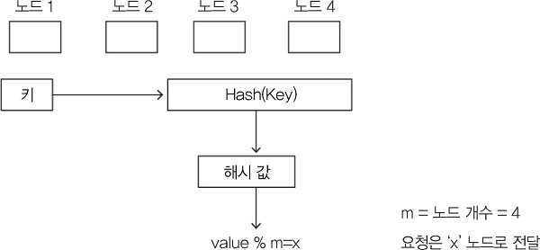

예를 들어 노드가 4개이고 키의 해시 값이 10이면 `10 % 4 = 2`다. 요청은 이 계산 결과에 해당하는 노드로 전달된다. 모든 참여자가 같은 해시 함수와 노드 목록을 사용하면 같은 키를 같은 위치로 보낼 수 있다.

문제는 노드 수가 바뀔 때다. 노드 하나가 제거되어 `m = 3`이 되면 같은 키도 `10 % 3 = 1`로 계산된다. 값이 원래 저장된 위치와 새로운 계산 결과가 달라진다. 이 변화는 제거된 노드의 키에만 한정되지 않으므로 많은 데이터를 다시 배치해야 할 수 있다. 데이터를 이동하는 비용이 발생하고 캐시도 영향을 받는다.

### 5.3.2 일관된 해싱 사용

일관된 해싱은 노드가 추가되거나 제거될 때 다시 배치해야 할 키의 범위를 줄이는 방법이다. 해시 값의 공간을 원형으로 연결한 **해시 링**으로 생각한다. 그림에서는 해시 공간을 `0`부터 `n-1`까지로 표현한다.

노드의 식별자를 해시해 링 위에 배치하고, 데이터의 키도 같은 해시 공간에 배치한다. 키의 위치에서 시계 방향으로 이동했을 때 처음 만나는 노드가 해당 키를 담당한다.

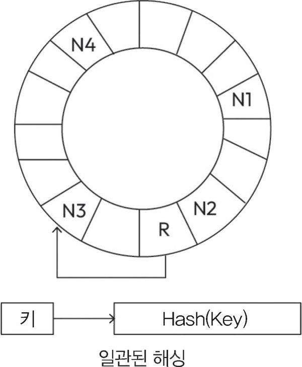

그림에서 요청의 키는 `R` 위치로 해시된다. 그 위치에서 시계 방향으로 이동하면 `N3`를 만나므로 `N3`가 요청을 처리한다.

새 노드를 링에 추가하면 그 노드가 맡게 될 구간의 키를 기존 담당 노드에서 옮긴다. 기존 노드를 제거하면 그 노드의 구간을 다음 노드가 넘겨받는다. 나머지 구간의 담당 노드는 그대로 유지할 수 있다. 노드 수가 바뀔 때 전체 키의 나머지를 다시 계산하는 방식보다 데이터 이동 범위가 작다.

다만 물리적 노드를 링에 하나씩만 배치하면 노드 사이의 간격이 일정하지 않을 수 있다. 어떤 노드는 넓은 구간을 맡고 다른 노드는 좁은 구간을 맡아 데이터와 부하가 불균형해질 수 있다. 이를 완화하는 방법이 가상 노드다.

### 5.3.3 가상 노드 사용

**가상 노드**는 하나의 물리적 노드를 해시 링의 여러 위치에 배치하는 방식이다. 한 서버가 하나의 연속된 구간만 담당하지 않고 링에 흩어진 여러 구간을 담당한다.

서로 다른 해시 함수를 이용해 한 노드를 세 위치에 배치할 때 데이터의 키는 하나의 해시 함수로 위치를 구한 뒤, 시계 방향에서 처음 만나는 가상 노드에 배정한다. 실제 데이터는 그 가상 노드를 소유한 물리적 서버가 저장한다.

가상 노드의 장점은 다음과 같다.

- **부하의 분산:** 물리적 노드 하나가 사용할 수 없게 되면 그 노드가 맡던 여러 구간을 다른 노드들이 나누어 받아 이웃 노드에만 부담이 집중되는 상황을 줄인다.
- **서로 다른 서버 성능의 반영:** 저장 공간이나 처리 능력이 큰 서버에 더 많은 가상 노드를 할당해 모든 물리적 서버의 성능이 같지 않아도 노드별 용량을 반영해 데이터와 부하를 배분할 수 있다.

### 5.3.4 데이터 복제 전략

키를 여러 노드에 나누는 것만으로는 데이터의 내구성을 확보할 수 없다. 한 노드가 가진 데이터가 그곳에만 있다면 그 노드의 장애가 데이터 손실로 이어질 수 있다. 따라서 같은 데이터를 여러 노드에 복제한다.

**주종 모델**

주 저장소가 쓰기 요청을 처리하고, 변경 사항을 종 저장소에 전달한다. 종 저장소는 복제된 데이터를 이용해 읽기 요청을 처리할 수 있다. 쓰기의 진입점을 주 저장소로 모으면 변경 순서를 관리하기 쉽고, 읽기 요청은 여러 복제본으로 분산할 수 있다.

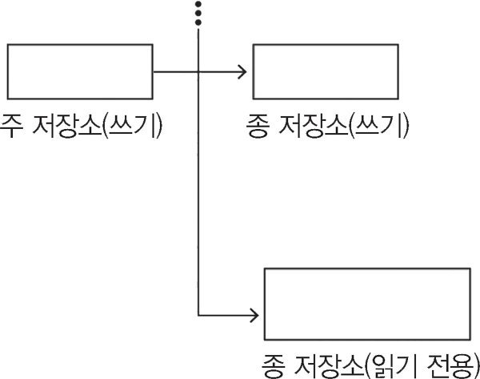

비동기로 복제하면 주 저장소에 반영한 변경이 종 저장소에는 아직 없을 수 있다. 이때 종 저장소에서 읽은 값은 최신 값보다 오래된 값일 수 있다. 주 저장소에 장애가 발생하면 쓰기를 맡을 새 주 저장소가 준비될 때까지 쓰기 처리도 영향을 받는다.

**동등 모델**

동등 모델에서는 노드들이 읽기와 쓰기를 처리할 수 있다. 쓰기를 받은 노드는 다른 복제본에 변경을 전달한다. 특정 주 노드에만 쓰기 역할을 맡기지 않으므로 노드 장애와 요청 분산에 유연하게 대응할 수 있다.

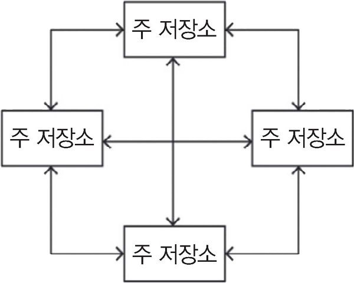

모든 데이터를 모든 서버에 복제하면 데이터가 늘어날수록 저장 공간과 복제 비용이 커진다. 이 경우 데이터를 3~5개의 노드에 복제하는 식으로 복제본 수를 제한하는 방식으로 해결할 수 있다. 복제본의 값이 잠시 달라지거나 쓰기가 충돌할 수 있으므로 일관성 처리 규칙도 필요하다.
키-값 저장소 설계는 지연 시간과 가용성을 고려해 동등 모델을 선택한다.

**해시 링에서 복제본을 배치하는 방법**

키를 담당하는 노드는 요청을 조정하는 **코디네이터**가 된다. 복제본 수를 `n`이라고 하면 코디네이터는 자신의 복제본과 함께, 링에서 시계 방향으로 만나는 `n-1`개의 노드에도 데이터를 저장한다. 이처럼 해당 키의 저장을 담당할 노드 목록을 선호 목록(preference list)이라고 한다.

가상 노드를 사용할 때는 목록의 항목 수만 세면 안 된다. 링에서 연속으로 만난 가상 노드들이 같은 물리적 서버에 속할 수 있기 때문이다. 물리적 서버 하나의 장애로 여러 복제본을 동시에 잃지 않도록 서로 다른 물리적 노드를 선택해 복제본을 배치한다.

<br>

## 5.4 get 및 put 함수 구현

### 5.4.1 get 및 put 함수 구현

분산 키-값 저장소에서는 키의 위치와 복제본 배치를 바탕으로 `get`과 `put`을 처리한다. 해당 키의 선호 목록에서 앞쪽에 있는 노드가 코디네이터가 되어 복제본에 요청을 전달하고 응답을 모은다.

클라이언트가 저장소에 요청을 전달하는 방법은 두 가지다.

- **일반적인 로드 밸런서 사용:** 클라이언트는 로드 밸런서로 요청을 보낸다. 요청을 받은 노드가 해당 키를 조정할 수 없다면 적절한 코디네이터로 전달한다. 클라이언트가 데이터 배치 정보를 관리할 필요는 줄어들지만 내부 전달 단계가 생길 수 있다.
- **파티션 정보를 아는 클라이언트 라이브러리 사용:** 클라이언트가 키의 담당 노드를 계산해 직접 요청을 보낸다. 중간 전달을 줄일 수 있지만, 라이브러리가 노드 구성과 데이터 배치 정보를 알고 있어야 한다.

노드가 `A, B, C, D, E` 순서로 링에 있고 복제본 수가 3이라고 하자. 키의 담당 노드가 `A`라면 `A`가 코디네이터로 동작하고 `B`, `C`에도 데이터를 복제한다. `put`은 이 복제본들에 변경을 전달하고, `get`은 복제본에서 값을 읽는다.

모든 복제본의 응답을 항상 기다리면 느린 노드 하나 때문에 요청 전체가 지연될 수 있다. 따라서 읽기와 쓰기가 성공했다고 판단하는 데 필요한 응답 수를 별도로 정한다.

### 5.4.2 r과 w 사용

`n`은 한 데이터를 저장하는 복제본 수다. `r`은 읽기가 성공하려면 응답해야 하는 복제본 수이고, `w`는 쓰기가 성공하려면 저장을 확인해야 하는 복제본 수다.

예를 들어 `n = 3`, `w = 2`라면 세 복제본에 쓰기를 전달하되 두 복제본의 저장 확인을 받으면 클라이언트에 성공을 응답할 수 있다. 나머지 한 복제본에 대한 반영은 뒤따라 완료될 수 있다. `r = 2`라면 읽기는 두 복제본의 응답을 모아 처리한다.

책은 읽기와 쓰기가 참여하는 복제본 집합이 겹치도록 다음 조건을 사용한다.

```text
r + w > n
```

복제본이 `A, B, C`이고 `w = 2`, `r = 2`라고 하자. 쓰기를 `A, B`가 확인했다면, 읽기가 어떤 두 복제본을 선택하더라도 `A`나 `B`를 최소 하나 포함한다. 두 집합이 세 복제본 안에서 완전히 분리될 수 없기 때문이다.

반대로 `w = 1`, `r = 2`이면 `r + w = n`이다. 쓰기를 `A`만 확인한 상태에서 `B, C`를 읽으면 이번 쓰기를 반영한 복제본을 만나지 못할 수 있다.

| 복제본 수 `n` | 읽기 응답 수 `r` | 쓰기 확인 수 `w` | 의미 |
|---|---|---|---|
| 3 | 2 | 1 | 읽기·쓰기 집합이 겹치지 않을 수 있다. |
| 3 | 2 | 2 | 같은 세 복제본 안에서는 두 집합이 최소 하나에서 겹친다. |
| 3 | 3 | 1 | 쓰기는 한 복제본만 기다리지만 읽기는 세 복제본 모두를 기다린다. |
| 3 | 1 | 3 | 읽기는 한 복제본만 기다리지만 쓰기는 세 복제본 모두를 기다린다. |

`r`이나 `w`를 크게 잡으면 해당 작업을 완료할 때 더 많은 응답이 필요하다. 따라서 필요한 수의 응답이 모이는 시간이 지연 시간을 결정하며, 응답하지 않는 복제본이 늘면 작업을 완료하지 못할 수 있다. 읽기가 많은지, 쓰기가 많은지, 어떤 장애까지 허용할지에 따라 두 값을 조정한다.

<br>

## 5.5 키-값 저장소의 장애 허용성과 장애 식별

### 5.5.1 일시적 장애 관리

노드 장애나 네트워크 단절이 발생하면 원래 복제본에 요청을 전달할 수 없을 수 있다. 고정된 복제본만 기다리는 방식에서는 필요한 정족수를 확보하지 못할 때 읽기나 쓰기가 중단된다. 여기서 정족수란 작업에 필요한 최소한의 참석 인원수를 뜻한다.

이 절은 느슨한 정족수(sloppy quorum)를 사용해 선호 목록에서 접근 가능한 노드를 선택하는 방식을 설명한다. 정상 상태에서는 원래 담당하는 상위 `n`개 노드를 사용하지만, 일부 노드가 응답하지 않으면 목록의 다음 정상 노드를 대신 사용한다.

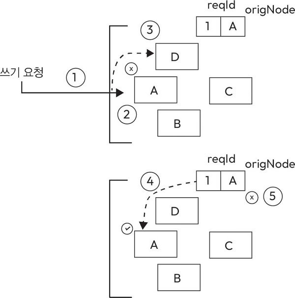

그림에서는 원래 `A`에 저장해야 할 쓰기를 임시로 `D`에 저장한다. 처리 과정은 다음과 같다.

1. 쓰기 요청이 `A`로 전달되지만 `A`에 접근할 수 없다.
2. 시스템은 대신 요청을 처리할 정상 노드 `D`를 선택한다.
3. `D`는 데이터를 저장하면서 원래 저장 대상이 `A`였다는 정보도 함께 기록한다. 그림의 `origNode = A`가 이 정보이며, 이를 **힌트**라고 한다.
4. `A`가 복구되면 `D`가 임시로 보관하던 데이터를 `A`로 전달한다.
5. 전달이 성공하면 `D`는 임시 데이터와 힌트를 삭제한다. 데이터가 원래의 복제본 배치로 돌아간다.

이 방식이 힌트 전달(hinted handoff)이다. 짧은 장애 때문에 쓰기 요청을 모두 중단하는 대신 다른 노드가 임시로 데이터를 맡고, 원래 노드가 돌아오면 밀린 변경을 전달한다.

### 5.5.2 영구적 장애 관리

일시적인 장애가 길어지거나 복제본 사이에 데이터 차이가 누적되면 힌트 전달만으로 충분하지 않을 수 있다. 남아 있는 복제본을 비교하고 불일치한 데이터를 동기화해야 한다. 이때 목표는 차이가 있는 부분을 찾아 복구하면서 네트워크 전송과 저장 장치 접근을 줄이는 것이다.

머클 트리(Merkle tree)는 데이터의 해시를 계층적으로 구성한 트리다. 리프 노드는 키-값 데이터의 해시를 담고, 부모 노드는 자식 해시들을 결합한 해시를 담는다. 아래 데이터가 달라지면 그 경로에 있는 상위 해시도 달라진다.

두 복제본의 전체 데이터를 먼저 전송할 필요 없이 루트 해시부터 비교할 수 있다. 루트 해시가 같으면 비교 범위의 데이터가 같다고 판단하고, 다르면 자식 해시를 비교해 차이가 있는 가지로 내려간다. 이 과정을 반복하면 동기화할 데이터 범위를 좁힐 수 있다. 이러한 복제본 간 불일치 복구를 안티 엔트로피(anti-entropy)라고 한다.

이를 정리하면 다음과 같다.

- **리프 노드 생성:** 비교 대상 데이터의 해시를 계산해 리프 노드를 만든다.
- **담당 범위별 트리 유지:** 물리적 노드는 자신이 담당하는 각 가상 노드의 키 범위에 대해 머클 트리를 유지한다. 같은 범위의 복제본을 가진 두 노드는 해당 트리의 해시를 비교한다.
  1. 두 트리의 루트 해시를 교환해 비교한다.
  2. 해시가 같으면 해당 범위의 비교를 끝낸다.
  3. 해시가 다르면 왼쪽과 오른쪽 자식의 해시를 재귀적으로 비교한다. 다른 가지를 따라 리프까지 내려가 동기화할 데이터를 찾는다.

장점은 전체 데이터셋을 주고받지 않아도 차이가 있는 가지를 개별적으로 확인할 수 있다는 점이다. 복제본 대부분이 같고 일부만 다를 때 특히 전송량과 저장소 접근을 줄일 수 있다.

단점은 노드 추가나 제거로 담당 키 범위가 바뀌면 영향을 받은 범위의 트리를 다시 계산해야 한다는 것이다. 또 머클 트리는 복제본의 차이를 찾는 구조이므로, 사라진 데이터를 복구하려면 해당 데이터를 보유한 다른 복제본이 있어야 한다.

### 5.5.3 해시 링의 노드 구성과 장애 감지

노드가 잠시 응답하지 않는다고 곧바로 링에서 제거하면 데이터 배치가 자주 바뀌게 된다. 일시적인 네트워크 문제를 영구적인 노드 제거로 처리하면 불필요한 데이터 이동과 복구 작업이 발생한다. 따라서 접근 실패를 감지하는 일과 노드 구성을 변경하는 일을 구분한다.

노드가 추가되거나 제거되면 각 노드는 변경된 구성 정보를 저장하고, 다른 노드와 공유한다. 이때 **가십 프로토콜**을 사용할 수 있다. 노드들은 일부 상대를 선택해 자신이 아는 구성 정보를 교환하고, 다른 정보를 받으면 갱신한다. 이 교환을 반복하면 변경 사항이 점진적으로 전체 노드에 퍼진다.

`A`가 `B`, `E`와 정보를 공유하고, `D`가 `C`, `E`와 정보를 공유할 때 `E`처럼 여러 노드와 교환하는 참여자를 통해 직접 통신하지 않은 노드의 정보도 전달된다. 모든 노드가 매번 모든 상대에게 한꺼번에 알리지 않아도 구성 정보를 확산할 수 있다.

링의 토큰은 노드가 담당하는 해시 범위를 나타낸다. 가십으로 공유하는 구성 정보에는 이런 노드와 담당 범위의 관계가 포함된다. 가십 상대를 선택하는 일과 사용자 데이터를 어느 복제본에 저장할지 결정하는 일은 역할이 다르다.

이러한 분산 키-값 저장소는 사용자 세션, 개인 설정처럼 키를 이용해 값을 빠르게 찾는 데이터에 활용할 수 있다. 따라서 실시간 추천이나 광고에 적합하다.

<br>

## 5.6 시스템 설계 인터뷰: 키-값 저장소 설계 관련 질문과 전략

키-값 저장소 설계 문제는 자료구조 하나를 고르는 데서 끝나지 않는다. 데이터와 요청이 늘어날 때의 확장 방식, 복제본의 일관성, 장애 중의 처리 규칙을 함께 설명해야 한다.

- **문제를 명확히 정의할 것:** 필요한 기능과 제한 사항을 먼저 파악한다. 소규모 애플리케이션인지 대규모 분산 시스템인지에 따라 데이터 배치와 운영 방식이 달라질 수 있다.
- **확장성과 성능에 중점을 둘 것:** 데이터와 요청이 증가할 때 노드를 어떻게 추가할지 설명한다. 샤딩과 일관된 해싱을 사용해 키를 배분하는 방법, 재배치 비용을 줄이는 방법을 연결해서 설명할 수 있어야 한다.
- **레플리카와 일관성을 설명할 것:** 복제본을 어디에 몇 개 둘지, 읽기와 쓰기에 몇 개의 응답이 필요한지 설명한다. 복제본의 값이 다르거나 쓰기가 충돌했을 때의 처리 방식도 고려한다.
- **장애 발생 가능성을 염두에 둘 것:** 노드와 네트워크의 장애를 전제로 설계한다. 복제, 장애 감지, 임시 저장, 복제본 동기화가 각각 어떤 문제를 해결하는지 설명한다.
- **시스템의 발전 가능성을 고려할 것:** 데이터 버전을 관리하고 요구 사항에 따라 설정을 바꿀 수 있게 한다. 처음 선택한 복제 수나 일관성 정책이 이후에도 적절한지 판단할 수 있어야 한다.

설계 인터뷰에서는 선택한 방법뿐 아니라 그 이유와 감수한 제약을 전달하는 것이 중요하다. 요구 사항에서 출발해 데이터 분할, 복제, 요청 처리, 복구로 설명을 이어가면 각 결정의 관계를 보여 줄 수 있다.

<br>

## 5.7 DynamoDB

DynamoDB는 AWS가 제공하는 완전 관리형 서버리스 비관계형 데이터베이스다. 키-값과 문서 데이터를 저장하며, 저장소와 처리량을 서비스가 관리한다. 내부적으로 SSD를 사용하고 데이터를 서로 분리된 데이터 센터에 복제해 장애에 대비한다.

### 5.7.1 고정된 스키마가 없다

DynamoDB에서는 관계형 테이블처럼 모든 항목의 속성을 동일하게 미리 정의할 필요가 없다. 같은 테이블 안에서도 항목마다 서로 다른 속성을 가질 수 있다. 다만 항목을 식별하고 배치하는 **기본 키의 구조는 정해야 한다**.

비관계형 데이터베이스의 장점은 다음과 같다.

- **유연성:** 반정형, 비정형 데이터를 다룰 수 있고 관계형 모델에서 여러 테이블로 나누었던 관련 정보를 하나의 문서에 담는 방식도 가능하다. 함께 읽는 정보를 한 단위로 구성하면 API에서 데이터를 조합하는 과정을 줄일 수 있다.
- **확장성:** 데이터를 여러 노드에 나누어 큰 클러스터에서 처리할 수 있어 데이터 모델과 분산 저장 구조를 함께 설계하면 데이터 증가에 대응하기 쉽다.
- **성능:** 대규모 읽기/쓰기 작업에 맞는 데이터 모델과 접근 방식을 사용한다. 실제 성능은 항목을 어떤 키로 조회하며 요청이 얼마나 고르게 분산되는지에 영향을 받는다.
- **가용성:** 데이터를 분할하고 복제본을 유지한다. 일부 노드를 교체하거나 장애가 발생하면 다른 복제본으로 요청을 처리해 서비스 중단을 줄일 수 있다.

DynamoDB의 데이터는 테이블 → 항목(item) → 속성(attribute)으로 구성된다. 테이블에는 항목이 없을 수도 있고 여러 개 있을 수도 있다. 각 항목은 기본 키로 구분하며 문자열, 숫자 등 여러 속성을 포함한다.

### 5.7.2 DynamoDB API 함수

- **`PutItem`:** 항목을 추가한다. 같은 기본 키의 항목이 이미 있으면 기존 항목을 새 항목으로 덮어쓴다.
- **`UpdateItem`:** 기존 항목의 속성을 수정하고 지정한 키의 항목이 없으면 새로운 항목을 만든다.
- **`DeleteItem`:** 지정한 기본 키에 해당하는 항목을 삭제한다.
- **`GetItem`:** 기본 키를 이용해 항목을 조회하고 속성을 가져온다.

`PutItem`과 `UpdateItem`은 모두 저장에 사용하지만 변경 범위가 다르다. `PutItem`으로 기존 항목을 교체할지, `UpdateItem`으로 필요한 속성을 수정할지 구분해야 한다.

### 5.7.3 DynamoDB의 데이터 분할

데이터를 여러 저장소로 나누는 방법에는 **수직적 분할**과 **수평적 분할**이 있다. 수직적 분할은 한 테이블의 컬럼을 나누고, 수평적 분할은 같은 구조를 가진 행들을 나눈다.

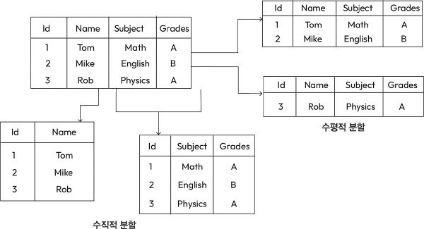

그림의 원래 테이블에는 `Id`, `Name`, `Subject`, `Grades`가 있다. 수직적으로 분할한 예에서는 `Id·Name`과 `Id·Subject·Grades`를 별도로 저장한다. 수평적으로 분할한 예에서는 Tom과 Mike의 행을 한쪽에, Rob의 행을 다른 쪽에 저장한다. 이 경우 두 저장소의 컬럼 구조는 같다.

DynamoDB는 항목을 여러 파티션에 수평적으로 나누어 저장한다. 클라이언트가 특정 항목을 조회하거나 수정하려면 그 항목을 식별할 수 있어야 하고, 서비스는 항목이 속한 파티션을 찾을 수 있어야 한다.

**기본 키 유형**

- **분할 키(partition key):** 하나의 속성으로 항목을 고유하게 식별한다. 분할 키만 사용하는 테이블에서는 같은 분할 키 값을 가진 항목을 둘 이상 저장할 수 없다.
- **분할 키와 정렬 키(sort key)를 결합한 복합 키:** 두 속성을 함께 사용해 항목을 식별한다. 분할 키가 같더라도 정렬 키가 다르면 별도 항목으로 저장할 수 있다.

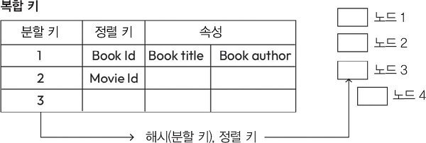

분할 키에 해시 함수를 적용한 결과는 데이터를 배치할 파티션을 결정하는 데 사용한다. 정렬 키는 같은 분할 키를 가진 항목들을 구분하고 정렬하는 데 사용한다. 그림은 `Book Id`, `Movie Id`와 같은 정렬 키 및 제목·저자 속성을 가진 항목을 예로 보여 준다.

**보조 인덱스**

기본 키 이외의 속성을 조회 기준으로 삼아야 할 수도 있다. DynamoDB는 보조 인덱스를 통해 다른 키를 사용하는 조회 경로를 제공한다. 따라서 데이터 모델을 정할 때는 항목을 저장할 기본 키와 함께 어떤 속성으로 검색해야 하는지도 고려한다.

### 5.7.4 DynamoDB에서 처리율 최적화

테이블의 처리 용량이 충분하더라도 특정 파티션에 요청이 몰리면 처리량 제한이 발생할 수 있다. 이 절은 처리 용량을 균등하게 나누는 방식에서 출발해, 짧은 요청 급증과 지속적인 부하 편중에 대응하는 방법을 설명한다.

**처리율 할당**

읽기 처리 용량 단위는 RCU(Read Capacity Unit), 쓰기 처리 용량 단위는 WCU(Write Capacity Unit)다. 테이블에 `20,000 RCU`와 `5,000 WCU`를 설정하고 이 용량을 파티션에 균등하게 배분하는 예시에서는 다음과 같이 분배할 수 있다.

| 상태 | 파티션 수 | 파티션당 읽기 용량 | 파티션당 쓰기 용량 |
|---|---|---|---|
| 처음 | 10개 | `20,000 / 10 = 2,000 RCU` | `5,000 / 10 = 500 WCU` |
| 파티션 10개 추가 후 | 20개 | `20,000 / 20 = 1,000 RCU` | `5,000 / 20 = 250 WCU` |

테이블 전체 용량을 그대로 둔 채 파티션 수만 늘리면 파티션당 용량이 줄어들고, 저장할 데이터가 늘어 파티션을 추가했는데 특정 파티션의 요청량은 그대로면 그 파티션이 배정받은 용량을 초과할 수 있다.

또한 실제 요청은 파티션마다 고르게 들어오지 않으므로 일부 파티션은 용량을 남기는 동안 다른 파티션은 제한에 걸릴 수 있다. 버스팅과 적응형 용량 관리를 통해 이런 불균형에 대응할 수 있다.

**버스팅: 단기 오버 프로비저닝**

버스팅은 짧은 시간 동안 요청이 몰릴 때 여유 처리 용량을 사용해 평소 배정량보다 많은 요청을 처리하는 방식이다. 예를 들어 한 파티션에서 잠깐 요청이 급증하더라도 여유 용량을 이용할 수 있다면 곧바로 모든 초과 요청을 제한하지 않아도 된다.

다만 한 파티션의 버스팅이 같은 자원을 사용하는 다른 파티션의 작업을 방해하면 안되고 여유 용량이 있는 범위에서 추가 처리를 허용하고 작업량을 분리해야 한다. 버스팅은 일시적인 증가를 흡수하는 수단이므로 지속적으로 초과하는 부하를 무제한 처리하는 보장은 아니다.

**토큰 버킷 시스템**

처리량을 제어하기 위해 두 종류의 토큰 버킷을 설명한다. **기본 처리량 버킷**은 평소 허용된 처리량을 나타내고, **버스트 처리량 버킷**은 일시적으로 추가 처리할 수 있는 여유분을 나타낸다.

요청을 처리할 때 먼저 기본 버킷의 토큰을 사용한다. 기본 버킷이 비면 버스트 버킷에 토큰이 남아 있는지 확인한다. 여유 토큰이 있으면 추가 요청을 처리할 수 있다. 이런 방식으로 기본 용량과 순간적인 초과 사용을 구분해 제어한다.

**적응형 용량 관리: 장기적 관점의 방향**

특정 파티션에 높은 부하가 계속되면 짧은 버스트만으로 대응하기 어렵다. 적응형 용량 관리(adaptive capacity)는 파티션별 사용 패턴을 살펴보고 처리 용량의 배분을 조정한다.

**적응형 용량 관리가 동작하는 방식**

자주 접근하는 파티션을 **핫 파티션**, 상대적으로 적게 접근하는 파티션을 **콜드 파티션**이라고 한다. 시스템은 읽기·쓰기 사용량을 관찰해 요청이 집중되는 곳을 찾는다. 여유가 있는 파티션과 과부하가 발생하는 파티션을 고려해 처리 용량을 재배분하면 핫 파티션의 처리량 제한을 줄일 수 있다.

이 과정에 접근 패턴을 관찰하고 용량을 조정하는 시간이 필요하다. 또한 하나의 파티션이 처리할 수 있는 양에도 한계가 있으므로 용량 재배분만으로 모든 편중을 해결할 수는 없다.

**글로벌 접근 제어: 파티션 간 관리**

글로벌 접근 제어(global admission control)는 테이블 전체의 처리 용량을 기준으로 얼마나 많은 요청을 받아 처리할지를 결정한다.

파티션별 고정 배정량만 보면 한쪽에 여유가 있는데도 다른 쪽의 요청을 제한할 수 있다. 테이블 전체의 초당 작업량과 각 파티션의 부하를 함께 고려하면 용량을 더 유연하게 사용할 수 있다.

**사용량에 맞춘 분할: 선제적 파티션 관리**

처리 용량 배분뿐 아니라 데이터를 나누는 단위도 조정할 수 있다. 사용량에 맞춘 분할(splitting for consumption)은 데이터의 분포와 접근 패턴을 바탕으로 파티션을 나누어 부하를 분산하는 방법이다.

키 범위를 기준으로 나누거나 해시를 기준으로 나누면 데이터를 여러 파티션에 재배치할 수 있다. 이때 저장된 데이터의 양만이 아니라 실제 요청이 어느 키에 집중되는지를 고려해야 한다.

### 5.7.5 DynamoDB의 높은 가용성

**쓰기 가용성**

DynamoDB는 테이블을 파티션으로 나누고 각 파티션의 복제본을 여러 곳에 둔다. 같은 파티션의 복제본들이 복제 그룹(replication group)을 이룬다. 복제 그룹은 멀티 팩소스를 바탕으로 리더를 선출하고 변경에 합의한다.

쓰기 요청은 리더 복제본이 처리한다. 리더는 변경을 WAL(Write-Ahead Log, 쓰기 전 로그)에 기록하고 메모리의 색인에도 반영하며, 복제 그룹의 다른 복제본에 변경을 전달한다. 충분한 복제본이 쓰기를 기록해야 성공을 확인할 수 있다.

쓰기를 계속하려면 정상적인 리더와 필요한 쓰기 정족수가 모두 있어야 한다. 일부 복제본이 응답하지 않으면 복제 그룹을 보완해 필요한 수의 정상 복제본을 유지한다. 여러 복제 그룹이 같은 물리적 노드를 사용할 수도 있지만, 정족수는 전체 서버 수를 합산해 판단하지 않고 해당 파티션의 복제 그룹별로 판단한다.

**읽기 가용성**

최종 일관성 읽기는 복제 그룹의 복제본에서 처리할 수 있다. 다만 모든 복제본이 변경을 동시에 반영하지는 않으므로 쓰기 직후에는 이전 값을 반환할 수 있다.

강한 일관성 읽기는 완료된 최신 쓰기를 반영해야 하므로 리더가 쓰기 순서와 반영 상태를 관리하며 이러한 읽기를 처리한다. 읽기를 여러 복제본에 분산하는 방식과 리더가 최신 상태를 확인하는 방식은 가용성과 지연 시간에 영향을 준다.

**리더 장애와 회색 장애**

리더가 고장 나면 다른 복제본이 장애를 감지하고 새 리더를 선출해야 한다. 이때 기존 리더가 아직 유효한 리더 권한을 가지고 있는지 확인하지 않으면 서로 다른 노드가 동시에 리더처럼 동작할 수 있다. 리더 권한을 일정 시간 동안 유지하는 리스(lease)로 이 문제를 해결할 수 있다.

회색 장애(gray failure)는 모든 참여자에게 같은 모습으로 드러나지 않는 장애다. 어떤 복제본에서는 리더에 연결할 수 없지만 다른 복제본에서는 정상적으로 통신할 수 있다. 연결 실패를 관찰한 노드가 매번 새 선거를 시작하면 불필요한 리더 교체로 가용성이 낮아질 수 있다. 따라서 다른 복제본도 리더와 통신할 수 없는지 확인한 뒤 선거를 진행하는 방식이 필요하다.

<br>

## 5.8 컬럼 패밀리 데이터베이스

컬럼 패밀리 데이터베이스는 관련 컬럼을 하나의 그룹으로 묶어 저장하는 비관계형 데이터베이스다. 대량의 데이터를 여러 노드에 분산하고 높은 읽기·쓰기 처리량을 확보하는 데 초점을 둔다.

- **데이터 구성:** 서로 관련된 컬럼을 컬럼 패밀리로 묶어 관련 데이터를 함께 관리하면서 필요에 따라 속성을 추가할 수 있다.
- **컬럼(column):** 개별 데이터 요소를 나타낸다. 필요한 컬럼을 동적으로 추가할 수 있다.
- **행(row):** 특정 개체나 레코드에 해당한다. 행의 데이터는 그 행에 속한 컬럼 패밀리와 컬럼을 통해 구성된다.
- **와이드 컬럼 스토어(wide-column store):** 한 개체에 다양한 속성을 저장할 수 있는 넓은 행 구조를 사용한다. 데이터마다 필요한 속성의 종류나 수가 다른 경우에도 활용할 수 있다.
- **확장성:** 클러스터에 노드를 추가하고 데이터를 나누어 저장한다. 데이터의 양과 트래픽이 증가할 때 수평적으로 확장할 수 있다.
- **높은 읽기 및 쓰기 처리량:** 많은 데이터를 지속적으로 기록하고 조회하는 작업에 맞게 저장 구조를 최적화한다. 실시간 데이터를 처리하는 애플리케이션에 활용한다.
- **데이터 분산:** 여러 노드에 데이터를 나누어 저장하고 복제본을 유지한다. 분산은 부하를 나누고, 복제는 일부 노드의 장애에 대비한다.
- **쿼리 처리:** 키를 기준으로 데이터를 찾는 접근에 적합하다. 관계형 데이터베이스의 복잡한 조인과 임의 조건의 쿼리를 같은 방식으로 기대하기는 어렵다.
- **활용 사례:** 시계열 데이터, 이벤트 기록, 모니터링 시스템과 분산 애플리케이션 등 많은 데이터를 계속 저장하고 조회하는 분야에서 활용한다.
- **일관성 모델:** 제품에 따라 일관성 수준과 설정 방식이 다르다. 애플리케이션이 요구하는 일관성, 성능, 가용성 사이에서 적절한 선택을 해야 한다.

대표적인 제품은 Cassandra와 HBase다. Cassandra를 높은 가용성과 유연한 확장성이 필요한 환경에 사용할 수 있다. HBase는 네트워크 분할 상황에서 가용성을 일부 포기하더라도 강한 일관성을 유지한다.

<br>

## 5.9 HBase

HBase는 HDFS(Hadoop Distributed FileSystem)를 기반으로 하는 분산 비관계형 데이터베이스다. 구글 Bigtable의 설계에서 영향을 받았으며, 대규모 데이터에 대한 실시간 랜덤 액세스(전체 데이터를 처음부터 읽지 않고 필요한 키의 데이터에 접근)한다.

데이터는 다음과 같이 구성된다.

- **테이블:** 여러 행으로 구성된다.
- **행:** 여러 컬럼 패밀리의 데이터를 포함한다.
- **컬럼 패밀리:** 관련된 여러 컬럼으로 구성된다.
- **컬럼:** 키-값 형태의 셀 데이터를 저장한다. HBase는 타임스탬프를 이용해 셀의 여러 버전도 관리한다.

HBase의 특징은 다음과 같다.

- **분산 처리 및 확장성:** 범용 하드웨어로 구성한 클러스터에서 동작한다. 서버를 추가해 데이터와 요청을 나눌 수 있다.
- **컬럼 패밀리 데이터 모델:** 관련 컬럼을 묶고 그 안에 필요한 컬럼을 추가한다. 행마다 다양한 속성을 가진 데이터를 저장할 수 있다.
- **일관성 모델:** 강한 일관성이 필요한 데이터 접근을 지원한다. WAL은 특히 장애가 발생했을 때 기록된 변경을 복구하고 내구성을 유지하는 역할을 한다.
- **데이터 버전 관리:** 셀의 이전 버전을 보관하고 조회할 수 있다. 보관된 버전을 통해 과거 데이터를 확인하거나 변화를 분석한다.
- **확장성과 부하 분산:** 데이터를 여러 서버에 나누고 리전을 재배치해 서버 간 부하를 조정한다.
- **높은 읽기 및 쓰기 처리량:** 많은 데이터를 실시간으로 저장하고 조회하는 작업에 적합하도록 설계되어 있다.
- **하둡을 이용한 통합 기능:** Hadoop MapReduce, Spark, Hive 등의 처리·분석 도구와 함께 활용할 수 있다.
- **블룸 필터와 블록 캐시:** 블룸 필터로 확인할 저장 파일을 줄이고, 블록 캐시로 최근에 읽은 데이터를 메모리에서 재사용해 읽기 비용을 줄인다.
- **데이터 압축:** 저장 데이터를 압축해 공간 사용을 줄인다. 저장 형식과 압축 방식을 통해 입출력 효율도 고려한다.
- **사용 사례:** 시계열, 센서, 로그처럼 지속적으로 쌓이는 데이터와 광고 타기팅, 추천 서비스처럼 필요한 데이터를 빠르게 찾아야 하는 작업에 활용한다.
- **활발한 커뮤니티와 생태계:** 아파치 프로젝트로서 여러 도구, 라이브러리와 연동 인터페이스를 제공한다.

### 5.9.1 HBase 자세히 살펴보기

**HBase의 개념과 아키텍처**

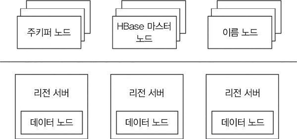

주요 서버는 리전 서버, HBase 마스터, 주키퍼다.

- **리전 서버(RegionServer):** 실제 읽기와 쓰기 요청을 처리한다. 클라이언트는 데이터가 있는 리전 서버에 직접 요청하고, 리전 서버는 HDFS에 데이터를 저장한다.

  테이블은 행 키의 범위에 따라 리전(region)으로 나뉜다. 하나의 리전은 시작 키와 끝 키로 정해지는 범위의 행을 담당하고, 리전 서버 하나는 여러 리전을 관리한다. 따라서 테이블 전체를 한 서버에 두지 않고 키 범위별로 나누어 처리할 수 있다. 리전 서버와 HDFS 데이터 노드를 함께 배치하면 데이터를 처리하는 프로세스와 저장된 데이터 사이의 거리를 줄일 수 있다.

- **HBase 마스터(Master):** 리전 할당과 테이블의 데이터 정의 언어(DDL) 작업을 관리한다. `CREATE`, `ALTER`, `TRUNCATE`, `DROP`처럼 테이블 구조와 상태를 바꾸는 작업을 담당한다.
  - 리전 서버를 관리하고 조율한다.
  - 시작 시 리전을 할당하고, 장애 복구나 부하 분산이 필요하면 리전을 다시 배치한다.
  - 리전 서버의 상태를 관찰하고 주키퍼의 상태 변경 알림을 받는다.
  - 테이블 생성·삭제·수정과 같은 작업의 인터페이스를 제공한다.

- **주키퍼(ZooKeeper):** 클러스터의 서버 상태를 관리하는 분산 조율 서비스다. 서버의 가용성을 추적하고 장애나 상태 변경을 알린다. 보통 3~5대의 서버가 합의에 참여한다.

그림의 **이름 노드(NameNode)**는 HDFS 구성 요소다. 파일을 구성하는 데이터 블록의 위치와 메타데이터를 관리한다. HBase 마스터가 리전과 테이블을 관리하는 역할과 구분한다. 실제 데이터 블록은 HDFS 데이터 노드가 저장한다.

**META 테이블과 .META. 서버**

클라이언트가 행 키를 알고 있어도 그 행이 어느 리전 서버에 있는지 알아야 한다. **META 테이블**은 리전과 리전 서버의 대응 정보를 보관하는 카탈로그다.

- **키(Keys):** 리전의 시작 키와 고유한 리전 ID를 이용해 리전을 구분한다.
- **값(Values):** 해당 리전을 담당하는 리전 서버의 정보를 나타낸다.

META 테이블도 리전 서버가 관리한다. 주키퍼는 클라이언트가 META 테이블을 관리하는 서버를 찾는 데 필요한 정보를 제공한다. 클라이언트는 META 테이블을 조회한 뒤 사용자 데이터가 있는 리전 서버로 이동한다.

**리전 서버 구성 요소**

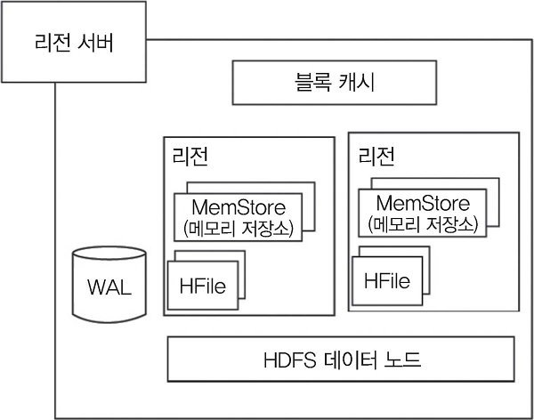

- **WAL:** 변경을 먼저 기록하는 로그다. HDFS와 같은 파일 시스템에 저장하며, 아직 HFile에 반영하지 않은 변경을 서버 장애 후 복구하는 데 사용한다. HFile에 쓰지 않았더라도 WAL에 기록해 내구성을 확보할 수 있다.
- **블록 캐시(BlockCache):** 읽은 데이터 블록을 메모리에 보관해 다시 사용할 때 디스크 접근을 줄인다. 공간이 부족하면 가장 오래 사용하지 않은 데이터를 제거하는 LRU 방식을 사용한다.
- **MemStore:** 변경된 데이터를 메모리에 정렬된 키-값 형태로 보관하는 쓰기 캐시다. 리전 안의 컬럼 패밀리마다 MemStore가 있으며, 쌓인 데이터를 나중에 HFile로 기록한다.
- **HFile:** HDFS에 저장하는 정렬된 데이터 파일이다. MemStore의 데이터를 모아 새로운 HFile에 순차적으로 기록한다. 변경할 때마다 디스크의 여러 위치를 찾아 직접 덮어쓰는 작업을 줄일 수 있다.

WAL과 HFile은 역할이 다르다. WAL은 변경을 복구할 수 있도록 순서대로 남기는 로그이고, HFile은 정렬된 데이터를 읽기 위한 저장 파일이다. MemStore는 아직 새 HFile로 내보내지 않은 변경을 메모리에서 관리한다.

**HBase의 작업 실행 과정**

처음 행에 접근할 때는 요청을 처리할 리전 서버를 찾는다.

1. 클라이언트가 주키퍼에 접속해 META 테이블을 관리하는 서버의 위치를 확인한다.
2. 클라이언트가 META 테이블에 행 키를 조회해 해당 행의 리전 서버를 찾는다.
3. 클라이언트가 META 위치와 조회한 리전 위치 정보를 캐시한다.
4. 클라이언트가 해당 리전 서버에 직접 읽기나 쓰기 요청을 보낸다.

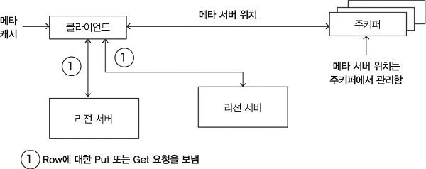

다음 요청에서는 캐시에 있는 위치 정보를 사용할 수 있다. 따라서 매번 주키퍼와 META 테이블을 거칠 필요는 없다. 리전이 이동했거나 필요한 정보가 캐시에 없으면 META 테이블을 다시 조회하고 캐시를 갱신한다. HBase 마스터가 모든 사용자 읽기·쓰기 요청을 중계하는 구조는 아니다.

**HBase 쓰기 작업**

클라이언트의 `Put`을 받은 리전 서버는 다음 순서로 처리한다.

1. 변경 내용을 WAL 파일 끝에 추가한다. WAL은 파일 시스템에 기록되므로 서버가 중단되더라도 아직 HFile로 옮기지 않은 변경을 복구할 근거가 된다.
2. 변경을 MemStore에 반영하고 클라이언트에 완료 응답을 보낸다.

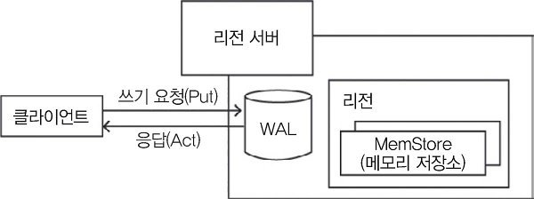

이 과정에서 매 요청마다 HFile을 새로 만들지는 않는다. 메모리에 변경을 모으고 나중에 한꺼번에 정렬된 파일로 내보낸다. 그렇다고 성공 응답을 받은 데이터가 메모리에만 있는 것은 아니다.

**HBase 리전 플러시**

플러시(flush)는 MemStore의 데이터를 HFile로 내보내는 작업이다.

- **새 HFile 생성:** MemStore에 데이터가 충분히 쌓이면 정렬된 데이터를 새로운 HFile에 기록한다. 메모리에 모은 변경을 순차적인 파일 쓰기로 처리한다.
- **컬럼 패밀리별 파일 관리:** 컬럼 패밀리마다 여러 HFile이 생길 수 있다. 실제 셀 데이터인 `KeyValue` 인스턴스를 이 파일들에 저장한다. 새로운 변경은 이후의 새 HFile에 반영된다.
- **시퀀스 번호 기록:** 어디까지 데이터를 기록했는지 알 수 있도록 시퀀스 번호를 관리한다. 각 HFile의 메타데이터에 기록된 가장 높은 번호는 복구 시 이미 파일에 반영한 변경을 구분하는 기준이 된다.
- **리전 재시작 시 복구 기준 확인:** 저장된 시퀀스 번호를 읽어 마지막 기록을 기준으로 다음 작업을 이어간다.

**KeyValue**

`KeyValue`는 단순히 일반적인 키와 값이라는 말만을 뜻하지 않고 HBase가 셀 데이터를 표현하는 단위의 이름이다. 셀을 식별하는 키 정보, 값, 타임스탬프와 같은 버전 관련 정보를 함께 다룬다. 따라서 읽기 과정에서는 같은 위치의 데이터라도 어떤 버전인지 고려해야 한다.

**HBase 읽기 작업**

한 행을 구성하는 데이터가 모두 같은 저장 위치에 있는 것은 아니다.

- 이미 플러시한 셀은 **HFile**에 있다.
- 최근에 갱신했지만 아직 플러시하지 않은 셀은 **MemStore**에 있다.
- 최근에 읽은 데이터는 **블록 캐시**에 있을 수 있다.

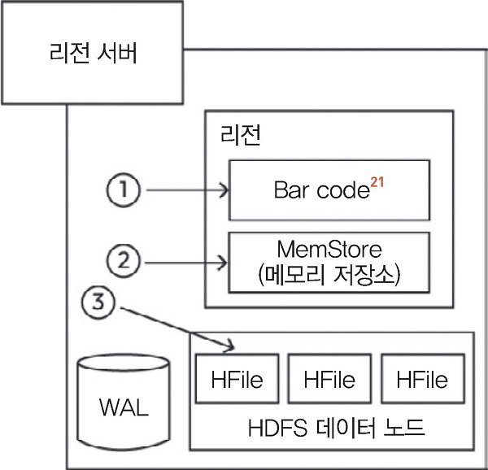

그림의 `Bar code`는 본문에서 설명하는 블록 캐시를 가리킨다. 읽기 과정은 다음과 같다.

1. **블록 캐시 확인:** 스캐너가 캐시에서 필요한 행 데이터를 찾는다. 캐시된 블록을 활용하면 같은 데이터를 다시 디스크에서 읽는 비용을 줄일 수 있다.
2. **MemStore 확인:** 최근에 반영된 변경이 있는지 확인한다. 디스크에 있는 값보다 새로운 값이 MemStore에 있을 수 있다.
3. **필요한 HFile 조회:** 메모리에서 필요한 데이터를 모두 얻지 못하면 인덱스와 블룸 필터를 이용해 확인할 HFile을 좁힌다. 데이터가 있을 가능성이 있는 파일의 필요한 블록을 읽고 목표 셀을 찾는다.

마지막에는 각 위치에서 얻은 데이터를 합쳐 클라이언트에 반환한다. 블록 캐시에서 값을 발견했다는 이유만으로 더 최근의 MemStore 데이터를 무시하고 곧바로 반환하는 것으로 이해해서는 안 된다. 이 절의 핵심은 **메모리와 파일에 나뉜 데이터를 함께 확인하고 통합한다**는 점이다.

블룸 필터는 특정 데이터가 파일에 없다는 것을 확인해 불필요한 읽기를 줄인다.
<br>

## 5.10 그래프 기반 데이터베이스

그래프 기반 데이터베이스는 개체 사이의 관계를 저장하고 탐색하는 데 적합한 비관계형 데이터베이스다. 개체 자체의 속성뿐 아니라 어떤 개체와 연결되어 있는지, 여러 연결을 따라가면 무엇을 만나는지가 중요한 데이터에 활용한다.

주요 특징과 개념은 다음과 같다.

- **그래프 구조:** 데이터를 노드와 에지로 표현한다. 노드는 개체를, 에지는 개체 사이의 연결을 나타낸다.
- **노드(node):** 사람, 장소, 제품과 같은 개체나 데이터 포인트를 나타낸다. 각 노드에는 개체의 특성을 설명하는 키-값 형태의 속성을 저장할 수 있다.
- **에지(edge):** 두 노드 사이의 관계를 나타낸다. 연결 자체에도 속성을 부여해 관계의 구체적인 정보를 저장할 수 있다.
- **레이블 및 관계 유형:** 노드와 관계를 종류별로 구분한다. 예를 들어 사람 노드는 `person`, 친구 관계는 `friends`처럼 의미를 부여할 수 있다. Neo4j에서는 노드의 레이블과 관계의 유형을 구분한다.
- **탐색 기능:** 노드에서 연결된 관계를 따라 이동하면서 경로와 연결 패턴을 찾는다. 여러 단계로 이어지는 관계를 분석하는 작업에 적합하다.
- **사이퍼(Cypher) 쿼리 언어:**  그래프의 노드와 관계 패턴을 표현해 조회하거나 변경할 수 있다.
- **인덱싱:** 특정 속성 등을 기준으로 탐색을 시작할 노드를 빠르게 찾는 데 사용한다. 인덱스로 시작점을 찾고 관계를 따라 탐색하는 과정을 결합할 수 있다.
- **확장성:** 일부 그래프 데이터베이스는 여러 서버에 데이터를 분산하거나 복제해 처리 능력과 장애 허용성을 높인다. 구체적인 확장 방식은 제품에 따라 다르다.
- **활용 사례:** 소셜 네트워크, 추천 엔진, 사기 탐지, 네트워크/인프라 관리, 지식 그래프처럼 복잡한 연결을 모델링하고 분석하는 분야에서 활용한다.
- **패턴 매칭:** 그래프 안에서 특정 연결 구조를 찾는다. 연결 관계나 공통된 특징을 기준으로 친구 추천과 개인화 기능을 구현할 수 있다.

예를 들어 친구 추천은 현재 사용자의 친구를 찾고, 다시 그 친구의 친구를 찾는 **2차 연결** 탐색으로 설명할 수 있다. 공통 관심사나 연결된 개체를 확인하는 방식도 가능하다. 관계를 여러 번 따라가야 하는 질문을 그래프 구조로 표현하면 조회하려는 대상과 경로가 직접 드러난다.

<br>

## 5.11 Neo4j 그래프 데이터베이스

Neo4j는 노드와 관계를 이용해 데이터를 저장하는 그래프 데이터베이스 관리 시스템이다. 소셜 관계, 추천, 사기 탐지 등 데이터 사이의 연결을 탐색하고 분석해야 하는 작업에 활용한다.

Neo4j의 특징은 다음과 같다.

- **그래프 데이터 모델:** 노드와 관계로 개체와 연결을 표현한다. 복잡하게 연결된 데이터를 그래프 구조로 관리한다.
- **노드:** 개체나 데이터 포인트를 나타낸다. 노드의 속성에 키-값 형태로 정보를 저장한다.
- **관계:** 두 노드의 연결을 정의한다. 관계 자체에도 속성이 있어 연결의 세부 정보를 저장할 수 있다.
- **레이블과 관계 유형:** 노드는 레이블로 분류하고, 관계는 유형으로 의미를 구분한다. 같은 사람 노드 사이에도 친구, 팔로우 등 서로 다른 관계를 표현할 수 있다.
- **사이퍼 쿼리 언어:** Cypher로 원하는 노드와 관계의 패턴을 표현해 데이터를 조회하고 수정한다.
- **인덱싱과 쿼리 최적화:** 속성을 기준으로 검색할 때 인덱스를 활용해 쿼리 비용을 줄인다. 찾은 노드에서 연결을 따라 필요한 범위를 탐색한다.
- **확장성:** 여러 서버를 사용하는 구성으로 처리 능력과 장애 대응 능력을 높일 수 있다. 책은 수평적 확장을 장점으로 들며, 구체적인 분산·복제 범위는 사용하는 구성에 따라 살펴봐야 한다.
- **ACID 특성:** 트랜잭션에서 ACID 특성을 지원해 여러 데이터 변경의 무결성을 유지한다. 비관계형 모델이면서도 트랜잭션을 제공하는 사례다.
- **데이터 버전 관리:** 과거 데이터를 저장하고 조회해 시간에 따른 변화를 추적한다.
- **활용 사례:** 소셜 네트워크, 추천 시스템, 사기 탐지, 실시간 분석, 네트워크/인프라 관리, 지식 그래프에 활용한다.

### 5.11.1 Neo4j 자세히 살펴보기

세 사람이 있는 소셜 네트워크를 생각해 보자. 사람을 각각 노드 `1`, `2`, `3`으로 표현하고, 팔로우를 방향이 있는 관계로 표현한다.

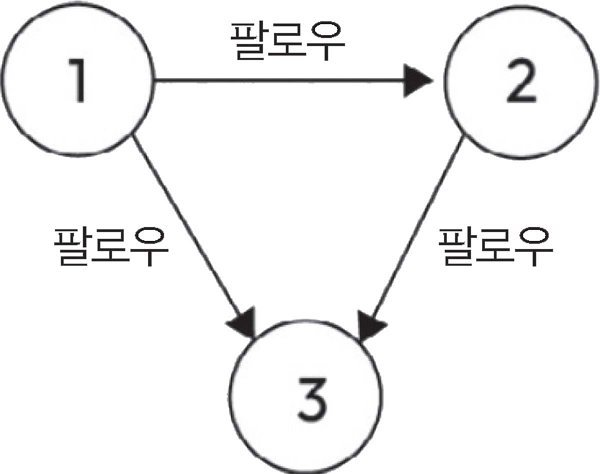

노드 `1`은 `2`와 `3`을 팔로우하고, 노드 `2`는 `3`을 팔로우한다. 따라서 관계는 `1 → 2`, `1 → 3`, `2 → 3`이다. 팔로우에는 방향이 있으므로 `1 → 2`가 있다는 사실만으로 `2 → 1`도 있다고 볼 수는 없다.

조금 이따 이 관계를 관계형 테이블에 저장하는 방법과 그래프 저장 구조로 표현하는 방법을 비교한다.

<br>

## 5.12 관계형 모델링과 그래프 모델링

같은 팔로우 데이터를 관계형 모델로 표현할 때는 다음 두 방법을 사용할 수 있다.

- **단방향 관계 저장:** 관계마다 출발점과 도착점을 하나의 행으로 저장한다. 예를 들어 `(1, 2)`, `(1, 3)`, `(2, 3)`이 각각 한 행이 된다. 출발점에 인덱스를 두면 어떤 사용자가 팔로우하는 대상을 찾기 쉽고, 도착점 기준의 인덱스로 그 사용자를 팔로우하는 사람을 찾을 수도 있다.
- **양방향으로 조회할 수 있게 저장:** 원래 관계와 반대 방향으로 조회할 행을 함께 저장하고, 추가 컬럼으로 관계의 방향을 표시한다. `(1, 2, 팔로우하는 관계)`와 `(2, 1, 팔로우받는 관계)`처럼 같은 사실을 두 방향에서 찾도록 표현한다.

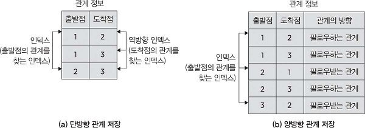

두 번째 방식에서 반대 방향의 행을 저장했다고 실제로 서로 팔로우하는 관계가 생기는 것은 아니다. 원래의 `1 → 2`를 `1`의 관점에서는 팔로우, `2`의 관점에서는 팔로워로 조회할 수 있게 만드는 것이다.

### 5.12.1 그래프 모델링

그래프 저장 구조를 **노드별 이중 연결 리스트**, **노드 테이블**, **관계 테이블**로 나눌 수 있다. 세 관계에 다음 ID를 붙인다.

| 관계 ID | 출발 노드 | 도착 노드 | 의미 |
|---|---|---|---|
| `A` | 1 | 2 | 1이 2를 팔로우한다. |
| `B` | 1 | 3 | 1이 3을 팔로우한다. |
| `C` | 2 | 3 | 2가 3을 팔로우한다. |

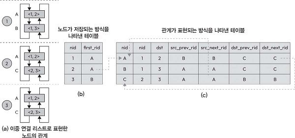

- **그림 5-20(a): 노드별 관계 목록.** 각 노드에 연결된 관계들을 이중 연결 리스트로 표현한다. 노드가 세 개이므로 관계 목록도 세 개다. 노드 `1`에는 `A, B`, 노드 `2`에는 `A, C`, 노드 `3`에는 `B, C`가 연결된다. 한 관계는 출발 노드의 목록과 도착 노드의 목록 모두에 참여한다.
- **그림 5-20(b): 노드 저장 구조.** 노드 레코드에는 노드 ID인 `nid`와 첫 관계 ID인 `first_rid`가 있다. 노드 `1`과 `2`의 첫 관계는 `A`이고, 노드 `3`의 첫 관계는 `B`다. 노드에서 관계를 탐색할 때 이 첫 관계가 시작점이 된다.
- **그림 5-20(c): 관계 저장 구조.** 관계 레코드는 관계 ID인 `rid`, 출발 노드 `src`, 도착 노드 `dst`를 저장한다. 여기에 출발 노드의 관계 목록에서 이전·다음 관계를 가리키는 `src_prev_rid`, `src_next_rid`와, 도착 노드의 목록에서 이전·다음 관계를 가리키는 `dst_prev_rid`, `dst_next_rid`를 둔다.

예제의 관계 레코드를 풀어 쓰면 다음과 같다.

| `rid` | `src` | `dst` | `src_prev_rid` | `src_next_rid` | `dst_prev_rid` | `dst_next_rid` |
|---|---|---|---|---|---|---|
| A | 1 | 2 | B | B | C | C |
| B | 1 | 3 | A | A | C | C |
| C | 2 | 3 | A | A | B | B |

관계 `A`를 예로 들면 출발 노드가 `1`이고 도착 노드가 `2`다. 노드 `1`의 다른 관계는 `B`이므로 `A`의 출발 노드 쪽 이전·다음 포인터는 `B`를 가리킨다. 노드 `2`의 다른 관계는 `C`이므로 도착 노드 쪽 이전·다음 포인터는 `C`를 가리킨다. 이 예제는 목록의 끝이 처음으로 이어지는 형태로 그려져 있다.

이 구조에서 노드 `2`에 연결된 관계를 찾는 과정을 따라가 보자. 노드 테이블의 `first_rid = A`에서 시작한다. 관계 `A`에서는 노드 `2`가 도착점이므로 `dst_next_rid = C`를 따라간다. 관계 `C`에서는 노드 `2`가 출발점이므로 `src_next_rid = A`를 따라 처음으로 돌아온다. 이렇게 노드가 관계의 어느 쪽 끝점인지에 따라 사용할 포인터가 달라진다.

관계 하나는 두 노드를 연결하므로, 두 노드 각각의 관계 목록에서 자신의 앞뒤 위치를 알아야 해 이전, 다음 관계 ID가 필요하다.

### 5.12.2 기존 그래프에 새로운 노드 추가

기존 그래프에 노드 `4`를 추가하고, 노드 `2`가 노드 `4`를 팔로우하도록 하자. 새로운 관계의 ID는 `D`다.

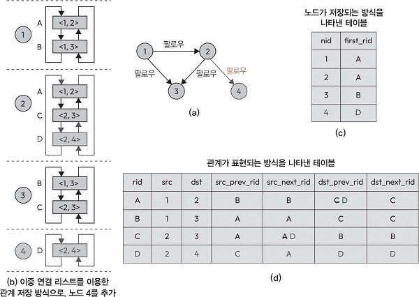

노드 테이블에는 `nid = 4`, `first_rid = D`인 행을 추가한다. 관계 테이블에는 출발점이 `2`, 도착점이 `4`인 `D`를 추가한다. 기존 노드의 첫 관계는 그대로 유지한다.

노드 `2`의 관계 목록은 기존의 `A, C`에서 `A, C, D`로 바뀐다. 새 관계를 목록에 연결하려면 `D`를 추가하는 것과 함께 기존 관계의 포인터도 수정해야 한다.

1. 관계 `C`의 출발 노드는 `2`다. `C` 다음에 `D`가 오도록 `C.src_next_rid`를 `A`에서 `D`로 바꾼다.
2. 관계 `A`의 도착 노드는 `2`다. 순환 목록에서 `A`의 앞에 `D`가 오도록 `A.dst_prev_rid`를 `C`에서 `D`로 바꾼다.
3. 새 관계 `D`의 출발 노드 쪽 포인터를 `src_prev_rid = C`, `src_next_rid = A`로 설정한다.
4. 노드 `4`에는 관계 `D`만 있으므로 이 예제의 도착 노드 쪽 이전·다음 포인터는 모두 `D`를 가리킨다.

변경된 관계 테이블은 다음과 같다.

| `rid` | `src` | `dst` | `src_prev_rid` | `src_next_rid` | `dst_prev_rid` | `dst_next_rid` |
|---|---|---|---|---|---|---|
| A | 1 | 2 | B | B | **D** | C |
| B | 1 | 3 | A | A | C | C |
| C | 2 | 3 | A | **D** | B | B |
| D | 2 | 4 | C | A | D | D |

노드 `1`과 `3`의 관계 목록은 바뀌지 않는다. 노드 `2`에 연결되는 새 관계만 추가했기 때문이다. 이 예시를 통해 관계 추가가 해당 노드의 기존 연결 목록도 갱신하는 작업임을 확인할 수 있다.

**노드와 관계가 저장되는 방식**

**노드 저장소**

노드 레코드는 노드 저장소 파일에 저장된다. 레코드 크기가 15바이트이면 다음과 같이 저장된다.

- **첫 1바이트:** 사용 중인지 나타내는 플래그다.
- **다음 4바이트:** 노드 ID이다.
- **다음 1바이트:** 첫 번째 관계 ID이다.
- **다음 1바이트:** 첫 번째 속성 ID이다.
- **다음 5바이트:** 레이블을 저장하는 영역이다.
- **남은 1바이트:** 향후 사용 공간이다.

**관계 저장소**

관계 레코드는 관계 저장소 파일에 저장한다. 34바이트의 레코드에는 다음과 같이 저장된다.

- **출발 노드 ID:** 관계가 시작되는 노드를 나타낸다.
- **도착 노드 ID:** 관계가 도착하는 노드를 나타낸다.
- **관계 유형 포인터:** 어떤 종류의 관계인지 나타내는 정보를 참조한다.
- **출발, 도착 노드별 이전·다음 관계 포인터:** 두 노드 각각의 관계 목록에서 앞뒤 관계로 이동할 수 있게 한다.

노드 레코드는 첫 관계의 위치를 알려 주고, 관계 레코드는 연결된 두 노드와 다음에 탐색할 관계를 알려 준다.