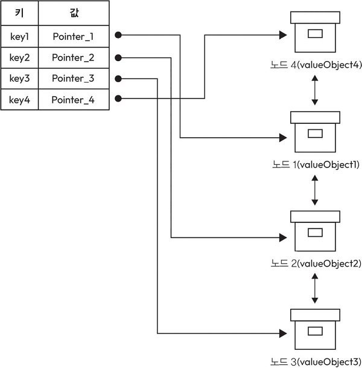
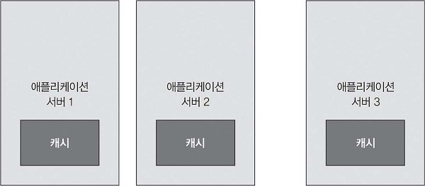
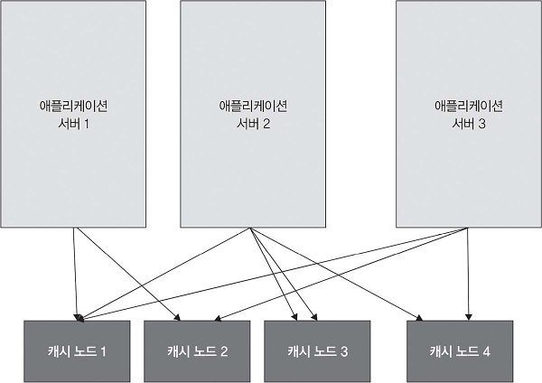

# 6장. 분산 캐싱

애플리케이션의 사용자와 데이터가 늘어나면 같은 데이터를 반복해서 조회하거나 계산하는 작업이 부담이 될 수 있다. 캐싱(caching)은 자주 쓰는 데이터나 계산 결과의 복사본을 더 빠르게 접근할 수 있는 곳에 보관해 이러한 비용을 줄이는 방법이다. 캐시는 메모리, 디스크 등 여러 저장 계층에 둘 수 있으며, 원본 저장소에 다시 접근하는 횟수와 데이터 조회 시간을 줄이는 데 목적이 있다.

애플리케이션이 여러 서버에서 실행되면 캐시도 하나의 서버를 넘어 확장해야 할 수 있다. **분산 캐싱**은 여러 노드에 캐시 데이터를 배치해 더 많은 데이터를 저장하고 여러 애플리케이션 서버가 이를 활용하게 한다. 대신 데이터를 어느 노드에 둘지, 변경 사항을 어떻게 반영할지, 장애가 발생하면 어떻게 처리할지도 설계해야 한다.

## 6.1 캐싱 정의

캐싱은 자주 사용하거나 계산 비용이 많이 드는 데이터를 빠르게 접근할 수 있는 위치에 저장하고 관리하는 기술이다. 원본 데이터베이스를 반복해서 조회하거나 같은 계산을 다시 수행하는 대신, 이미 얻어 둔 결과를 재사용한다.

캐시에 저장하는 데이터는 보통 원본의 복사본이다. 원본은 데이터베이스나 디스크 등에 보관하고, 조회가 빠른 캐시에 필요한 데이터를 임시로 저장한다. 따라서 캐시를 사용할 때는 데이터를 빠르게 찾는 방법뿐 아니라 원본이 바뀌었을 때 복사본을 어떻게 다룰지도 생각해야 한다.

**캐싱의 주요 개념**

- **캐시(cache):** 자주 접근하는 데이터나 리소스의 복사본을 임시로 보관하는 공간이다. CPU 캐시 같은 하드웨어 캐시와 인 메모리 캐시 같은 소프트웨어 캐시가 있다.
- **캐싱된 데이터(cached data):** 캐시에 저장한 데이터의 복사본이다. 보통 데이터베이스나 디스크처럼 영구적으로 저장하는 위치에서 가져와 빠른 조회에 사용한다.
- **캐시 히트(cache hit):** 요청한 데이터가 캐시에 있는 경우다. 원본 저장소까지 접근하지 않고 캐시에 있는 데이터를 반환할 수 있다.
- **캐시 미스(cache miss):** 요청한 데이터가 캐시에 없는 경우다. 이 장의 기본 흐름에서는 원본 저장소에서 데이터를 가져오고, 다음 조회에서 사용할 수 있도록 캐시에도 저장한다.
- **캐시 제거(eviction):** 제한된 캐시 공간에 새 데이터를 넣기 위해 기존 항목을 삭제하는 과정이다. 어떤 항목을 제거할지는 사용 시점이나 사용 빈도 등에 따른 정책으로 결정한다.

캐시 히트에서는 원본 조회를 생략하는 효과를 얻는다. 캐시 미스에서는 원본 조회가 여전히 필요하므로, 자주 요청되는 데이터가 캐시에 남아 있도록 관리하는 것이 중요하다.

### 6.1.1 분산 캐싱 정의

분산 캐싱은 자주 사용하는 데이터를 여러 서버나 노드의 메모리에 나누어 저장하는 방식이다. 같은 데이터를 매번 원본 저장소에서 가져오는 대신 여러 캐시 노드에 저장된 데이터를 이용한다.

하나의 서버에서 사용할 수 있는 메모리와 처리 능력에는 한계가 있다. 캐시를 여러 노드에 배치하면 저장 용량과 요청 처리 부하를 나눌 수 있다. 여러 애플리케이션 서버가 공통 캐시 계층을 이용하도록 구성할 수도 있다.

분산 캐싱은 디스크 기반 저장소를 반복해서 읽을 때 발생하는 입출력 비용을 줄이는 데 초점을 둔다. 캐시 히트에서는 메모리의 데이터를 사용하므로 원본의 디스크 읽기를 피할 수 있다. 다만 다른 서버에 있는 캐시를 조회할 때는 네트워크 통신과 캐시 서버의 처리 시간이 필요하다.

웹 애플리케이션, 데이터베이스와 대규모 데이터 처리 시스템처럼 같은 데이터에 빠르게 접근해야 하는 환경에서 이러한 구조를 활용할 수 있다.

### 6.1.2 분산 캐싱과 일반 캐싱의 차이점

이 절에서 **일반 캐싱**은 비분산/로컬/단일 노드 캐싱을 뜻한다.

**일반 캐싱과 분산 캐싱의 비교**

| 비교 항목 | 일반 캐싱 | 분산 캐싱 |
|---|---|---|
| 적용 범위 | 단일 기기나 서버 안의 로컬 캐시에 데이터를 저장한다. 캐시는 애플리케이션이나 해당 시스템의 일부로 사용된다. | 네트워크로 연결된 여러 노드에 캐시 데이터를 배치한다. 여러 서버가 캐시 계층을 공유할 수 있다. |
| 아키텍처 | 보통 같은 기기의 메모리에 데이터를 두고 애플리케이션이 가까운 위치에서 접근한다. | 여러 캐시 노드로 구성한다. 데이터 배치와 요청 전달을 관리하며 노드를 추가해 확장한다. |
| 확장성 | 단일 서버나 애플리케이션 안에서 캐싱만으로 충분한 성능을 얻을 수 있는 환경에 적합하다. | 많은 데이터와 요청을 여러 노드가 나누어 처리해야 하는 환경에 적합하다. 여러 서버가 공통 데이터를 활용하기에도 유리하다. |
| 활용 사례 | 애플리케이션 내부의 반복 조회, 데이터베이스 접근 감소, 자주 사용하는 데이터의 빠른 재사용에 활용한다. | 대규모 웹 서비스, 분산 데이터베이스, 마이크로서비스처럼 여러 시스템이 데이터를 공유하는 환경에 활용한다. |
| 일관성 및 동기화 | 관리할 캐시 범위가 작아 상대적으로 단순하다. 다만 원본이 바뀌었을 때 로컬 복사본을 갱신하는 문제는 남는다. | 여러 위치의 복사본을 관리하면 동기화와 무효화가 복잡해진다. 변경 사항을 어떤 노드에 어떻게 반영할지 정해야 한다. |

분산 캐싱을 선택하면 단일 서버의 한계를 넘어 확장할 수 있지만, 여러 위치의 데이터를 관리하는 비용이 추가된다. 애플리케이션의 규모와 공유 요구 사항을 바탕으로 로컬 캐시로 충분한지, 별도의 분산 캐시 계층이 필요한지 판단한 뒤 사용하는 것이 적절하다.

### 6.1.3 활용 사례

분산 캐싱의 대표적인 활용 사례는 다음과 같다.

- **웹 애플리케이션:** 사용자 세션, 페이지 구성 요소, 데이터베이스 쿼리 결과처럼 자주 사용하는 데이터를 저장해 같은 정보를 반복해서 만들거나 조회하는 비용을 줄인다.
- **데이터베이스 쿼리 결과:** 자주 실행하는 쿼리의 결과를 저장해 같은 결과를 다시 요청할 때 데이터베이스에서 쿼리를 재실행하는 횟수를 줄일 수 있다.
- **콘텐츠 전송 네트워크(CDN):** 이미지, 동영상, 스타일 시트 같은 정적 콘텐츠를 에지 서버에 저장하고 제공해 사용자는 원본 서버보다 가까운 위치에서 콘텐츠를 받을 수 있다.
- **세션 관리:** 사용자 세션 데이터를 분산 캐시에 저장해 여러 애플리케이션 서버가 필요한 세션 정보를 공통 저장 위치에서 조회하도록 구성한다.
- **API 응답 캐싱:** 자주 요청하는 API 응답을 저장해 재사용해 같은 응답을 만들기 위한 백엔드 처리량을 줄이고 빠르게 반환할 수 있다.
- **실시간 분석:** 자주 조회하는 분석 데이터나 이미 집계한 결과를 저장해 보고서를 생성하거나 대시보드를 갱신할 때 같은 계산을 반복하는 부담을 줄인다.
- **메시지 큐:** 메시지 처리 과정의 중간 결과를 캐시에 보관해 효율을 높인다.

### 6.1.4 분산 캐싱을 사용할 때 장점

- **성능 개선:** 자주 사용하는 데이터를 메모리에서 조회해 데이터 접근 시간을 줄여 반복적인 원본 조회나 계산을 생략할 수 있어 전체 응답 시간이 짧아진다.
- **확장 용이성:** 데이터와 요청이 늘어나면 캐시 노드를 추가해 저장 용량과 처리 부하를 나눌 수 있다.
- **백엔드 시스템의 부하 감소:** 캐시에서 처리한 요청은 데이터베이스나 파일 시스템으로 전달하지 않아도 돼 요청이 급증하거나 DDoS 공격이 발생하는 상황에서도 원본 서버의 과부하를 줄이는 데 도움이 될 수 있다고 설명한다.
- **장애 허용성:** 데이터를 복제하고 다른 노드로 요청을 넘길 수 있게 구성하면 한 캐시 노드의 장애에도 대응할 수 있다.
- **일관된 접근 속도:** 캐시 히트에서는 원본 데이터셋을 다시 조회하거나 복잡한 쿼리를 실행하지 않으므로 반복 요청의 처리 시간을 비교적 일정하게 유지할 수 있다.
- **비용 절감:** 백엔드의 반복 작업이 줄면 데이터베이스나 애플리케이션 서버의 증설 부담을 낮출 수 있다.
- **사용자 경험 향상:** 데이터와 화면을 빠르게 제공해 대기 시간을 줄여 응답 속도가 중요한 애플리케이션에서는 사용자가 체감하는 서비스 품질을 높일 수 있다.

### 6.1.5 분산 캐싱의 한계점

- **일관성 유지의 어려움:** 같은 데이터의 복사본이 여러 노드에 있으면 변경 사항을 일관되게 반영해야 한다. 더 강하게 동기화할수록 노드 사이의 조율과 대기 시간이 늘어날 수 있다.
- **캐시 무효화의 복잡성:** 원본이 바뀌면 기존 캐시를 제거하거나 새로운 값으로 갱신해야 한다.
- **설정과 관리의 복잡성:** 단일 노드 캐시와 달리 노드 구성, 데이터 분산, 통신과 장애 처리를 함께 관리해야 하고 배포와 유지 보수에 필요한 작업도 많아진다.
- **네트워크 부하 문제:** 캐시 조회와 노드 사이의 데이터 교환은 네트워크를 사용하므로 갱신과 복제가 많아지면 대역폭이 필요하고, 노드가 멀리 떨어져 있을수록 통신 지연의 영향도 커질 수 있다.
- **캐시 데이터의 오래됨 문제:** 원본이 갱신되었는데 캐시 반영이 늦으면 이전 값을 반환할 수 있다.
- **데이터 분배의 어려움:** 데이터를 어느 노드에 배치할지 결정하는 전략이 필요하다. 배치가 불균형하면 일부 노드는 과부하가 걸리고 다른 노드는 충분히 활용되지 않을 수 있다.
- **높은 메모리 사용량:** 많은 데이터를 여러 노드의 메모리에 보관하면 메모리 자원이 많이 필요하다. 다른 작업과 자원을 공유하는 경우에는 캐시가 애플리케이션의 가용 메모리에도 영향을 줄 수 있다.
- **비용:** 서버나 클라우드 자원뿐 아니라 배포, 모니터링, 장애 대응과 유지 관리 비용이 발생한다. 백엔드 부하 감소로 얻는 이점과 캐시를 운영하는 비용의 트레이드-오프를 비교해야 한다.
- **데이터 접근 패턴:** 재사용이 거의 없거나 많은 데이터를 고르게 한 번씩만 읽는 패턴에서는 캐시 효과가 작을 수 있다.
- **쓰기 작업에서 한계:** 읽기보다 데이터 갱신이 잦으면 캐시와 복제본을 계속 수정해야 한다.

분산 캐시를 도입할 때는 데이터의 조회·갱신 빈도, 허용할 수 있는 데이터 지연, 메모리와 운영 비용을 함께 살펴본다. 적절한 데이터 분산과 무효화 방식을 선택한 뒤, 실제 성능을 관찰하면서 설정을 조정해야 한다.

<br>

## 6.2 분산 캐시 설계

요구 사항을 먼저 정의하고, 하나의 캐시 안에서 데이터를 관리하는 자료구조를 설계해보자. 이어서 캐시를 애플리케이션과 함께 배포할지 별도로 배포할지 비교하고, 마지막으로 복제를 추가해 가용성을 보완한다.

### 6.2.1 요구 사항 정의

**기능적 요구 사항**

- **`put(key, value)`:** 키와 값의 쌍을 캐시에 추가할 수 있어야 한다.
- **`get(key)`:** 지정한 키에 해당하는 값을 캐시에서 조회할 수 있어야 한다.

**비기능적 요구 사항**

- **높은 성능:** 캐시 데이터에 짧은 지연 시간으로 접근하고 많은 요청을 처리할 수 있어야 한다. 캐시를 조회하고 관리하는 비용이 데이터 재사용의 이점을 크게 줄이지 않도록 한다.
- **높은 확장성:** 데이터, 요청과 사용자 수가 늘어날 때 자원이나 노드를 추가해 대응할 수 있어야 한다. 추가한 자원이 실제로 저장 공간과 요청 처리 능력의 증가로 이어져야 한다.
- **높은 가용성:** 일부 서버에 장애가 발생하거나 노드가 중단되어도 요청 처리를 계속할 수 있어야 한다. 이를 위해 데이터를 어떻게 복제하고 어느 노드가 대신 처리할지 고려한다.

### 6.2.2 설계 과정

**캐싱에 필요한 데이터 구조**

키로 값을 저장하고 찾는 가장 단순한 자료구조로 **해시 맵 또는 해시 테이블**을 사용할 수 있다. 키를 해시해 해당 항목에 접근하므로 캐시의 모든 항목을 차례로 확인하지 않고도 `put`과 `get`을 처리할 수 있다.

하지만 해시 맵에 데이터를 계속 추가할 수는 없다. 캐시가 사용할 수 있는 메모리는 제한되어 있으며, 용량을 넘으면 일부 항목을 제거해야 한다. 따라서 키로 데이터를 찾는 구조와 함께 어떤 데이터를 남길지 결정하는 캐시 삭제 정책(cache eviction policy)이 필요하다.

**캐시 삭제 정책**

캐시가 정해진 용량에 도달하거나 삭제 조건을 충족하면 기존 항목 가운데 제거할 대상을 고른다. 책은 정책을 삽입 순서에 따른 방식과 접근 이력에 따른 방식으로 나눈다.

- **삽입 순서 기반: 접근 시간은 고려하지 않는다.**
  - **선입선출(FIFO, First In, First Out):** 캐시에 먼저 들어온 항목부터 제거한다. 레스토랑 예약 정보를 캐시에 저장하는 사례를 있다. 저장 가능한 수가 제한되어 있고 새 예약 정보를 넣어야 한다면, 가장 먼저 저장한 예약 항목을 캐시에서 제거한다. 이후 얼마나 자주 조회했는지보다 캐시에 넣은 순서가 기준이다.
  - **후입선출(LIFO, Last In, First Out):** 캐시에 가장 나중에 들어온 항목부터 제거한다. 소셜 미디어에서 최근 추천한 스토리를 제거하고 다른 스토리를 저장해 보여 주는 경우 정책을 구분하는 기준은 마지막 접근 시각이 아니라 삽입 순서다.
- **접근 기반: 항목을 사용한 시점이나 횟수를 고려한다.**
  - **가장 최근에 사용한 항목 제거(MRU, Most Recently Used):** 마지막으로 사용한 항목을 먼저 제거한다. 문서 편집 프로그램에서 새 문서를 캐시에 넣기 위해 방금 열거나 수정한 문서를 제거하는 경우 최근 사용을 마친 항목이 당분간 다시 필요하지 않다고 판단해 삭제할 수 있다.
  - **가장 오래 사용하지 않은 항목 제거(LRU, Least Recently Used):** 마지막 접근 이후 가장 오래 지난 항목을 제거한다. 웹 페이지 캐시의 경우 새 페이지를 넣을 공간이 없으면 오랫동안 방문하지 않은 페이지를 제거하고 최근에 사용한 페이지를 남긴다.
  - **최소 사용 빈도 제거(LFU, Least Frequently Used):** 사용 횟수가 가장 적은 항목을 제거한다. 음악 스트리밍 서비스에서 재생한 곡을 캐시에 저장한다면, 공간이 부족할 때 재생 횟수가 가장 적은 곡을 제거하는 방식이다. 최근 사용 시점을 보는 LRU와 달리 사용 빈도를 기준으로 삼는다.

FIFO와 LRU는 둘 다 오래된 항목을 제거하는 것처럼 보이지만 오래됨의 기준이 다르다. 처음 저장한 뒤에도 계속 조회한 데이터는 FIFO에서는 먼저 제거될 수 있지만, LRU에서는 최근 사용 항목으로 남을 수 있다. LIFO와 MRU 역시 각각 마지막 삽입과 마지막 사용을 기준으로 구분한다.

**LRU 캐시 설계하기**

이제 LRU 정책을 적용하는 캐시를 설계한다. 여기서 `N`은 시간 단위가 아니라 **캐시에 저장할 수 있는 최대 항목 수**다.

- 캐시에는 최대 `N`개의 항목을 저장할 수 있다.
- 새로운 항목을 추가하는 작업은 `O(1)` 시간에 처리해야 한다.
- 기존 항목을 삭제하는 작업도 `O(1)` 시간에 처리해야 한다.

이를 위해 **해시 맵과 이중 연결 리스트를 함께 사용한다.**



해시 맵은 요청한 키의 노드를 빠르게 찾는 역할을 한다. 그림에서 해시 맵의 값은 실제 사용자 데이터가 아니라 연결 리스트의 노드를 가리키는 `Pointer_1`, `Pointer_2` 같은 포인터다. 키를 조회하면 이 포인터를 이용해 데이터가 있는 노드로 바로 이동한다.

이중 연결 리스트는 **최근 사용 순서**를 관리한다. 맨 앞에는 가장 최근에 사용한 항목을 두고, 맨 뒤에는 가장 오래 사용하지 않은 항목을 둔다. 이미 있는 항목을 읽으면 그 노드를 앞으로 옮긴다. 새 항목을 추가할 때도 맨 앞에 넣는다. 공간이 부족하면 맨 뒤의 항목을 제거한다.

두 자료구조의 역할을 나누면 키를 찾기 위해 리스트 전체를 훑을 필요가 없다. 해시 맵으로 노드를 찾고, 이중 연결 리스트의 앞뒤 연결을 수정해 그 노드를 이동하거나 삭제할 수 있다.

**valueObject와 해시 맵의 값 구분**

실제 캐싱할 데이터를 해시 맵의 값에 저장하는 포인터와 구분하기 위해 `valueObject`라고 부르자. 사용자 프로필을 저장한다면 `valueObject`는 다음과 같다.

```json
{
  "name": "John Doe",
  "city": "San Jose",
  "state": "California"
}
```

즉, **키 → 해시 맵에 저장된 포인터 → 연결 리스트의 노드 → valueObject** 순서로 실제 데이터를 찾는다.

**키가 캐시에 있는지와 여유 공간에 따른 세 가지 경우**

- **경우 1: 키가 해시 맵에 없고, 캐시에 여유 공간이 있다.**

  캐시 미스가 발생했지만 현재 항목 수가 `N`보다 작다. 기존 항목을 제거할 필요 없이 다음 순서로 추가한다.

  - 데이터베이스에서 해당 키의 `valueObject`를 가져온다.
  - 이 데이터를 가진 노드를 생성해 연결 리스트의 맨 앞에 추가한다. 방금 요청받은 데이터이므로 가장 최근에 사용한 항목이 된다.
  - 해시 맵에 키를 추가하고, 값으로 새 노드를 가리키는 포인터를 저장한다. 다음 조회부터는 이 포인터를 따라 노드를 찾을 수 있다.

- **경우 2: 키가 해시 맵에 없고, 캐시가 이미 가득 차 있다.**

  캐시 미스가 발생했으며 현재 항목 수가 `N`이다. 먼저 기존 항목을 제거해 공간을 만든다.

  - 새 항목을 저장할 공간을 확보해야 한다.
  - 연결 리스트의 맨 뒤에서 가장 오래 사용하지 않은 항목을 확인한다.
  - 해당 항목을 연결 리스트에서 제거하고, 해시 맵에서도 그 키를 삭제한다. 이제 항목 수가 `N`보다 작아졌으므로 첫 번째 경우와 같은 추가 과정을 수행한다.
    - 데이터베이스에서 요청한 키의 `valueObject`를 가져온다.
    - 데이터를 가진 새 노드를 만들고 연결 리스트의 맨 앞에 추가한다.
    - 해시 맵에 키와 새 노드의 포인터를 저장한다.

- **경우 3: 키가 해시 맵에 이미 있다.**

  캐시 히트이므로 원본 데이터베이스에서 다시 가져올 필요가 없다. 대신 이번 접근을 최근 사용 순서에 반영해야 한다.

  - 해시 맵에서 키를 찾고 저장된 포인터를 따라 연결 리스트의 해당 노드로 이동한다.
  - 그 노드를 현재 위치에서 분리해 연결 리스트의 맨 앞으로 옮긴다. 노드에 있는 `valueObject`를 반환한다.

캐시 히트에서는 데이터 내용이 같더라도 사용 순서가 바뀐다. 이 순서를 갱신하지 않으면 자주 읽히는 항목도 리스트 뒤에 남아 제거될 수 있다. 반대로 캐시에서 항목을 삭제할 때는 해시 맵과 리스트를 함께 갱신해야 두 구조가 같은 항목 집합을 나타낸다.

**그림을 이용한 동작 확인**

그림 6-1의 위쪽을 최근 사용 위치로 읽으면 리스트 순서는 `노드 4 → 노드 1 → 노드 2 → 노드 3`이다. 이 상태에서 `key2`를 조회하면 해시 맵의 `Pointer_2`를 따라 노드 2를 찾는다. 노드 2를 맨 앞으로 옮긴 뒤 순서는 `노드 2 → 노드 4 → 노드 1 → 노드 3`이 된다.

그다음 새로운 항목을 넣어야 하는데 캐시가 가득 찼다면 맨 뒤의 노드 3이 제거 대상이다. 이때 노드 3만 연결 리스트에서 빼는 것으로 끝내지 않고, 해시 맵의 `key3` 항목도 함께 지운다.

**O(1)이 가능한 이유와 적용 범위**

해시 맵으로 노드 위치를 찾은 후에는 그 노드의 이전/다음 포인터를 직접 수정한다. 이중 연결 리스트에서 중간 노드를 분리할 때 앞 노드는 뒷 노드를, 뒷 노드는 앞 노드를 가리키도록 바꾼다. 맨 앞에 붙일 때도 필요한 몇 개의 포인터만 수정한다. 전체 항목 수만큼 순회할 필요가 없다.

맨 뒤의 항목도 바로 찾을 수 있도록 리스트의 마지막 노드를 가리키는 참조를 유지한다. 해시 맵에서 제거할 키 역시 즉시 알아낼 수 있어야 한다.

**시스템 통합하기**

앞에서는 캐시 내부의 자료구조를 설계했다. 이제 이 캐시를 어디에 배포할지 결정한다. 같은 LRU 구조라도 애플리케이션 서버와 자원을 공유하는지, 별도 서버에서 요청을 받는지에 따라 접근 비용과 확장 방법이 달라진다.

**방법 1. 애플리케이션 서버와 캐시를 함께 배치하기**

캐시를 애플리케이션 서버와 같은 머신에서 실행한다. 그림에서는 각 애플리케이션 서버 안에 캐시가 하나씩 있다. 애플리케이션 서버를 추가하면 그 서버의 캐시도 함께 추가된다.



- **장점:** 같은 머신 안에서 캐시에 접근하므로 별도 서버까지 통신하는 비용을 줄일 수 있다. 또한 애플리케이션과 캐시를 함께 늘릴 수 있다.
- **한계점:** 머신이 중단되면 그 안의 캐시도 함께 사용할 수 없게 된다. 요청을 다른 애플리케이션 서버로 보내더라도 그 서버에는 필요한 데이터가 아직 캐시되어 있지 않을 수 있다. 이 경우 원본 저장소에서 데이터를 다시 가져와 캐시를 채워야 한다.

장애 후 요청을 넘겨받은 서버의 캐시가 비어 있는 경우 기존 서버에 캐시 데이터가 일부 남아 있더라도 장애 서버가 가지고 있던 항목까지 모두 가지고 있다고 보장할 수는 없다.

**방법 2. 애플리케이션 서버와 독립적으로 구현하기**

캐시를 별도 서버 클러스터에 배포하고 여러 애플리케이션 서버가 네트워크로 접근하게 한다. 애플리케이션 서버의 수와 캐시 서버의 수를 따로 조정할 수 있다.



- **장점:** 캐시 요청량이나 동시 처리량이 늘어나면 캐시 서버를 독립적으로 추가할 수 있다. 캐시 용량을 늘리기 위해 애플리케이션 서버까지 같은 비율로 늘릴 필요가 없다.
- **한계점:** 여러 캐시 서버에 데이터를 나누면 요청한 키가 어느 서버에 있는지 찾아야 한다.

키로 서버를 선택하는 규칙이 읽기와 쓰기에 일관되게 적용되어야 한다. 키를 `hash(key) % m`으로 배치한다면 서버 수 `m`이 바뀔 때 많은 키의 목적지가 달라질 수 있다. 일관된 해싱은 노드 구성이 바뀔 때 이동할 키의 범위를 줄일 수 있다.

**어떤 방법을 선택해야 할까?**

서버 통합형과 스탠드얼론형은 성능, 확장성, 자원 배분과 운영 방식에서 다른 선택을 요구한다. 스탠드얼론(standalone)은 애플리케이션과 분리해 독립적으로 운영하는 구성을 뜻한다.

**서버 통합형 캐시와 스탠드얼론 캐시의 선택 기준**

| 비교 항목 | 서버 통합형 | 스탠드얼론형 |
|---|---|---|
| 성능 요구 사항 | 같은 머신에서 접근하므로 원격 통신 비용을 줄일 수 있다. 캐시 조회 지연을 줄이는 데 유리하다. | 캐시를 별도로 확장해 높은 요청량과 처리량에 대응하기에 유리하다. |
| 확장성 | 애플리케이션과 캐시를 함께 늘려도 요구 사항을 충족하는 환경에 적합하다. | 애플리케이션과 무관하게 캐시 노드와 자원을 늘릴 수 있다. |
| 자원 공유 | 머신의 메모리와 CPU를 애플리케이션과 캐시가 함께 사용한다. 기존 자원을 활용할 수 있지만 사용량 배분이 필요하다. | 자원을 분리해 캐시와 애플리케이션이 같은 머신의 자원을 두고 경쟁하는 상황을 줄인다. |
| 유연성 | 통합과 설정이 비교적 간단하지만 애플리케이션의 배포 구조에 영향을 받는다. | 캐시 솔루션과 구성을 독립적으로 선택하고 변경하기 쉽다. |
| 의존성 및 독립성 | 한 머신의 장애나 자원 문제가 애플리케이션과 캐시에 함께 영향을 줄 수 있다. | 배포와 장애 범위를 나눌 수 있다. 다만 애플리케이션은 캐시 서비스의 응답에 의존한다. |
| 운영 복잡성 | 구성 요소를 함께 배포하고 관리하기는 쉽지만 캐시만 별도로 조정하는 데 제약이 있을 수 있다. | 캐시 클러스터의 설정과 관리가 추가된다. 대신 캐시를 독립적으로 수정하거나 업데이트할 수 있다. |
| 인프라와 비용 | 기존 애플리케이션 서버의 자원을 공유하므로 별도 캐시 인프라를 줄일 수 있다. | 별도의 서버와 네트워크 자원이 필요해 인프라 비용이 늘어날 수 있다. |
| 네트워크 지연 허용성 | 원격 캐시 조회에 필요한 지연을 줄이는 것이 중요한 환경에 적합하다. | 네트워크로 캐시에 접근하는 비용을 허용하면서 공유와 독립 확장을 얻으려는 환경에 적합하다. |

현재 요청량뿐 아니라 앞으로 애플리케이션과 캐시의 사용량이 같은 비율로 증가할지도 살펴봐야 한다. 캐시만 더 크게 늘려야 하는 요구가 있다면 독립적인 자원 배분이 중요해진다. 반대로 같은 머신의 캐시만으로 충분하고 원격 조회 지연을 줄이는 것이 우선이라면 서버 통합형을 고려할 수 있다.

**요구 사항에 맞게 설계되었는지 점검하기**

해시 맵과 연결 리스트로 데이터를 저장하고 조회할 수 있으므로, `put`과 `get`의 기능적 요구 사항을 충족했다고 평가한다. 비기능적 요구 사항은 다음과 같이 확인한다.

- **높은 성능:** 해시 맵으로 키를 찾고 연결 리스트의 포인터를 수정하므로 항목 관리 연산을 평균 `O(1)`로 수행할 수 있다.
- **높은 확장성:** 캐시 서버를 추가하고 데이터를 적절히 샤딩하면 저장 공간과 처리량을 늘릴 수 있다.
- **높은 가용성:** 복제하지 않은 상태에서는 아직 부족하다. 서버 하나가 중단되면 그 서버에 저장한 캐시 항목을 모두 사용할 수 없게 된다.

**데이터 복제로 가용성 보완하기**

같은 데이터를 서로 다른 서버에 복제하면 일부 서버가 중단되어도 다른 복사본을 이용할 수 있다. 주 복사본 하나와 보조 복사본 두 개, 총 세 개를 서로 다른 서버에 저장하는 구성이 일반적이다.

쓰기는 먼저 주 복사본(primary copy)에 반영하고, 그 변경을 두 보조 복사본(secondary copy)에 전달한다. 보조 복사본은 주 서버 장애에 대비할 뿐 아니라 읽기 요청이 많을 때 부하를 나누는 데도 활용할 수 있다.

복제를 추가하면 모든 복사본이 같은 시점에 같은 값을 가지는지 고려해야 한다. 보조 복사본에 변경이 반영되기 전에 읽으면 이전 값을 볼 수 있다. 더 많은 복제 완료를 기다리면 최신 상태를 확인하는 데 도움이 되지만, 느리거나 응답하지 않는 노드가 요청 처리를 지연시킬 수 있다. 이 단계에서 가용성과 일관성에 관한 선택이 다시 필요해진다.

<br>

## 6.3 대표적인 분산 캐시 솔루션

분산 캐시 솔루션의 대표적인 사례로 레디스(Redis)와 맴캐시드(Memcached)가 있다. 두 솔루션 모두 메모리에서 데이터를 빠르게 저장하고 조회하는 데 활용하지만, 제공하는 데이터 구조와 기능, 데이터 보존 방식에 차이가 있다.

### 6.3.1 레디스

Redis는 문자열, 리스트, 집합, 해시 등 여러 데이터 구조를 지원하는 인 메모리 데이터 저장소다. 단순히 키로 값을 저장하고 가져오는 것에 더해 데이터 구조에 맞는 작업을 수행할 수 있다.

데이터를 영구적으로 유지하는 옵션을 제공하며, 발행·구독 메시징, 트랜잭션, Lua 스크립팅도 지원한다. 이러한 기능을 바탕으로 Redis를 캐시뿐 아니라 메시지 브로커나 데이터베이스 용도로도 활용할 수 있다.

**활용 사례**

- **웹 애플리케이션 캐싱:** 자주 요청하는 데이터를 메모리에 보관하고 빠르게 반환해 같은 데이터를 얻기 위한 백엔드의 반복 작업을 줄인다.
- **실시간 분석:** 빠른 데이터 처리와 조회가 필요한 분석 환경에 활용해 자주 확인하는 데이터나 분석에 필요한 상태를 메모리에서 다룰 수 있다.
- **세션 저장소:** 사용자 세션 데이터를 저장하고 조회해 여러 애플리케이션 서버가 세션 정보를 공통으로 관리하는 데 활용할 수 있다.
- **리더보드 및 카운팅 시스템:** 순위 정보를 계산하고 조회하거나, 계속 바뀌는 수치를 집계하는 작업에 활용한다.

**확장성**

데이터를 여러 노드에 나누어 저장하는 **샤딩**을 이용해 확장할 수 있다. 데이터의 담당 범위를 나누면 한 서버에 집중되는 저장 공간과 처리 부하를 여러 서버로 분산할 수 있다.

### 6.3.2 맴캐시드

Memcached는 메모리에 키-값 데이터를 저장하는 캐싱 솔루션이다. 가볍고 단순한 구조, 사용하기 쉬운 인터페이스와 수평적 확장성이 특징이다.

애플리케이션이 필요한 데이터를 키에 연결해 저장하고, 이후 같은 키로 읽는 방식으로 사용한다. 데이터베이스 조회 결과나 API 호출 결과처럼 한 번 얻은 데이터를 다시 활용하려는 경우에 적합하다.

**활용 사례**

- **웹 애플리케이션 캐싱:** 자주 사용하는 데이터를 저장해 반복 요청에 빠르게 응답한다.
- **세션 저장소:** 사용자 세션 데이터를 저장하고 조회하는 데 활용한다.
- **데이터베이스 결과 캐싱:** 쿼리 결과를 캐시에 보관하고 같은 결과를 요구하는 요청에 재사용한다. 데이터베이스에서 같은 쿼리를 반복하는 부담을 줄인다.
- **단순 키-값 분산 시스템:** 복잡한 데이터 구조 조작보다 키를 기준으로 값을 저장하고 읽는 기능이 필요한 환경에 활용한다.

**확장성**

- 캐시 서버를 추가해 사용할 수 있는 메모리와 처리 능력을 늘리는 수평적 확장을 지원한다.
- 일관된 해싱을 이용해 데이터를 여러 노드에 분산할 수 있다. 키를 기준으로 담당 서버를 선택하고, 서버 구성이 바뀔 때 다시 배치해야 할 키의 범위를 줄일 수 있다.


### 6.3.3 레디스와 맴캐시드 중 어떤 것을 선택해야 할까?

- **사용 목적:** Redis는 다양한 자료구조와 추가 기능을 제공하므로 활용 범위가 넓다. Memcached는 단순한 키-값 캐싱을 간단하게 구성하려는 경우에 적합하다. 애플리케이션이 캐시에 값을 넣고 읽기만 하는지, 저장된 구조에 여러 연산을 수행해야 하는지 살펴본다.
- **데이터 보존 여부:** Redis에는 데이터를 영구 저장할 수 있는 옵션이 있다. Memcached는 기본적으로 메모리 캐시이므로 데이터를 영구 보관하는 저장소로 취급하지 않는다. 캐시의 데이터를 다시 만들 수 있는지, 재시작이나 장애 뒤에도 보존해야 하는지에 따라 요구 사항이 달라진다.
- **다양한 데이터 구조 지원:** 리스트, 집합, 해시 등 여러 데이터 구조와 조작 기능이 필요하면 Redis가 더 많은 선택지를 제공한다. 단순한 값 조회를 넘어 어떤 데이터 연산이 필요한지가 판단 기준이다.
- **사용 편의성:** Memcached는 단순한 기능과 인터페이스 덕분에 통합과 사용이 비교적 쉽다. Redis는 활용할 수 있는 기능이 많은 만큼 선택한 기능과 설정을 이해하는 학습이 필요하다.

선택할 때는 애플리케이션의 요구 사항, 데이터 처리의 복잡성, 데이터 보존 필요성, 사용 편의성과 커뮤니티 지원의 우선순위를 정한다.