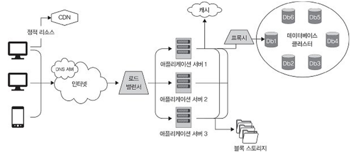

# 1강: 시스템 설계의 기본

강의 번호: 요즘 개발자를 위한 시스템 설계 수업
유형: 스터디 그룹
복습: No

<aside>
🚨

</aside>

## 1.1 시스템 설계의 정의

**시스템 설계**는 특정 요구 사항을 이루기 위해 시스템의 아키텍처나 구성 요소, 인터페이스 및 기타 여러 **특성을 정의**하는 과정

1.1.1 소프트웨어 시스템

원하는 기능을 실행할 수 있는 연관된 소프트웨어 애플리케이션으로 구성
언어 선택 ~ 유지보수까지 설계 과정에서 고려되어야 함

1.1.2 분산 소프트웨어 시스템

중앙 집중형 소프트웨어 시스템: 모든 구성 요소가 하나의 기기에 위치
vs 분산 소프트웨어 시스템: 여러 독립적인 컴포넌트, 프로세스, 노드가 지리적으로 다른 위치에 있는 여러 기기와 네트워크에 걸쳐 있음

각 구성 요소들: 원격 프로시저 호출(RPC), 메시지 전달, 발행/구독 등의 프로토콜로 소통
**주요 요구 사항: 확장성, 가용성, 장애 허용**
예시: 클라우트 컴퓨팅 플랫폼(ex. AWS), P2P 네트워크(ex. 카카오톡 파일 전송), 분산 데이터베이스(ex. 넷플릭스 → 안정적, 빠른 서비스), 콘텐츠 전송 네트워크(CDN / ex. 유튜브)
ex) 넷플릭스: DB에 어디까지 봤는지 정보 저장 → CDN 서버에서 콘텐츠 받아오기

1. 사용자가 정적 리소스 요구: CDN에 이미 캐싱된 데이터를 전달
2. 다른 요청: DNS 서버 → 로드밸런서 → 사용량 적은 서버로 연결(라우팅) → 응답위해 스토리지, DB에 통신

1.1.3 시스템 설계의 이해

시스템 설계: 소프트웨어 시스템의 아키텍처, 컴포넌트, 모듈, 인터페이스 및
상호 작용을 정의하여 **기능적·비기능적 요구 사항을 채우는 과정**
요구 사항 → 소프트웨어 시스템의 구조, 구현, 유지 보수 방식 설명하는 청사진, 계획으로 변환
❗목표: 쉬운 이해, 유지 보수와 확장 용이, 성능, 확장성, 신뢰성, 보안 요구 사항 지킬 수 있는 설계 + 유연한 대응

1. 요구 사항 분석: 기능적**·**비기능적 요구사항 분석 / 주로 데이터 조회, 저장 패턴 분석
2. 상위 수준의 아키텍처 설계: 전반적인 구조 설계 / 컴포넌트, 모듈, 인터페이스 등
3. 하위 수준의 아키텍처 설계: 내부 구조, 동작 설계 / 각 컴포넌트의 핵심 비즈니스 로직 구현할 알고리즘 정의, 상호 작용 설계
4. 사용자 인터페이스 설계: API 통신으로 백엔드 서비스와 통신할 인터페이스 설계 (보통 상위 수준)
5. API 설계: 인터페이스나 프론트 ↔ 백엔드 상호작용 하기위해 적절한 API 설계
6. 데이터베이스 설계: 데이터 구조, 저장 메커니즘 설계 / SQL, HBase 등

## 1.2 시스템 설계의 다양한 유형

1.2.1 상위 수준 시스템 설계

- 시스템 아키텍처: 전반적인 구조 / 컴포넌트, 구성 요소  간 **통신 방식, 관계**
[아키텍처 설계 패턴]
****- 모놀리식: 모든 시스템 구성 요소 결합한 하나의 독립적인 애플리케이션 (전통적 방법)
- 클라이언트-서버: 클라이언트가 하나 이상의 서버에 서비스 요청하는 분산 아키텍처
- 마이크로서비스: 네트워크를 통해 통신하는 작고 독립적인 여러 서비스로 구성된 모듈형 아키텍처
- 이벤트 주도: 비동기 이벤트 또는 메시지로 각 구성 요소가 상호 작용
+ 고려사항: 확장성, 유지 보수성, 신뢰성(안정적으로 중단 없이 동작, 문제가 발생하더라도 기능을 지속적으로 유지할 수 있는지), 지연 시간(아키텍처가 시스템의 응답 시간과 성능에 미치는 영향)
→ 선택할 때 이유와 적합성을 분명히 정의, 시스템 목표와 일치하는지 확인하는 데 중점을 두기
- 데이터 흐름: 데이터 수집, 저장, 처리 과정
[고려사항]
- 데이터 수집: 데이터 어디서 오는 지, 어떻게 가져올 것인지 (ex. API로 불러오기)
- 데이터 저장: 데이터에 얼마나 자주 접근하는지, 검색 성능 중요한지, 데이터 일관성있게 유지되어야 하는지
- 데이터 처리: 데이터 변환, 분석, 요약 과정 / 필요한 컴퓨팅 자원, 처리 과정에서 발생할 수 있는 지연이나 병목 현상 미리 고려
- 데이터 검색: 사용자가 처리된 데이터를 어떻게 접근할지 / 응답 시간, 캐시 사용해 속도 높일지, 부하를 어떻게 나눌지 등의 전략 고민 필요
- 확장성: 작업량 많아져도 성능 저하 없이 처리 가능하도록
- 수직 확장성: CPU, 메모리, 저장소 등 단일 컴포넌트에 **자원 추가**하여 성능 향상
- 수평 확장성: 작업 부하를 여러 컴포넌트나 인스턴스로 분산
✳️ 로드밸런싱, 캐싱, 데이터베이스 분할, 스테이트리스한 서비스(사용자가 이전에 뭘 했는지 서버가 저장하지 않음) 활용 검토
- 장애 허용 시스템: 오류 발생해도 제 기능 수행 가능한지 
[고려사항]
복제(동일 데이터, 서비스 여러 개로 복사), 중복성(중요한 구성요소를 여분으로 준비), 점진적 성능 저하(장애 발생 시 일부 기능만 포기), 모니터링, 자가 복구 등

1.2.2 하위 수준 시스템 설계

- 알고리즘: 계산, 데이터 처리, 문제 해결을 수행하는 단계 별 절차
효율적인 알고리즘 선택 → 시스템 성능, 자원 사용, 유지 보수성 최적화에 필수
[고려 사항]
- 시간 복잡도: 입력데이터의 크기와 **연산 횟수**의 상관관계
- 공간 복잡도: 입력데이터의 크기와 사용하는 **메모리** 간의 관계
- 트레이드오프: 요구사항과 제약에 따라 시간복잡도와 공간복잡도 간의 균형 맞추기
- 데이터 구조: 메모리에서 데이터 구성, 관리에 사용 → 시스템 성능과 자원 사용에 영향
예시) 배열, 연결 리스트, 해시 테이블, 트리, 그래프 등
[고려 사항]
- 데이터 접근 방식: 데이터 접근 빈도, 형태 / 읽기, 쓰기, 업데이트 등 작업
- 쿼리 성능: 검색, 삽입, 삭제 등의 작업에 대한 시간 복잡도
- 메모리 사용량: 데이터 구조, 내용물을 저장하는 데 필요한 메모리양
- API: 시스템 내 구성 요소 간 통신에 사용하는 규약
[고려 사항]
- 일관성: 모든 구성 요소에서 API 설계가 일관성을 유지하여 누가 보더라도 이해, 사용하기 쉬워야
- 유연성: 기존 기능에 영향 주지 않으며 향후에 생길 변경 대비
- 보안: 인증, 권한 부여, 입력 유효성 검사 등을 구현해 무단 접근, 데이터 유출에 노출되지 않도록
- 성능: API의 지연 시간을 최소화, 자원 효율적으로 사용할 수 있도록 최적화
- 코드 최적화: 성능, 가독성, 유지 보수성 향상 시키기
[고려 사항]
- 리팩토링: 기존 기능 유지하며 코드 구조 재구성하여 가독성, 유지 보수성 끌어올리기
- 루프 언롤링: 반복문을 개별 구문 여러 개로 대체 → 반복문에서 발생하는 오버헤드 줄이고 성능 향상
- 메모이제이션: 이전 실행 결과 저장해 동일한 결과를 다시 계산하는 시간 절약법
- 병렬 처리: 작업을 작고 개별적인 하위 작업으로 나눠 동시에 실행해 전체 처리 시간 줄이는 기법

1.1.3 업계에서 시스템 설계가 갖는 중요성

1. 요구 사항에 대한 명확한 이해: 설계하면서 자연스럽게 요구 사항 이해
2. 협업의 시너지 효과: 팀원들과 설계 과정을 공유하고 참여하며 소통 활발, 협업 효율 높아짐. 팀원뿐 아니라 영업부, 마케팅 부와 같은 이해 관계자 간 소통과 조율이 원활
3. 설계 검토 및 피드백: 설계가 있으면 팀원, 아키텍트가 설계 검토에 쉽게 참여 가능 → 문제 논의, 피드백 반영하기 수월
4. 높은 확장성: 요구 사항에 맞춰 시스템의 확장 가능성 파악, 필요에 따라 확장 및 축소할 수 있는 구조 설계 가능
5. 성능: 다양한 부하, 여러 사용 방식에서 최적 성능 발휘할 수 있도록 함. 성능에 악영향 주는 병목 현상을 사전에 방지. 사용자 만족도(응답 시간, 신뢰성, 가용성 등) 보장
6. 비용 효율성: 꼼꼼하게 설계 → 버그 발생 가능성이 낮아 오류와 재작업이 줄어듦

1.1.4 실제 사례

금융: 신뢰성이 뛰어난 시스템 필요 → 설계 진행하면 안정성, 신뢰성, 효율성 갖출 수 있음
전자상거래: 대량의 온라인 거래, 재고 관리 등 복잡한 처리 시스템 필요 → 사용자 친화적, 안전, 확장 가능한 서비스
의료: 안전, 신뢰성, 규제 기준 준수
제조업: 생산 공정 제어, 장비 성능 모니터링, 재고 관리 → **통합적**, 효율적, 신뢰성
운송업: 물류 관리, 배송 추적, 경로 최적화 → 신뢰성, 안전, 대량의 데이터 처리

⇒ 신뢰성있고 효율적이며 사용자 친화적으로 작동하여 더 나은 **비즈니스 성과**를 이끌어 낼 수 있음