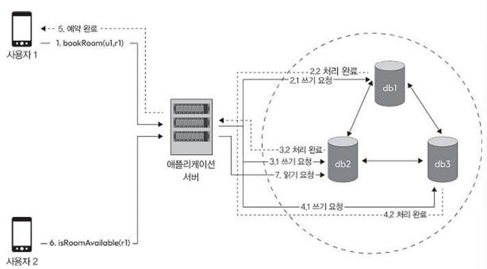

# 2강: 분산 시스템의 속성

강의 번호: 요즘 개발자를 위한 시스템 설계 수업
유형: 스터디 그룹
복습: No

<aside>
🚨 분산 시스템의 속성이 분산 시스템을 설계하는 과정에서 어떻게 작용하는지
요구 사항 준수하려면 각 속성 간 적절한 균형맞추기

</aside>

## 2.1 호텔 객실 예약 시스템

상황: u1이 호텔 방 예약하는 동안 u2가 동일한 방의 예약 여부를 확인
db 3개와 연동 중(쓰기 작업 결과 직접 쓰기 또는 db 자체 복제 기능)

쓰기 요청: u1이 방 예약 →  RoomAvailable 앱 서버에 (u1, r1) 예약 요청 → 서버: 하나 또는 여러 레플리카에 데이터 기록

- 직렬 동기 쓰기: 서버가 먼저 db1에 데이터 쓰고 답 받은 후에 db2에 쓰고 응답, 마지막으로 db3에 쓰고 응답
→ 객실 예약 완료까지 기다려야하는 지연 시간 길어짐
- 직렬 비동기 쓰기: 서버가 db1에 데이터 쓰고 확인 응답받은 후 즉시 클라이언트 응답 → 이후에 다른 레플리카 비동기적으로 업데이트
→ 지연 시간 낮음
- 병렬 비동기 쓰기: 서버가 데이터베이스 모두 동시에 업데이트 but 모든 처리 완료 응답 기다리지 않고 일부 응답 받은 후 클라이언트한테 확인 
→ 지연 시간은 낮지만 스레드 자원 사용량이 높다
- 메시징 서비스(카프카 등): 메시징 서비스에 데이터 기록한 후 클라이언트에 바로 응답 → 이후 메시징 서비스에 저장된 데이터 읽어와서 데이터 적용
→ 지연 시간이 가장 짧고, 쓰기 요청 아주 많아도 문제없이 처리 가능

읽기 요청: u2가 방 예약 가능 여부 확인 → RoomAvailable 앱 서버에 (u2, r1) 예약 가능 여부 요청 → 서버: 하나 또는 여러 레플리카에서 데이터 조회

- 하나의 레플리카: 하나 db에서만 읽어와서 반환
- 일부 레플리카: 과반수에 해당하는 레플리카에서 데이터를 읽어와 일관성을 확인한 후 클라이언트에 반환
- 모든 레플리카: 모든 레플리카에서 읽은 후 반환

→ 하나만 읽으면 오래된 데이터 반환될 수 있음, 모든 거 읽으면 오래 걸림(트레이드 오프), 몇 개만 골라 읽으면 일관성, 속도 사이에서 균형있는 방식일 수 있음

## 2.2 일관성

여러 노드에 데이터 복제, 분산되어 있더라도 시스템 내 모든 노드가 항상 동일한 상태나 데이터 참조하도록하는 개념

2.2.1 강한 일관성

모든 노드가 공유하고 있는 데이터 업데이트를 동일한 순서로 처리하도록 보장
쓰기 작업 이후 모든 읽기 작업이 항상 최신 값 반환하도록 함. 
→ 엄격한 동기화, 작업 순위 유지되며 시스템이 선형적 상태

분산 시스템에서의 강한 일관성
→ 여러 노드가 동시 작업을 처리할 때 서로 데이터의 업데이트 순서 맞추는 방법 사용
ex) 분산 트랜잭션(여러 노드/DB에 걸친 하나의 작업을 일관되게 완료), 분산 잠금(여러 노드가 동시에 같은 자원을 수정하지 못하도록 접근 권한을 조정), 팩소스, 래프트 (분산된 노드들이 하나의 결정에 합의하도록 하는 알고리즘)

[장점]
- 개발자 입장에서 시스템 예측 가능, 직관적인 방식으로 동작한다고 예상하며 개발 가능
- 시스템 상태에 대해 확신 갖고, 작업 수행하는 순서에 따라 시스템 어떻게 반응할지 쉽게 추측 가능
[단점]
-각 노드가 데이터의 업데이트 순서에 동의할 때까지 기다려야 하기에 처리 속도가 느리거나 시스템 가용성이 떨어짐
⇒ 은행 시스템 같은 민감한 데이터를 다루는 서비스에서 사용하기 좋음

2.2.2 최종 일관성

시스템 내에서 일시적이나마 데이터 불일치를 허용하지만, 시간이 지나면 모든 레플리카 데이터베이스나 노드가 결국 동일한 상태에 도달하도록 보장하는 방식
⇒ 시스템에 각 노드를 비동기적으로 업데이트하지만 최종적으로 모든 레플리카가 동일한 값을 가짐

강한 일관성과 달리 모든 노드가 실시간으로 동일한 순서로 데이터 업데이트되지 않아도 됨.
대신 일정 시간 동안 각 노드가 서로 다른 데이터를 가지고 있을 수 있음 (일시적인 데이터 불일치)
→ 네트워크 지연, 메시지 전달 속도, 레플리카 동기화 같은 문제 때문에 생길 수 있음

최종 일관성 문제 해결 방법
- 충돌 해결: 다른 노드에서 동일한 데이터에 대해 동시 업데이트 하는 경우, 충돌 해결 전략을 적용해 차이를 조정하고 데이터를 일관된 상태에 도달하게 함
- 데이터 복제: 데이터를 여러 노드에 복사해 유지, 하나의 노드에서 업데이트되면 그 변경 사항이 다른 레플리카에 비동기적으로 전달되도록 함.
- 가십 프로토콜: 시스템 전체에 업데이트가 서서히 전파될 수 있도록 하는 방법(소문 퍼트리듯)

[장점]
- 가용성, 확장성을 높이고, 클라이언트에 더 빠른 응답 시간을 줄 수 있음
- 네트워크 분할이나 일시적인 장애 발생해도 각 노드가 계속해서 운영되며 요청을 처리할 수 있음
- 작업 부하를 여러 레플리카에 분산할 수 있어 시스템 성능이 향상됨
[단점]
- 일시적인 데이터 불일치나 충돌을 처리해야만 함
- 애플리케이션이 분산 시스템에서 각 노드가 동일한 데이터에 대해 서로 다른 버전이나 값을 가질 수 있는 상황을 처리할 수 있어야 함 (ex. 충돌 해결, 버전 관리, 조정 알고리즘)

❓강한 일관성 vs 최종 일관성
→ 즉각적이고 엄격한 동기화 필요한 경우: 강한 일관성
     일시적인 데이터 불일치 감수하는 대신 가용성과 확장성 높이기: 최종 일관성

n = 레플리카의 총 개수
r = 데이터를 읽을 때 참조할 레플리카 수
w = 데이터를 쓸 때 반영할 레플리카 수
⇒ 항상 r + w > n을 만족할 때 강한 일관성이 보장되며, 그렇지 않을 때는 최종 일관성이 적용됨

## 2.3 가용성

시스템에 장애나 오류가 발생하더라도 사용자에게 서비스를 지속적으로 제공할 수 있는 능력
→ 언제나 요청에 응답할 준비가 되어 있으며, 시스템 내부에서 발생하는 문제와 상관없이 사용자에게 서비스를 제공할 수 있는 시스템

- 다중화(중복성): 시스템의 일부 구성 요소에 장애가 발생해도 시스템이 계속 작동할 수 있도록 여러 구성 요소나 자원을 중복해두기
다양한 수준에서 구현 할 수 있음 
- 하드웨어 중복성: 전원 공급 장치, 네트워크 연결 장치를 여러 개 준비 → 하나가 고장 나더라도 다른 장치가 대신 작동 가능
- 소프트웨어 다중화: 프로세스, 서비스를 여러 개 준비해 두기 → 하나의 소프트웨어가 중단되더라도 다른 것이 이어서 서비스를 제공할 수 있음
- 복제(레플리케이션): 데이터를 여러 노드에 복제해 둬야 일부 노드에서 장애가 발생하더라도 다른 노드가 해당 기능을 이어받아 시스템을 계속 운영할 수 있음
[복제 방식]
1. 액티브-패시브: 한 노드가 주 노드로 작동, 나머지 노드는 백업으로 대기 (복제 노드는 일 안하고 대기)
2. 액티브-액티브: 여러 노드가 동시에 요청 처리하도록 구성해 가용성 높이는 방식
- 로드 밸런싱: 여러 노드에 작업량 고르게 분배해 특정 노드에 과부하 걸리지 않도록하는 방식
들어오는 요청을 현재 사용 가능한 노드로 분배
⇒ 자원 활용 최적화, 모든 요청을 일부 노드에서만 처리할 때 발생하는 CPU, 메모리, I/O 병목 현상 방지
- 장애 감지 및 복구: 노드나 구성 요소의 장애를 감지하고 해결할 수 있는 매커니즘을 가지고 있음
하트비팅(heartbeating), 모니터링, 헬스 체크 등의 기법으로 장애가 발생한 노드를 파악, 복구 메커니즘으로 장애 발생한 구성 요소를 복원하거나 교체할 수 있도록 함.
- 장애 전환 및 복귀
장애 전환: 문제가 발생한 노드나 장치의 요청을 자동으로 백업 노드나 다른 노드로 돌리는 방식
복귀: 문제가 해결되어 원래 노드나 장치 사용 가능하게 되면 요청을 다시 그쪽으로 돌려놓는 방식

높은 가용성을 확보하려면 복잡성이 증가하거나 자원 소모가 늘어나고, 일관성 문제나 성능 저하 같은 조정이 필요할 수 있음
→ 시스템의 요구 사항에 맞게 신중하게 고려해야 함

## 2.4 파티션 허용성

2.4.1 네트워크 파티션

네트워크 파티션: 네트워크 장애나 문제로 일부 노드나 컴포넌트가 시스템의 다른 부분과 연결이 끊겨 서로 접근하거나 데이터를 주고받지 못하는 상태
⇒ 분산 시스템을 서로 통신할 수 없는 여러 독립된 그룹이나 조각으로 나누는 것. 각 그룹은 서로 정보를 주고받을 수 없는 고립된 상태가 됨.
네트워크 장애, 하드웨어 고장, 시스템 버그, 네트워크 설정 변경 시 분리 발생, 네트워크 공격 등으로 발생 가능

→ db1, db3에 대한 쓰기 작업이 db2로 전달 되지 않아 사용자가 db2를 읽으면 오래된 데이터 반환됨

네트워크 파티션 발생하면 다른 파티션에 있는 노드와 연결이 끊겨 일관성이 떨어지고 데이터 충돌 등 문제 발생할 수 있으며 일관성, 가용성, 장애 허용성 같은 중요한 특성 유지하는 데 어려움이 생김

2.4.2 파티션 허용성

네트워크 장애나 파티션이 발생하더라도 시스템이 계속 정상적으로 작동할 수 있는 능력을 의미
네트워크 파티션으로 고립된 노드는 독립적으로 기능하며 각자 클라이언트 요청을 처리할 수 있으며, 시스템의 나머지 부분도 평소처럼 동작 가능 → CAP 정리 (파티션 허용성 갖춘 시스템 어떻게 작동하는지, 일관성과 가용성 사이에서 어떤 선택해야 하는지)

클라우드 컴퓨팅, 분산 데이터베이스, 대규모 분산 애플리케이션처럼 가용성이 중요한 상황에서 매우 중요한 역할을 함. 
장애가 발생한 상황에서도 시스템 성능이 급격히 떨어지지 않고 점진적으로 저하되도록 설계되어 시스템이 더 견고하고 예기치 못한 오류에도 강한 구조를 갖추게 됨.

## 2.5 지연 시간

분산 시스템에서 들어온 요청에 대한 응답이 돌아오기까지 걸리는 시간
시스템 성능, 사용자 경험에 영향을 미치기 때문에 분산 시스템 설계에서 중요한 지표

시스템 내 노드 간 거리, 네트워크 혼잡도, 각 노드에서 처리 시간, 전송되는 데이터의 크기와 복잡성 등 여러 요인에 영향을 받음. 하지만 원인을 안다고 해도 시스템의 여러 부분을 최적화해야 하는 일이라 지연 시간을 줄이는 일은 쉽지 않음.

- 네트워크 최적화: 네트워크 인프라 개선하는 방법
빠른 연결 사용, 네트워크 홉 수 줄이기, 네트워크 혼잡도 최소화
- 캐싱: 시스템의 여러 위치에서 캐싱 메커니즘을 적용해 자주 들어오는 요청은 데이터나 콘텐츠를 사용자에게 더 가까운 곳에서 제공하여 응답 시간 개선 가능
- 데이터 지역화: 데이터를 사용자와 가까운 위치에 배치해 지연 시간 줄이기
데이터 복제, edge 컴퓨팅, 콘텐츠 분산 전략 등을 활용
- 비동기 통신: 비동기 통신 패턴을 사용해 컴포넌트 간 결합 줄이고, 병렬 처리나 논블로킹 상호 작용(느린 작업 기다리지 않음)으로 지연 시간 영향 줄일 수 있음
- 성능 튜닝: 시스템이 더 빠르게 작동하도록 설정 조정하고 데이터베이스 쿼리를 최적화해 알고리즘과 코드 실행 방식 개선하는 작업

지연 시간을 최소화하는 것이 바람직하나 완전히 없앨 수는 없음.
분산 시스템은 본질적으로 네트워크 지연이 발생하는 환경에서 운영되므로 지연 시간 극도로 줄이려다보면 다른 시스템 특성에 영향 줄 수 있기 때문에 적절한 균형을 찾아야 함.

## 2.6 내구성

분산 시스템에서 장애나 오류가 발생하더라도 시스템에 저장된 데이터가 손실되지 않도록 보장하는 능력
복제, 백업 같은 방식 사용해 한 노드에 장애 발생하더라도 다른 노드에서 데이터 복구 가능하도록 함

금융, 의료 관련 데이터 저장 시스템, 메시징 플랫폼 사용하는 sns 같이 지속적으로 서비스 운영해야 하는 곳에서도 내구성 반드시 필요함
내구성이 있어야 신뢰성을 갖추고 사용자가 항상 데이터 사용할 수 있도록 보장함

내구성은 분산 시스템의 일관성이나 가용성과 밀접하게 연관되어 있음
ex) 데이터 여러 곳에 복제해 내구성 높이면 일관성 유지하는 데 시간이 더 걸림
⇒ 내구성, 일관성, 가용성 같은 요소들 종합적으로 고려해 조율해야 함

## 2.7 신뢰성

하드웨어 고장, 네트워크 문제, 애플리케이션 버그, 휴먼 에러 등 다양한 오류와 장애가 발생하더라도 시스템이 원래 기능을 꾸준히 제공할 수 있는 능력

여러 노드나 컴포넌트가 서로 연결되어 함께 동작하는 분산 시스템에서 매우 중요한 요소임
분산 시스템에서 신뢰성 높이려면 여러 가지 방법이 필요함(ex. 다중화, 복제, 로드 밸런싱 등)

❓가용성 vs 신뢰성

가용성: 지금 서비스를 쓸 수 있는가?
신뢰성: 서비스가 계속 정확하게 동작하는 가?

## 2.8 장애 허용성

일부 요소가 고장 나서 제대로 돌아가지 않거나 네트워크 문제가 발생해도 시스템이 정상적으로 계속 작동할 수 있음을 의미
장애를 자동으로 감지하고 복구할 수 있도록 설계하고 구현해 사람이 개입하지 않아도 문제를 해결할 수 있게 함

[장애 허용 구현]

- 다중화(중복성): 시스템 구성 요소나 데이터를 여러 개로 만들어 두기
하나 고장 나더라도 다른 게 대신하여 전체 시스템이 중단되지 않도록
- 복제: 데이터, 서비스를 여러 위치에 복사하여 저장
특정 위치에서 장애 발생해도 다른 위치에서 계속 서비스 제공할 수 있도록
- 장애 감지 및 복구 메커니즘: 시스템 내에서 오류나 장애 지속적으로 모니터링해 이를 정상 상태로 복구하는 적절한 조치를 취함
특정 노드가 응답하지 않으면 다른 노드와 통신 시도하거나 백업된 노드로 전환하여 서비스 중단되지 않도록 함

⇒ 장애 허용성은 분산 시스템이 장애나 오류가 발생해도 서비스를 지속적으로 제공할 수 있도록 하여 신뢰성과 가용성을 높여줌

## 2.9 확장성

사용자 수나 데이터양이 증가해도 성능이나 신뢰성을 유지하며 시스템이 더 많은 작업 처리할 수 있는 능력
새로운 자원 추가하거나 기존 자원 최적화하여 더 많은 작업을 효율적이고 효과적으로 처리할 수 있는 시스템을 설계하고 구현하는 것이 포함

- 수직 확장성: 서버나 장비의 성능을 높여 처리 능력을 향상시키기
단일 노드 성능을 개선하여 작업량이나 요구 사항이 증가하더라도 정상적으로 이를 처리할 수 있도록 함
    
    [장점]
    
    - 단순성: 기존 시스템 아키텍처나 소프트웨어에 최소한의 변경만 필요로 함
    - 소규모 작업에 대한 비용 효율성: 상대적으로 적은 작업량을 처리하는 시스템의 경우 비용면에서 더 효율적일 수 있음 (여러 노드 관리, 유지 안해도 되니까)
    
    → 최소한의 변경으로 최대한의 효율 추구
    
    [단점]
    
    - 하드웨어 한계점: 업그레이드하는 데 한계가 있음. 비용이 지나치게 높아짐
    - 단일 장애점: 시스템이 단일 노드에 의존하기 때문에 해당 노드에 장애 발생하면 시스템 전체가 먹통이 될 수 있음
- 수평 확장성: 노드나 인스턴스를 추가하여 여러 노드에 작업 분산시켜 병렬 처리, 시스템 용량 향상시키는데 중점
    
    [장점]
    
    - 용량 및 성능 증가: 시스템에 더 많은 노드 추가해 기존보다 더 많은 요청이나 데이터 처리 수행해 성능, 반응 속도 향상됨
    - 장애 허용성: 여러 노드 있는 경우 장애에 더 견고함. 한 노드에 문제 생겨도 다른 노드가 계속 작동해 가용성 유지 가능
    
    [단점]
    
    - 분산 조정: 여러 노드에 작업 분산하려면 각 노드가 적절하게 협력하고 동기화 할 수 있는 메커니즘이 필요
    - 데이터 일관성: 데이터가 여러 노드에 걸쳐 분산되기 때문에 데이터 일관성을 유지하는 것이 어려움
    분산 트랜잭션이나 최종 일관성 등을 사용해 데이터 일관성 관리해야함

둘 중 하나만 선택해야 하는 것이 아님!!
원하는 확장성,성능 목표 달성위해 섞어서 사용 가능

분산 시스템 아키텍처 설계 시 모듈화
- 독립적인 기능별 모듈, 모듈 간 연결 최소화해 필요할 때 쉽게 추가하거나 제거할 수 있게 하는 구조
- 모듈끼리 꼭 필요한 정보만 주고 받는 식으로 느슨하게 연결해 한 모듈에 변경 생겨도 다른 모듈에 미치는 영향 최소화
⇒ 작업 부하의 변화에 따라 자원 유연하게 조정할 수 있어 확장성 지닌 시스템 만들 수 있음