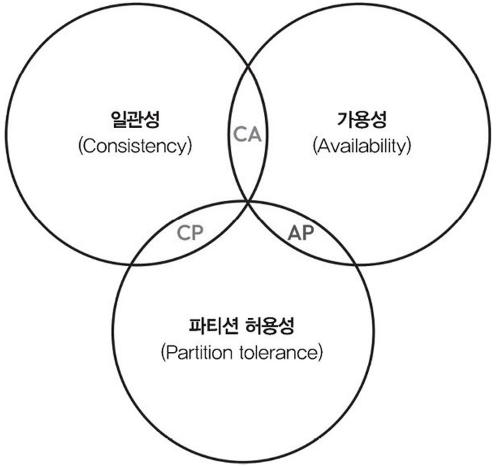

# 3강: 분산 시스템의 이론과 데이터 구조

강의 번호: 요즘 개발자를 위한 시스템 설계 수업
유형: 스터디 그룹
복습: No

<aside>
💡

분산 시스템을 설계하고 구현하는데 필요한 이론, 기법, 데이터 구조

</aside>

## 3.1 CAP 정리

= 브루어의 정리
**분산 시스템이 일관성(C), 가용성(A), 파티션 허용성(P)을 동시에 취할 수 없음**

ex) 네트워크 파티션 발생 ⇒ 이때 일관성 vs 가용성 무엇을 더 우선시 할지
1. 가용성, 파티션 허용성(AP) 선택: 파티션 발생 시에도 시스템을 계속 운영할 수 있지만, 모든 노드가 동일한 데이터 유지하기 어려움
2. 일관성, 파티션 허용성(CP): 모든 노드가 항상 같은 데이터 유지하려 하므로 파티션 상태에서는 일부 노드가 사용자 요청을 처리하지 못할 수 있음

분산 시스템의 경우 네트워크 파티션 발생 막을 수 없음(서버, 데이터 여러 위치에 분산 또는 인터넷에 의존하기 때문) → 파티션 허용성을 처리할 수 있도록 설계해야 함
본질적으로 이때 가용성과 일관성 중 하나를 선택해야 함

금융: 일관성, 파티션 허용성
웹 애플리케이션: 가용성, 파티션 허용성

## 3.2 PACELC 정리

CAP 정리의 연장성에 있는 개념. 네트워크 파티션 발생 시의 CAP 한계점 보완하기 위해 등장

- 파티션 허용성(**P**articion tolerance): 네트워크 파티션 발생 시에도 정상적으로 기능 수행 가능
- 가용성(**A**vailability): 모든 요청이 결국 응답을 받도록 보장. 강한 일관성 포기하더라도 신속한 응답
- 일관성(**C**onsistency): 모든 노드가 시스템의 현재 상태를 일치시키는 것. 지연 시간, 가용성 떨어짐
- 그 외(**E**lse): 네트워크 파티션이 발생하지 않는 상황을 의미
→ **시스템이 정상적으로 작동하는 상태에서 지연 시간(빠르게 처리)과 일관성(최신 정보 제공) 중 하나를 선택**해야 함
- 지연 시간(**L**atency): 요청 시작하고 응답 받기까지 지연된 시간. 지연 시간을 짧아지도록 설계하면 일관성 떨어지거나 가용성(지연 시간 한계 이후에 답을 줄 수 있는데도 못 주는 경우) 줄어들 수 있음.
- 일관성 수준(**C**onsistency level): 원하는 일관성의 정도

CAP 뿐만 아니라 문제 없는 상황에서 지연 시간, 일관성에 미치는 영향도 함께 고민하여 결정해야 함
분산 시스템의 경우, 각 서버가 동일한 결정을 내리는 것이 중요 (일관성) → 여러 노드 간에 합의를 이루어야 함

[합의 알고리즘]

3.2.1 팩소스 알고리즘

1990년 레슬리 램포트가 개발했으며 현대 분산 시스템의 초석이 됨
분산 시스템에서 여러 문제가 발생하더라도 하나의 값을 도출할 수 있도록 합의하는 것이 핵심
하나의 값: 시스템 내 모든 노드가 동의해야 하는 특정 데이터나 결정을 의미

여러 단계의 통신을 거쳐 각 노드가 하나의 값으로 일치할 수 있도록 합의하는 프로토콜을 사용해 시스템이 안정적으로 운영될 수 있게 하는 알고리즘

[구성요소]

- 제안자(proposer): 합의 프로세스를 시작하는 역할을 하는 노드
합의해야 할 값을 제안하며 이 제안을 다른 노드에 전파
- 수용자(accepter): 제안자에게서 제안을 받고, 제안이 수용되었는지 다른 노드에 알림
- 학습자(learner): 합의 된 값을 최종적으로 받는 노드이며 합의한 후 학습자는 이 값을 확보하고 이를 기반으로 후속 작업을 수행함

[프로토콜 과정]

- 준비 단계: 제안자는 고유 제안 번호를 선택해 가능한 많은 수용자에게 준비 요청을 보냄
                 수용자는 자신이 지금까지 수용한 제안 중 가장 높은 번호의 제안을 응답으로 반환
                 (낮은 번호의 제안이 오면 거부할 수 있음)
- 수용 단계: 제안자가 수용자에게 응답을 받으면 자신의 제안 번호와 값을 담아 수용자에게 수용 요청을 보냄
- 합의점 도달: 여러 수용자가 제안을 수용하면 합의가 돼 해당 값이 선택되며 학습자에게 선택된 값을 전달함

[고려 사항]

- 장애 허용성: 일부 노드가 작동하지 않거나 네트워크에서 분리되는 상황에서도 시스템이 원활하게 작동하도록 해야 함
(한 노드가 네트워크 오류 등으로 응답 보내지 못하는 경우에도 다수결로 제안자는 다음 단계로 넘어 갈 수 있음)
- 확장성: 팩소스의 성능은 시스템에 포함된 노드 개수에 영향을 받음
시스템이 커지면 노드 간 조율과 통신 부담으로 성능이 떨어질 수 있음
- 복잡성: 구현하기 어려운 알고리즘으로, 모든 참여자가 프로토콜을 정확하게 따를 수 있게 설계하는 것이 중요

**제안 번호를 기준으로 우선순위를 정해서 일관성을 유지하는 것이 핵심**

[팩소스 확장]

- 멀티 팩소스: 기본 팩소스 확장해 **값 여러 개에 대해 지속적으로 합의**할 수 있도록 함
준비 단계와 수용 단계의 반복을 피할 수 있어 요청 오버헤드를 줄이고 후속 값에 대한 합의 속도를 빠르게 함
- 패스트 팩소스: 합의에 필요한 메시지 수를 줄이는 방식
제안자가 일반적인 준비 단계를 건너뛰어 직접 수용자에게 값을 제안할 수 있게 해 합의 시간 단축
- 심플 팩소스: 원래의 팩소스 프로토콜을 단순화하는 것이 목표
준비 단계와 수용 단계를 하나의 라운드로 통합해 메시지 교환 수 줄이고 쉽게 이해되도록 함

[팩소스 활용 예시]

- 분산 데이터베이스: 각 복제 데이터베이스 사이의 일관성과 내구성 확보하는 데 사용
DB 노드가 성공적으로 수행된 트랜잭션 순서 정하고 장애 효과적으로 처리 가능
- 분산 파일 시스템: 구글 파일 시스템, 하둡 분산 파일 시스템 등에서 여러 노드 간 메타데이터의 일관성과 가용성을 유지하는 데 사용
장애 상황에서도 모든 복제본이 동일한 명령에 합의하도록 보장하여 파일 시스템의 상태를 일관되게 유지할 수 있게 함
- 상태 기계 복제: 노드 클러스가 **작업 순서를 합의**하여 레플리카 간 일관성을 유지하게 함

3.2.2 래프트 알고리즘

2013년에 개발됨. 이해하기 쉬운 구조와 낮은 구현 난이도로 팩소스의 대안으로 많이 사용됨
**목표: 분산 시스템에 장애 발생하더라도 하나의 일관된 상태에 합의할 수 있도록 하는 것**
합의 문제를 하위 문제 세 개로 나눠 해결하는 방식이며 팩소스와 달리 지정된 리더가 있음

[구성 요소]

- 리더: 합의 과정을 관리하고 로그 항목을 다른 노드에 복제하도록 지시함
리더가 새로운 정보를 만들면 다른 노드에 전달해 모든 노드가 동일한 정보를 갖도록 함
- 추종자: 리더의 로그를 복제하고 들어오는 요청에 응답하는 수동적인 역할을 함
- 후보자: 리더가 실패하거나 새로운 리더를 선출해야 할 때 노드 상태가 후보 상태로 바뀌며, 후보가 된 노드는 다른 노드에 투표를 요청하여 리더 선출을 시작함

[프로토콜 과정]

- 리더 선출: 시스템이 시작되거나 리더가 없음을 감지하면 새로운 리더를 선출함
노드는 후보 상태로 전환하고 다른 노드에 요청 투표 메시지를 전달해 후보가 과반수의 투표를 받으면 리더가 됨
- 로그 복제: 리더는 클라이언트 요청을 받아 로그에 추가하고 해당 로그 항목을 추종자에게 복제하게 함
추종자는 받은 로그를 자신의 상태 기계에 적용하여 시스템 전반의 일관성을 유지함.
- 안정성과 일관성: 로그 추가, 투표 규칙처럼 특정 규칙을 적용해 안정성과 일관성을 유지함
이를 통해 불일치를 방지하고 가장 최신의 로그 항목만 커밋되도록 함

[고려 사항]

- 리더 가용성: 리더 역할을 맡은 노드는 항상 활성화되어 있어야 함. 없으면 신속하게 새로운 리더 선출해야 함
- 확장성: 시스템이 커지고 노드 개수 늘어나면 통신 오버헤드 커져 성능 저하로 이어질 수 있음
따라서 확장성을 안정적으로 유지하려면 적절한 최적화와 시스템 설정 조정이 필요함
(ex. 클러스터 크기 적절하게 유지, 요청 배치 처리 등)
- 장애 허용성: 추종자 노드는 리더 노드가 정상적으로 동작하지 않을 때 이를 감지해 새로운 리더 선출을 시작함으로써 시스템의 장애 허용성을 확보함

[래프트 활용 예시]

- 분산 데이터베이스(아마존): 모든 노드가 커밋된 트랜잭션 순서에 동의하고 장애를 원활하게 처리하기 위해 사용
- 분산 파일 시스템: 장애가 발생해도 모든 레플리카가 파일 시스템 상태에 대해 동일한 상태를 유지하도록 함
- 클러스터 관리 및 서비스 디스커버리(아파치 주키퍼): 클러스터 관리 프레임워크에서 사용됨
주키퍼의 경우 리더 선출, 구성 변경, 분산 잠금 등 중요한 시스템 메타데이터에 대한 합의를 거쳐 여러 분산 서비스가 장애 견디고 안정적으로 협력할 수 있도록 함
- 합의 기반 알고리즘(구글 스패너): 구글 스패너는 전 세계에 분산된 데이터베이스로, 전역에 걸친 복제 데이터베이스 간의 일관성, 장애 허용성을 보장하는 데 래프트를 사용
작업 순서, 트랜잭션 커밋에 대한 합의를 이끌어냄
- 클라우드 인프라 관리 시스템: 자원 할당, 장애 허용, 오토 스케일링 같은 작업을 위해 여러 구성 요소 간의 일관된 합의하는 과정에서 사용

장점: 이해 쉬움, 장애에 견딜 수 있는 견고한 구조
단점: 노드가 잘못 작동하거나 악의적으로 행동하는 등의 복잡한 오류 상황까지는 다루지 못함

- **Paxos**: 제안자가 **값을 제안 → 수용자들에게 수용 여부 확인 → 과반수가 수용하면 합의**
- **Raft**: 먼저 **리더를 선출 → 리더가 로그를 복제 → 과반수에 복제되면 합의(커밋)**

## 3.3 비잔티움 장군 문제

시스템 내 하위 시스템 중 일부가 **오류를 발생시키거나 잘못된 명령을 전달할 때**, 나머지 시스템이 어떻게 정상 기능을 유지하며 작동할 수 있는 지
→ 신뢰할 수 있는 합의가 얼마나 까다로운 지

[비잔티움 장군 문제]
여러 장군이 각자 군대를 이끌고 적의 도시를 포위 중이며, **동시에 공격해야 승리할 수 있지만 일부 장군이 배신자라 거짓 명령을 보낼 수 있음**
일부 장군이 배신자일 수 있고 직접 소통도 불가능한 상황에서, **전령**을 통해 정보를 주고받으며 충성스러운 장군들이 동일한 공격 명령과 시점에 합의해야 하는 상황

- 장군들은 오직 전령만을 통해 소통 가능하며 전령이 도중에 가로채이거나 전달에 실패할 가능성이 있음
- 누가 충신인지 배신자인지 구별할 수 없으며 겉보기에는 모든 장군이 동일해보임
- 배신자들은 서로 공모하여 충성스러운 장군들의 합의에 이르는 것을 방해할 수 있음

[요구 사항]

- 충신이 과반수를 넘을 경우 합의에 도달 할 수 있어야 하며 배신자가 있더라도 합의할 수 있어야 함
- 충신이 합의를 내리는데 적당한 시간이 필요하며 즉각적인 합의는 불가능

⇒ 일부 노드가 고장나거나 악의적으로 행동할 수 있는 분산 시스템에서 신뢰할 수 있는 합의에 도달할 수 있는가

[해결 방안]

- 투표 알고리즘: 모든 장군이 실행 계획에 대해 투표를 진행해 특정 기준(ex.과반수 이상)이 충족되면 해당 계획을 실행하는 합의점에 이를 수 있음
- 반복 서명 방식: 계획을 제안하고 서명으로 찬성을 표시함 장군 3분의 2 이상이 서명한 계획이 있으면 그 계획을 선택하며 서명하지 않은 장군은 배신자로 간주해 여러 라운드를 거쳐 배신자를 걸러냄
- 쿼럼(집단) 방식
쿼럼: 합의나 의사결정을 내리는데 필요한 최소한의 동의 인원
장군들을 여러 쿼럼으로 나눠(각 쿼럼에는 충성군이 과반수 이상 포함되어야 함) 각 쿼럼이 독립적으로 계획에 대해 투표를 진행하여 모든 쿼럼에서 과반수 이상을 얻은 계획이 최종 선택됨.
- 타임아웃과 확인 절차: 일정 시간이 지나도 투표하지 않은 장군은 의심 대상으로 표시
각 장군은 다른 장군에게 투표 내용을 질문할 수 있으며 투표 내용과 답변이 일치하지 않는 장군은 배제할 수 있음
- 무작위 선택 방식: 임의의 난수를 포함한 계획을 제안함
배신자들은 이 난수를 사전에 알 수 없으므로 투표 내용에서 난수를 정확히 맞춘 장군은 충신일 가능성이 높음

⇒ 투표를 통해 배신자를 색출하여 배신자를 제외한 나머지 인원만으로 합의할 수 있도록 함

3.3.1 비잔티움 장애

시스템 내 일부 노드가 예측할 수 없고 신뢰할 수 없는 행동을 보이는 상황
소프트웨어 버그, 하드웨어 고장, 악의적인 공격 등의 문제로 발생
거짓이거나 모순된 정보를 만들어 내기 때문에 이 문제를 일으키는 노드를 식별하고 격리하기가 어려움

3.3.2 비잔티움 장애 허용성

비잔티움 장애 문제를 해결하기 위해선 시스템이 비잔티움 장애 허용성을 구현해야 함
일부 노드가 고장 나거나 악의적으로 행동하더라도 시스템이 올바르게 기능하며 합의에 도달할 수 있는 성질을 의미함 (비잔티움 장애 발생하더라도 시스템을 정상적으로 사용가능하게)

초기버전: 각 노드가 자신의 값을 다른 모든 노드에 투표 형식으로 전송하는 방식
고장난 노드가 전체 3분의 1 미만일떄만 작동하며 모든 노드가 서로 통신해야 하기 때문에 계산 및 통신 비용이 많이 소모됨

3.3.3 최신 비잔티움 장애 허용성

비잔티움 장애 허용 알고리즘(PBFT): 기존 비잔티움 장애 허용성의 단점이였던 통신 비용을 줄이고 대규모 네트워크에서 효율적으로 동작 가능한 합의 메커니즘을 가지고 있음
→ 비트코인, 이더리움 같은 블록체인 기술을 포함한 최신 분산 시스템에 중요한 역할

## 3.4 FLP 불가능성 정리

하나의 노드에 문제가 생겼을 때 완전 비동기 환경에서 모든 노드가 동일한 결정을 내리도록 하는 것이 불가능하다는 이론

- 비동기성: 메시지 지연 시간, 프로세스 속도에 제한이 없으며 프로세스는 메시지를 통해 통신하지만 항상 서로 같은 값을 갖지는 않음
- 프로세스 장애: 전체 프로세스 수가 n일 때 프로세스가 최대 f개 고장날 수 있음(0<f<n)
- 유한한 단계: 각 프로세스는 정해진 유한한 단계만 수행하고 메시지 크기도 제한되어 있음

→ 이 조건이 만족되면 정상적으로 동작하는 모든 프로세스가 하나의 일치된 결정을 내리도록 보장하는 알고리즘은 있을 수 없다

장애 허용성, 합의, 종료 이 세가지 특정을 동시에 달성하는 것이 불가능 (두가지만 가능)

❗비동기 시스템에서는 여러 프로세스 중 느리게 응답하는 프로세스와 실제로 고장 난 프로세스를 구별할 방법이 없다는 것
→ 서로 같은 값에 합의하면서, 반드시 끝나는 것을 항상 보장할 수 없음

[한계 극복 방법]

- 메시지 지연 시간에 정해진 시간 범위 설정 (동기적인 가정)
- 높은 확률로 합의에 도달할 수 있는 확률 알고리즘 사용
(무조건 반드시 종료 대신 높은 확률로 합의가 끝나도록)
- 무작위 요소나 시간 동기화를 도입
(서버들이 똑같은 행동을 반복해서 합의가 계속 미뤄지는 상황을 랜덤하게 깨버리기)
- 리더 선출하거나 조정자 역할 두기

## 3.5 일관된 해싱

데이터를 여러 노드에 효율적으로 분배하며 노드를 추가하거나 삭제할 때 데이터 위치를 다른 곳으로 옮겨야 하는 과정이 최소화되도록 하는 방식

모듈로 해싱 방식 → 데이터를 저장할 수 있는 노드나 버킷 수가 고정되어 있음 따라서 노드 추가하거나 삭제하면 데이터 키 노드에 매핑하는 해싱 함수가 변경돼 많은 데이터를 다시 매핑하고 재분배 해야 함 (시간 오래걸리고 리소스 많이 씀)

일관된 해싱 → 노드를 추가하거나 삭제할 때 전체 데이터를 다시 매핑하지 않고 일부 데이터만 이동하도록 하여 영향을 최소화하는 것이 목표
콘텐츠 전송 네트워크나 분산 데이터베이스 같은 시스템에서 특히 유용 (노드 추가, 제거가 빈번)

- 노드와 데이터 키를 모두 해싱해서 같은 원 위에 배치하고, 데이터 위치에서 시계 방향으로 가장 가까운 노드가 그 데이터를 담당함

1. 동일한 해시 함수를 사용해 서버와 API 요청을 동일한 링 위에 위치 시킴
2. 요청에 해당하는 점을 가져와 시계 방향으로 이동해 처음 만나는 서버 점을 찾아 분배

⇒ 서버 하나가 다운되면 시계 방향으로 다음 서버가 고장난 서버의 작업까지 떠안아야 하는 문제 발생

1. 각 서버 당 가상 지점 세 개 추가 생성
2. 한 서버가 다운되더라도 해당 서버에 연결된 지점 네 개만 사라지고 다른 서버의 지점은 잘 분산되어 있으므로 특정 서버 하나에 집중되지 않고 남아있는 서버에 균등하게 분배됨

⇒ 해시 링으로 데이터 키와 노드 식별자를 공통 해시 공간에 매핑해 데이터를 노드에 일관되게 할당하며
확장성과 장애 허용성까지 챙길 수 있음
(노드 추가/삭제 시 인접한 노드로 일부 데이터만 다시 매핑하면 됨)

## 3.6 블룸 필터

메모리를 적게 사용하면서 특정 요소가 집합에 속해 있는 지 빠르게 확인할 수 있는 데이터 구조
장점: 요소가 집합에 **‘포함될 가능성’**이 있는지를 효율적으로 판단 가능
고려: 실제로는 포함되지 않은 요소를 포함된 것처럼 판단하는 경우(거짓 양성) 가끔 발생

1. 배열의 모든 비트를 0으로 설정
2. 요소 추가: 데이터를 여러 해시 함수에 넣어 나온 비트 배열의 위치를 모두 `1`로 설정
3. 요소 조회: 같은 해시 함수로 위치를 확인
    - 하나라도 `0` → 확실히 존재하지 않음
    - 모두 `1` → 존재할 가능성이 높음 (거짓 양성 가능)

⇒ donald는 가능
     sarah는 사용할 수 없을 수도 있음(거짓 양성)

[사용 예시]

- 포함 여부 검사: 웹 크롤러에서 특정 URL이 이미 수집된 URL 집합에 있는 지, 맞춤법 검사기에서 특정 단어가 사전에 있는 지
- 캐싱: 어떤 데이터가 캐시에 있는지 확인하는 데 사용 → 불필요한 캐시 조회 줄이고 조회 비용 절감 가능
- 데이터베이스 최적화: 데이터베이스에 없는 것으로 보이는 데이터 빠르게 식별해 불필요한 디스크 읽기 걸러내는데 활용 가능, I/O  작업 줄여 성능 향상시킬 수 있음
- 네트워크 라우팅: 특정 패킷이나 메시지를 어디로 보낼 지 결정할 때, 전송 가능한 목적지 빠르게 파악
- 중복 제거: 대규모 데이터 시트에서 중복 항목 골라내 저장 공간 절약하고 효율성 높일 수 있음

다만, 거짓 양성 가능성이 있으므로 특정 요소가 있다고 판단할 때 실제로 없을 수 있음
→ 비트 배열 크기, 해시 함수 개수를 조정해 줄일 수 있음
배열 크기, 해시 함수 개수 늘리면 거짓 양성 확률 줄어들지만 그만큼 메모리 사용, 계산량이 늘어남
⇒ 거짓 양성의 작은 확률을 허용할 수 있는 상황에서 유용하게 활용 가능

## 3.7 카운트-민 스케치

데이터 스트림에서 요소의 빈도를 추정하는 확률적 데이터 구조
빈도 분포를 근사적으로 표현하며 메모리 적게 사용함 → 대규모 데이터 스트림 실시간 처리, 메모리 제한된 상황에서 효과적

1. 이차원 배열 형태의 카운터로 구성, 배열의 행과 열 수는 원하는 정확도와 오류율로 결정됨
2. 데이터 스트림에 요소가 나타나면 해시 함수를 여러 개 실행하여 배열에서 해당 요소의 카운터 위치를 결정하고 그 위치의 카운터를 증가시킴
3. 여러 해시 함수가 충돌을 분산시키고, 각 카운터에 걸쳐 요소 빈도를 추정함

초기

A, A, B, D 순으로 데이터 스트림에 들어온 이후

문자 A가 데이터 스트림에 몇 번 나타났는지
(2, 2, 3, 2, 2) → 다섯 개 중 최솟값 2

정확도: 카운터 수, 해시 함수 개수에 따라 결정
카운터 수, 해시 함수 개수 늘리면 정확도 올라가지만 메모리 증가, 계산 비용 증가

[사용 예시]

- 빈도 추정: 텍스트에서 특정 단어가 등장한 횟수 세기 등
- 트래픽 분석: 특정 프로토콜이나 네트워크 주소와 관련된 패킷이나 흐름의 수 파악
- 웹 분석: 웹 사이트 방문 횟수, 클릭 수, 사용자 상호 작용 빈도 추적해 웹 트래픽 분석
- 분산 시스템: 여러 노드에 걸친 요청 빈도 추적
- 데이터 스트림 처리: 실시간 데이터 스트림에서 메모리에 전체 데이터를 저장할 수 없을 때 근삿값으로 빈도 추정

유의: 빈도를 근사적으로 표현하기 때문에 충돌로 과대 추정이 발생할 수 있음

## 3.8 하이퍼로그로그

집합 내 중복되지 않은 요소 개수(카디널리티)를 적은 메모리로 파악하는 데 사용하는 확률적 알고리즘
대규모 데이터셋을 다루거나 메모리 효율성이 중요한 경우 유용
집합 크기와 상관없이 고정된 양의 메모리만으로 카디널리티를 근사적으로 계산, 해시 함수와 확률적 카운팅 기법을 활용하여 메모리 절약과 계산 효율성을 높임

집합의 각 요소를 해싱한 후 해시 값의 이진 표현에서 가장 긴 0의 연속 길이를 찾음
이 연속 길이를 카디널리티의 추정 값으로 활용하며, 여러 해시 함수에서 나온 이 추정 값의 평균을 내어 더 정확한 카디널리티를 계산할 수 있음

‘웹 사이트의 실제 방문자 수 구하기’
고유 ID로 구하기: 방문자가 많으면 메모리가 너무 많이 필요해짐
하이퍼로그로그: 사용자의 이름을 2진수로 변경해 끝에 연속된 0의 개수 사용해 방문자 수 업데이트

→ 가장 긴 0의 개수 2 ⇒ 00이라는 패턴을 볼 정도로(0보다 희귀) 사람이 들어왔다 ⇒ 대략 8명정도 방문했다

다만, 이상치가 들어오는 경우 실제보다 훨씬 큰 값으로 추정돼 결과가 왜곡될 수있음
[정확성 높이기]

1. 사용자 이름의 해시 값을 무작위 버킷 k로 나누기
2. 각 버킷에서 끝에 연속된 0의 최대 개수 계산
3. 2. 단계에서 계산한 끝자리 0의 개수를 각 버킷에 저장
4. 모든 버킷에서 구한 값을 바탕으로 L을 계산
산술 평균 대신 조화 평균 사용(역수들의 평균을 낸 뒤 다시 역수) ⇒ 큰 값의 영향 줄이기
5. $2^{(L+1)}$을 계산하여 고유 방문자 수를 추정

정확한 카디널리티 계산하려면 카디널리티에 비례하는 메모리가 필요함 → 대규모에서는 비현실적

