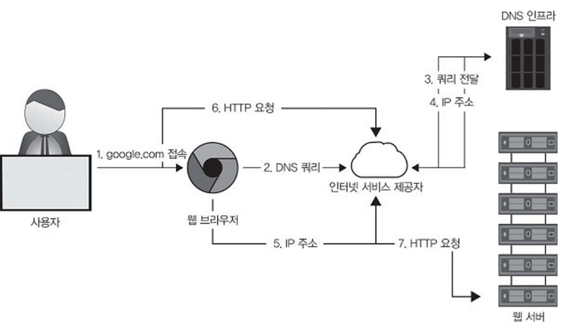

# 4강: 분산 시스템의 기본 요소

강의 번호: 요즘 개발자를 위한 시스템 설계 수업
유형: 스터디 그룹
복습: No

<aside>
💡

확장성이 좋고 안정적인 시스템을 구축하는데 필요한 핵심 요소

</aside>

## 4.1 DNS 이해

사람이 이해하기 쉬운 도메인 이름 → 기계가 읽을 수 있는 IP 주소

브라우저에 도메인 이름 입력 → 웹 브라우저가 DNS 인프라에 쿼리 보냄 → 웹 브라우저가 IP 주소를 얻으면 목적지 웹 서버로 사용자 요청을 전달

- 네임 서버: 사용자 쿼리에 응답하는 DNS 서버
- 리소스 레코드: DNS 데이터 베이스는 매핑 정보를 리소스 레코드(RR) 단위로 저장
- A 레코드: 호스트 이름을 IP주소에 매핑
- NS 레코드: 도메인의 DNS 요청을 처리할 수 있는 네임 서버를 매핑
- CNAME 레코드: 하나의 도메인 이름에 별칭 부여해 별칭 도메인 이름을 실제 도메인 이름으로 연결
    ‘www.example.com’을 ‘example.com’으로 연결
- MX 레코드: 도메인을 메일 서버에 매핑
- 캐싱: 여러 단계에서 캐싱을 사용해 대기 시간을 줄임
웹 브라우저, 운영 체제, 네트워크의 DNS 서버에서 단계적으로 캐싱되어 빠르게 주소 찾아올 수 있음
- 계층 구조: DNS의 네임 서버는 계층적으로 구성되어 DNS가 거대한 규모와 쿼리 부하를 감당할 수 있게 함

- 루트 서버: 로컬 리졸버(resolver)에서 쿼리를 받아 최상위 도메인의 네임 서버 정보를 관리함
- 최상위 도메인 서버: 해당 도메인의 권한 있는 네임 서버 IP 주소를 보유
- 권한 있는 네임 서버: 특정 조직, 도메인의 최종 DNS 서버, 웹 및 애플리케이션 IP 주소 제공

4.1.1 DNS 쿼리

반복적 쿼리

- 컴퓨터가 로컬 DNS 리졸버로 모든 과정을 직접 처리
- 루트 서버 → 최상위 도메인 서버 → 권한 있는 네임 서버 순으로 직접 통신
- 컴퓨터가 여러 서버에 차례로 요청을 보내며 답을 찾음

DNS 재귀적 쿼리

- 컴퓨터가 로컬 DNS 리졸버에 원하는 웹 사이트의 IP를 요청하면 이후 과정은 로컬 리졸버가 처리함
- 로컬 리졸버가 DNS 계층 구조를 직접 거쳐 가며 IP주소를 찾음
- 인터넷: 웹 사이트의 ISP나 네트워크 로컬 리졸버에 IP 주소 요청

💡.env에 도메인 이름 대신 IP 주소를 넣으면?
네트워크가 DNS 쿼리 과정을 건너뛸 수 있어 응답 지연 시간 줄일 수 있음
but **현업에서 도메인 쓰는 이유?
- 유연성: 서버 IP주소가 변경되더라도 도메인 이름을 사용하면 코드나 환경 변수를 바꾸지 않아도 됨
- 로드 밸런싱: DNS가 요청을 분산해 각기 다른 서버로 보내줘 과부하 안걸리고 빠르게 사용가능
- 보안: 도메인 이름을 사용하면 인증서를 통한 신뢰성 검증이 가능

DNS 캐싱

- DNS 계층 구조로 쿼리하지 않고 로컬에서 답을 제공해 응답 시간 단축
- 불필요한 쿼리 줄여 네트워크 트래픽 감소
- 사용자의 웹 브라우저, 운영 체제, 사용자 네트워크 내 로컬 네임 서버, ISP의 리졸버 등 다양한 곳에서 사용 가능

⇒ DNS 리소스 레코드를 여러 단계에서 캐싱하면 효과가 더욱 커짐

## 4.2 DNS의 확장성, 신뢰성, 일관성

4.2.1 확장성

- DNS는 단계별로 부하를 분산시켜 전 세계에서 발생하는 쿼리 수십억 건을 효율적으로 처리할 수 있는 확장성을 가짐
- 전 세계 여러 곳에 중복된 DNS 서버가 배치되어 있어 사용자 요청에 빠르게 응답하여 지연 시간을 줄일 수 있음 → 하나 과부하돼도 다른 서버가 요청 대신 처리함으로써 안정성, 확장성 강화

4.2.2 신뢰성

- 여러 단계에서 캐싱을 하기 때문에 일부 DNS 서버가 일시적으러 응답하지 못하더라도 필요한 정보를 빠르게 전달할 수 있음
- 전 세계의 분산된 중복 DNS 서버가 사용자 요청에 신속히 응답해 시스템 안정성 높임
- 쿼리와 응답은 신뢰성이 낮은 UDP 프로토콜이지만, DNS는 응답이 없을 때 요청을 재전송하는 방식으로 이를 보완함

4.2.3 일관성

- 캐싱된 레코드의 유효 기간 설정과 점진적으로 업데이트를 반영해 시간이 지나면 모든 서버가 일관된 데이터를 가지는 최종 일관성을 적용함
(모든 서버에 반영되기까지 몇 초 ~ 며칠 걸릴 수 있음)
- DNS는 일관성보다 성능을 우선시함

## 4.3 로드 밸런서

- 트래픽을 여러 서버에 고르게 **분산시켜** 특정 서버에 과부하 걸리는 것을 방지
작업량을 확인해 가장 적게 사용중인 서버에 요청 전달함
- 장애가 발생하거나 속도가 느려진 서버의 요청을 다른 정상 서버로 재전송해 시스템의 내구성 높임
- 일부 서버가 작동하지 않더라도 나머지 서버가 요청처리할 수 있어 서비스 가용성 유지
- 높은 트래픽 상황에서도 시스템 안멈추고 성능이 점진적으로 저하되도록 함
부하가 늘어나면 응답 시간이 길어질 수 있지만 시스템은 계속 운영됨
- 서버 풀에 서버를 추가해 더 많은 트래픽 처리 가능(수평 확장)

4.3.1 로드 밸런서 위치

시스템 아키텍처 내 다양한 위치에 배치해 부하를 분산하고 확장성을 확보할 수 있음
클라이언트와 프런트엔드 서버 사이, 다층 시스템의 각 계층 사이, 여러 인스턴스가 있는 서비스 간에 배치 가능
(각 계층을 독립적으로 확장 가능)

여러 지점에서 트래픽 분산시키면 각 계층을 서로 독립적으로 보호할 수 있음
특정 계층에서 문제 감지되면 트래픽을 우회해 전체 시스템이 원활하게 운영되도록 도움

4.3.2 로드 밸런서의 장점

- 백엔드의 서버 상태를 확인하는 헬스 체크를 이용해 서버가 정상 작동 중인지 파악할 수 있음
→ 클라이언트가 접근할 수 없는 서버에 요청 안보내도록 해줌
- TLS(전송 계층 보안) 연결을 종료해 백엔드 서버의 **안정성**을 높임
로드 밸런서가 암호화된 데이터를 백엔드 서버로 바로 보내지 않고 먼저 복호화 한 후 보냄
⇒ 서버가 본연의 작업만 할 수 있어서 성능 효율적, 서버 과부하도 줄일 수 있음
- 트래픽 패턴을 분석하고 효율적인 요청 분배 알고리즘을 사용

4.3.3 전역 로드 밸런싱과 로컬 로드 밸런싱

전역 로드 밸런싱: 다양한 지역에 있는 데이터 센터 간의 트래픽 분산
사용자 위치, 데이터 센터 상태, 서버 수 같은 요인을 기반으로 전역 트래픽을 적절한 데이터 센터로 전달
네트워크 장애 발생 시에도 다른 데이터 센터로 전환

로컬 로드 밸런싱: 개별 데이터 센터 내에서 자원 활용도 높이기
해당 지역 내 서버로 트래픽 분산
전역 로드 밸런싱에 서버 상태와 용량 정보 전달

4.3.4 DNS와 전역 로드 밸런서

- DNS 로드 밸런싱 = 데이터센터 간 분산
    - 하나의 도메인에 여러 IP를 등록
    - 사용자마다 서로 다른 IP를 반환해서 트래픽을 분산
    - 라운드 로빈 방식 등을 사용할 수 있음.
    라운드 로빈: 요청을 순차적으로 분배 → 각 서버의 상태나 처리 능력은 고려하지 않음
    트래픽 별 차이 반영 못하고, 서버 다운됐을 때 감지 못함 → 캐시의 TTL을 짧게 설정함
- DNS 로드 밸런싱의 한계
    - 패킷의 크기가 작아 모든 서버 IP 주소를 응답에 포함할 수 없어 기능이 제한됨
    - 클라이언트가 여러 IP 중 무엇을 사용할지 선택하기 때문에 DNS가 완전히 통제하기 어려움.
    - 단순 라운드 로빈만으로는 사용자와 가까운 데이터센터를 정확히 선택하기 어려움.
    다만 위치 기반 연결이나 애니캐스팅 사용할 순 있지만 적용이 간단하지 않음.
    - 장애 발생했을 때 TTL값이 길수록 캐싱으로 DNS를 이용한 복구 느릴 수 있음
    옛날 DNS 정보가 오래 캐싱되어 있기 때문에 복구 반영이 느림

⇒ 데이터센터 안에는 로컬 로드 밸런서를 두어야 막을 수 있음
    로컬 로드 밸런서가 정교한 방식으로 트래픽을 분배해야 함 (전역, 로컬 둘 다 필요)

4.3.5 로드 밸런서가 사용하는 알고리즘

클라이언트 요청 어떻게 분배할지

- 라운드 로빈 스케줄링: 각 요청 순차적으로 다음 서버에 할당
가장 간단한 알고리즘이나 서버간 성능 차이나 현재 부하는 고려하지 않음
- 가중치 기반 라운드 로빈: 서버 용량에 따라 가중치를 부여하고 가중치가 높은 서버가 더 많은 요청을 받도록 설정
- 최소 연결 알고리즘: 현재 연결된 요청 수가 가장 적은 서버에 새로운 요청을 할당하는 방식
처리 시간이 긴 요청 포함되었을 때도 서버 간 부하를 고르게 분배할 수 있도록 도와줌
 로드 밸런서가 각 서버의 연결 상태를 알고 있어야 함
- 최소 응답 시간 알고리즘: 응답 시간이 가장 짧은 서버에 요청을 할당해 성능이 중요한 서비스에서 효율을 극대화
- IP해시, URL해시, 일관성 해시 알거리즘: 각각 클라이언트의 IP주소나 요청 URL을 기반으로 요청을 특정 서버에 할당하는 방식

단순한 알고리즘: 부하 고르게 분산하는 데 한계
정교한 알고리즘: 서버 상태 지속적으로 추적하고 관리해야 하는 부담
→ 알맞게 선택해야 함

#### 정적 알고리즘 vs 동적 알고리즘

정적 알고리즘: 서버 상태를 실시간으로 반영하지 않고, 미리 설정된 서버 구성에 따라 분배
동적 알고리즘: 서버의 현재 상태나 최근 상태를 고려해 요청 분배
서버와 통신해 상태 정보 유지해야 하므로 통신 비용 증가, 시스템 다소 복잡
but 시스템 유연하게 작동 + 활성 상태인 서버로만 요청 보냄

#### 스테이트풀 vs 스테이트리스

클라이언트의 세션 정보를 유지하는 지
스테이트풀: 클라이언트 ↔ 백엔드 서버의 세션/연결 상태를 저장하고, 이를 이용해 기존 요청을 적절한 서버로 보냄. 상태 정보를 여러 로드 밸런서가 공유해야 해서 복잡하고 확장성이 떨어질 수 있음
스테이트리스: 클라이언트의 세션 상태를 별도로 공유,저장하지 않고 일관된 해싱 등으로 요청을 서버에 매핑함. 성능과 확장성은 좋지만, 서버 추가,제거,장애 시 기존 세션을 올바른 서버로 보내기 어려울 수 있음.

**상태 정보를 여러 로드 밸런서가 공유하며 라우팅 → 스테이트풀 (가용성, 신뢰성)
공유 상태 없이 요청 자체의 정보나 해싱으로 라우팅 → 스테이트리스 (속도 빠름, 확장성)**
⇒ 적절히 섞어서 사용할 때가 더 많음

4.3.6 OSI 모델의 각 계층에서 로드 밸런싱

OSI: 네트워크 기능 표준화 / 물리적 계층, 데이터 링크 계층, 네트워크 계층, 전송 계층, 세션 계층, 프레젠테이션 계층, 응용 계층

- 4계층(전송 계층) 로드 밸런서: TCP/UDP를 기준으로 요청을 분산 
낮은 계층에서 동작하므로 빠르고 기본적인 부하 분산과 연결 안정성을 제공함
일부는 TLS 종료 기능도 지원
- 7계층(응용 계층) 로드 밸런서: HTTP의 URL, 헤더, 쿠키, 사용자 ID 등 요청 내용을 보고 더 정교하게 분산
TLS 종료, 속도 제한, HTTP 라우팅, 헤더 재작성 등의 기능도 가능
- 차이: L4 = 빠르고 단순한 분산 / L7 = 애플리케이션 정보를 활용한 정교한 분산

4.3.7 로드 밸런서의 배치

- 0단계 - DNS: 웹 사이트나 서비스에 대해 여러 IP를 제공하여 큰 단위로 트래픽 분산
- 1단계 - 라우터: IP 주소나 라운드 로빈 규칙 등을 이용해 인터넷 트래픽 분배
- 2단계 - L4(전송 계층) 로드 밸런서: 동일한 사용자 세션이나 연관된 데이터 요청이 한 로드 밸런서로 일관되게 전달되도록 함 이를 위해 일관된 해싱, 네트워크 설정 변경 사항 추적 사용
- 3단계 - L7(응용 계층) 로드 밸런서: 서버 상태를 확인하고 정상 서버에 요청을 정교하게 분배

아래 계층에서는 기본적인 트래픽 분산 → 위 계층으로 갈수록 더 많은 정보를 활용해 세밀하게 분산하여 확장성과 가용성을 높임

4.3.8 로드 밸런서의 구현

- 하드웨어 로드 밸런서: 전용 장비로 성능과 처리량이 높지만, 비싸고 설정, 유지 보수가 어렵고 벤더 종속성 문제가 있음
- 소프트웨어 로드 밸런서: 프로그램으로 구현하여 트래픽 분배 규칙을 유연하게 설정할 수 있고, 상황에 따른 자동 대응이 가능함
- 클라우드 로드 밸런서(LBaaS): 클라우드 업체가 제공하는 서비스로 사용이 쉽고 확장성이 높으며, 사용량 기반 비용 관리·모니터링·글로벌 트래픽 관리 등이 가능함

소프트웨어, 클라우드 방식이 비용과 관리 측면에서 많이 사용되지만, 매우 높은 처리량에는 하드웨어가 유리할 수 있으며 필요하다면 여러 방식을 혼합해서 사용하고 있음

## 4.4 애플리케이션 게이트웨이

클라이언트와 백엔드 서비스 사이에서 트래픽을 가로채며 라우팅, 보안 강화, 성능 가속, 분석, 유연성 등을 지원함
API를 사용하는 마이크로서비스 기반 아키텍처에서 큰 장점을 발휘

4.4.1 애플리케이션 게이트웨이의 기능과 역할

단순 로드 밸런서와 달리 특정한 프록시 서비스에 더 중점을 둠

- 고급 요청 라우팅: 호스트, URL 경로, 헤더, IP 등을 보고 요청을 적절한 백엔드 서비스로 전달
- 보안: 인증, 접근 제어, TLS 종료, DDoS 방어, WAF 등 공통 보안 기능을 중앙에서 처리
- 가속화, 오프로딩: 캐싱, 압축, TCP 연결 관리, TLS 오프로딩 등을 대신 수행해 백엔드의 부하를 줄이고 성능 향상
- 모니터링: 로그, 메트릭, 트레이스를 중앙에서 수집해 상태 파악하고 분석해 문제 해결을 지원
- 적응성: 요청,응답이나 프로토콜을 조정해 변화하는 백엔드 서비스와 유연하게 연결할 수 있음

## 4.5 마이크로서비스 아키텍처

하나의 큰 시스템을 독립적이고 재사용 가능한 여러 서비스로 나눠 독립적으로 개발하고 배포하는 방식

마이크로서비스에서 애플리케이션 게이트웨이

- 여러 마이크로서비스를 하나의 통합 API로 묶어 클라이언트에 제공하여 백엔드 변화가 클라이언트에 직접 영향을 주지 않게 함
- 서비스 디스커버리와 동적 라우팅을 통해 적절한 서비스/인스턴스로 요청을 전달
- 보안, 모니터링, 안정성 같은 횡단 관심사를 게이트웨이에서 처리하여 서비스마다 중복 구현할 필요를 줄임
- 백엔드와 상관없이 게이트웨이의 새 버전 독립적으로 배포 가능

⇒애플리케이션 게이트웨이는 독립적인 여러 마이크로서비스를 하나의 시스템처럼 연결, 조율하는 역할을 함

## 4.6 클라우드 네이티브 애플리케이션 게이트웨이 서비스 개요

- AWS: API Gateway로 API 생성, 배포, 관리, 보안을 담당하며 애플리케이션 로드 밸런서로 트래픽 라우팅을 처리
- Azure: 응용 계층 로드 밸런싱과 함께 WAF, SSL 오프로딩, TLS 암호화, 자동 확장 등을 제공.
- Google Cloud: Cloud Armor로 DDoS 방어·방화벽, Cloud CDN으로 캐싱, 콘텐츠 전송 성능 향상을 제공
- 쿠버네티스: Istio, Kong, Traefik, Ambassador 등을 이용해 HTTP/HTTPS 인그레스 트래픽과 API를 관리

⇒ 클라우드 업체들은 관리형 게이트웨이 서비스를 제공해 운영 부담을 줄일 수 있음

## 4.7 온프레미스 옵션

API 게이트웨이는 클라우드뿐 아니라 온프레미스에서도 사용되며, 자체 데이터센터를 운영하는 기업에서는 오픈소스 소프트웨어를 선호하는 편(쉽게 배포 가능)

1. **Kong**: API 게이트웨이, 서비스 메시(마이크로서비스 간 통신 관리, 보안 및 트래픽 제어, 모니터링 등을 중앙에서 수행하는 기능) 제공, 플러그인을 통해 인증, 보안, 분석 등을 지원.
2. **Tyk**: 강력한 접근 제어, 개발자 포털, REST API 기반 설정 등을 지원하는 오픈소스 게이트웨이
3. **NGINX**: API 게이트웨이와 로드 밸런서로 사용 가능하며 속도 제한, 접근 제어, 서비스 디스커버리 등을 지원
4. **HAProxy**: 빠르고 경량화된 로드 밸런서, 프록시로 응용 계층 요청 관리 가능.

이런 오픈소스 플랫폼을 이용하면 온프레미스에서도 라우팅, 보안, 성능 최적화 등을 제공하는 API 게이트웨이를 구축할 수 있음