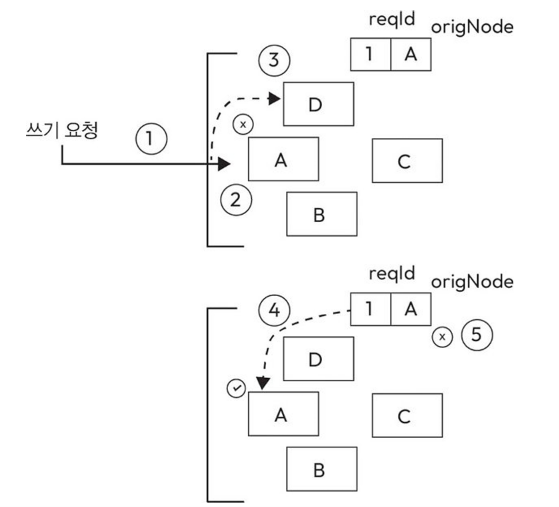

# 5강: 시스템 구성 요소의 설계 및 구현 - 데이터베이스와 스토리지

강의 번호: 요즘 개발자를 위한 시스템 설계 수업
유형: 스터디 그룹
복습: No

<aside>
💡

데이터 기반 의사 결정의 중요성이 높아지므로 데이터베이스와 스토리지의 개념, 전략, 기술, 시스템 설계 장식이 중요해짐

</aside>

## 5.1 데이터베이스

데이터베이스: 방대한 양의 정보를 체계적, 일관된 방식으로 저장하고 관리하며 활용할 수 있게 함

데이터베이스가 왜 필요한가?

- 데이터 구성: 테이블, 행, 열 형태로 정리해 정보를 쉽게 분류하고 접근할 수 있음
- 데이터 검색: 빠르고 효율적인 데이터 검색 가능
복잡한 쿼리를 사용해 원하는 데이터 추출, 인덱싱 메커니즘으로 데이터를 빠르게 조회
- 데이터 무결성: 제약 조건, 관계, 검증 규칙을 이용해 데이터 무결성(데이터 자체가 정해진 규칙에 맞고 정확하도록 보장) 유지함
데이터의 신뢰성, 정확성, 일관성이 보장됨
- 데이터 보안: 사용자 인증, 권한 부여, 암호화 등 보안 기능 이용해 무단으로 데이터 유출하는 것 막아줌
- 데이터 일관성: 트랜잭션 관리와 ACID(원자성, 일관성, 독립성, 지속성) 특성으로 **여러 사용자가 동시에 데이터 접근하고 수정하더라도 데이터 일관성을 유지**함
- 확장성: 대규모 데이터를 처리하거나 데이터 수요가 증가함에 따라 확장할 수 있음
수직 확장(단일 서버에 리소스 추가), 수평 확장(여러 서버, 노드 추가) 둘 다 가능
- 다중화, 백업 및 복구: 데이터의 가용성, 신뢰성 보장하기 위해 복제, 자동 백업 같은 다중화(중복성), 백업 메커니즘을 갖춤
- 복잡한 쿼리: 대규모 데이터셋 다룰 때 복잡한 쿼리, 통계 작업을 실행해 가치 있는 정보를 추출하고 분석할 수 있음
- 데이터 관계: 관계형 데이터베이스에서는 데이터 간 관계가 정의 되어있어 연관된 데이터를 효율적으로 관리 가능
- 데이터 이력: 데이터 변화를 시간에 따라 기록해 과거 데이터를 조회할 수 있음 → **감사, 법적 요구사항 충족**하는데 도움이 됨
- 데이터 분석: **데이터 분석 및 보고서 작성 도구 지원**해 데이터 기반 의사 결정, 운영 상태 및 성과 현황 파악 쉬워짐
- **데이터 공유**: 여러 사용자와 애플리케이션이 동시에 데이터에 접근하고 공유할 수 있도록 지원해 협업과 실시간 작업 환경에서 필수 요소가 됨

5.1.1 데이터베이스 유형

하나의 데이터베이스 유형이 모든 시스템과 애플리케이션 요구사항을 모두 충족할 수 없어 다양한 데이터베이스 유형이 존재함

크게 관계형 데이터베이스와 NoSQL(비관계형) 데이터베이스로 분류 가능하며 두 데이터베이스 모두 데이터를 효율적으로 저장, 관리, 검색하는 것이 목표지만 다른 모델과 데이터 조회 메커니즘을 사용함
→ 요구사항에 맞는 데이터베이스 유형 사용

5.1.2 관계형 데이터베이스

데이터를 행과 열로 구성된 표 형식으로 관리하는 유형

[주요 개념 및 특성]

- 테이블: 데이터를 테이블 형태로 표현함. 테이블은 행과 열로 나뉨
- 행(row): 각 행은 레코드, 튜플로 불리며 고유한 데이터 항목을 나타냄
ex. ‘고객’ 테이블의 개별 고객 정보
- 열(column): 열은 속성, 필드라고 불리며 테이블에 저장할 수 있는 데이터 유형을 의미함
- 키: 테이블 간 관계를 설정함 
기본키 - 테이블의 각 행을 고유하게 구별
외래 키 - 다른 테이블의 기본 키를 참조하여 두 테이블 간 관계를 형성
- 정규화: 데이터 중복 제거하고 데이터 무결성 높임
두(도)부이결다조
- SQL: 관계형 데이터베이스와 상호 작용할 때 사용하는 언어
테이블 구조 정의, 테이블 간 관계 설정, 데이터 생성, 조회, 업데이트, 삭제 가능
- ACID 특성: 데이터의 원자성, 일관성, 독립성, 지속성 보장 → 데이터 무결성 보장
원자성: 트랜잭션이 모두 실행되거나 모두 실행 안되거나
일관성: 트랜잭션 실행 전 후 데이터베이스가 정의된 규칙을 만족해야 함
독립성: 여러 트랜잭션이 동시 실행될 때, 다른 트랜잭션의 영향을 받지 않도록 해야 함
지속성: 트랜잭션이 성공적으로 완료되면, 그 결과가 영구적으로 저장되어야 함
- 트랜잭션: 여러 SQL 작업을 하나의 묶음으로 처리하는 트랜잭션 기능을 지원

대표적인 관계형 데이터베이스: MySQL, PostgreSQL, Oracle Database, Microsoft SQL Server, SQLite, IBM Db2
금융 시스템, 재고 관리, 고객 관계 관리 등 데이터의 일관성, 구조, 신뢰성이 중요한 애플리케이션과 산업에 주로 사용

5.1.3 비관계형 데이터베이스

테이블, 행, 열을 사용하는 관계형 데이터베이스와 달리 데이터 저장과 검색에서 더 유연한 방식으로 사용함
비정형 또는 반정형 데이터를 처리하도록 설계되어 다양한 애플리케이션과 용도에 적합

[주요 개념 및 특성]

- 키-값 저장소: 고유한 키와 데이터 값을 연관 짓는 방식
단순한 데이터 검색에는 효율적이지만 복잡한 쿼리에는 적합하지 않음
    
    ex) "user:1001" → {이름: "소연", 나이: 24}, "user:1002" → {이름: "철수", 나이: 30}
    
    Redis, DynamoDB - 간단한 인덱스나 별도의 자료구조/쿼리 기능 제공하긴 하지만 여러 속성 조합하는 복잡한 쿼리에는 적합하진 않음
    
- 문서 지향 데이터베이스: JSON, XML 같은 형식의 문서로 데이터를 저장하며 주로 웹 애플리케이션에서 많이 사용함
    
    ```jsx
    {
    "product_id": 1001,
    "name": "맥북 프로",
    "price": 2500000,
    "category": "노트북",
    "spec": {
    "memory": "16GB",
    "storage": "512GB"
    },
    "reviews": [
    {"user": "철수", "rating": 5},
    {"user": "영희", "rating": 4}
    ]
    }
    ```
    
    상품 정보를 개별적으로 저장 → 관계형의 경우 여러 테이블에서 JOIN 해와야 함
    
- 컬럼 패밀리 데이터베이스: 관련된 데이터를 컬럼 패밀리라는 그룹으로 구성하며 수평 확장에 유리함
아파치 카산드라, HBase 등
- 그래프 기반 데이터베이스: 복잡한 관계를 표현하기 위함. 데이터 간 관계를 그래프 구조를 사용해 나타내고 탐색함

요구사항에 유연하게 대응할 수 있다는 장점이 있지만 강력한 데이터 일관성이 약하기 때문에 데이터 모델링, 인덱싱 설계를 더 꼼꼼히 해야 함

5.1.4 관계형 데이터베이스와 비관계형 데이터베이스의 장단점

1. 관계형 데이터베이스
    
    [장점]
    
    - 데이터 중복 처리: 테이블 간 데이터 중복 최소화 해 데이터 무결성을 유지하고 저장 공간을 최적화하며 검색을 간편하게 할 수 있음
    - 강력한 보안 기능: 내장된 보안 기능으로 허가되지 않은 접근 차단
    - ACID 트랜잭션: 작업 중 데이터의 일관성과 신뢰성을 유지함
    
    [단점]
    
    - 성능: 여러 테이블에 대해 복잡한 조인을 거쳐 데이터 가져올 경우 성능 저하 있을 수 있음
    - 메모리 소모량: 행과 열이 저장 공간 차지하고 null이더라도 메모리 사용량이 증가함
    - 복잡성: 여러 테이블 간 관계와 조인을 처리하는 작업이 쉬운 일이 아니라서 DB 운영에 어려움을 줄 수 있음
    - 수평적 확장 어려움: 기존 관계형 데이터베이스는 수평적 확장이 어려워 대용량 데이터를 처리하기에 적합하지 않음
    여러 서버로 나눴을 때 관계, 트랜잭션, 일관성을 유지하기 어려움
2. 비관계형 데이터베이스
    
    [장점]
    
    - 유연한 데이터 모델: 정형, 비정형 데이터 모두 효과적으로 저장할 수 있어 데이터 구조 변화에 유연하게 대응할 수 있음
    - 스키마 업데이트: 스키마 업데이트해도 애플리케이션에 영향을 주지 않아 데이터 모델을 유연하게 변경할 수 있음
    - 수평적 확장: 수평적 확장 기능이 뛰어나 데이터와 작업량이 늘어나도 무리없이 대응 가능
    
    [단점]
    
    - 아직은 부족한 표준화: 비관계형 DB의 표준화가 부족해 설계 방식, 쿼리 언어가 제각각이라 서로 다른 시스템 간 호환성이나 데이터 일관성을 유지하기가 어려움
    - ACID 트랜잭션 미지원: 대부분 ACID 트랜잭션 제공하지 않아 일관성이 중요한 작업에서 신뢰성과 무결성 유지하기 어려움

## 5.2 키-값 저장소

5.2.1 키-값 저장소란?

각 고유한 키가 특정 값과 연결되는 데이터 저장 방식
키를 이용해 데이터를 저장,검색,업데이트 할 수 있음

5.2.2 분산

아래 특성이 있어 여러 분산 시스템에서 많이 사용함

- 확장성: 키-값 쌍의 단순한 구조로 **데이터를 여러 노드에 쉽게 분산**할 수 있어 시스템의 처리량을 높일 수 있음
- 성능: 데이터 읽기, 쓰기 속도가 매우 빠름. 특히 키-값 쌍이 같은 노드에 있을 때는 더 빠름
- 유연성: 고정된 데이터 스키마가 필요하지 않으며 다양한 형태의 데이터를 저장할 수 있음
- 장애 허용성: 데이터를 여러 노드에 복제하고 분할하도록 설계할 수 있어 특정 노드에 장애 발생하더라도 데이터에 접근할 수 있음

☑️ 정형, 비정형, 반정형 데이터란?

정형 데이터: 학교 성적표처럼 정해진 표 형식의 데이터
반정형 데이터: JSON 파일이나 XML 같은 형식으로 일정한 형식이 있지만 완전히 고정되지 않은 데이터를 의미
비정형 데이터: 자유롭게 작성한 글이나 사진처럼 정해진 형식이 아예 없는 데이터

5.2.3 키-값 저장소 설계

기능적 요구사항

- `Put(key, value)` : 키-값 쌍을 저장소에 **삽입**하는 put 연산을 지원해야 함. 이미 있으면 기존 값을 새로운 값으로 업데이트해야 함
- `Get(key)` : 저장된 키에 연결된 값을 **검색**하는 get 연산을 지원해야 함. 없으면 오류메시지 반환
- `Delete(key)` : 주어진 키-값 쌍을 삭제하는 delete 연산을 지원해야 함. 없으면 오류메시지 반환

비기능적 요구사항

- 확장성: 시스템에 새로운 노드를 추가해 수평적으로 확장할 수 있어야 함
- 성능: put, get 연산에 대해 낮은 지연 시간을 보장해야 함
- 내구성: 시스템은 값을 저장한 이후에도 지속적으로 유지하고 노드 장애로 발생하는 데이터 손실을 방지해야 함
- 일관성: 특정 키에 대해 가장 최근에 수행된 쓰기 작업이 모든 읽기 작업에 반영되도록 보장해야 함
충돌 발생하면 해결하는 메커니즘이 필요함
- 가용성: 노드 장애 발생하더라도 지속적으로 연산 처리할 수 있어야 함. 따라서 데이터를 여러 노드에 복제해두는 메커니즘 필요
- 파티션 허용성: 네트워크 장애로 노드 간 통신이 불가능한 상황에서도 시스템이 정상적으로 작동하며 데이터 무결성을 유지해야 함

## 5.3 확장성과 데이터 복제의 최적화

데이터와 트래픽이 많아지는 상황에서도 이를 효율적으로 처리하고 가용성을 높이기 위해 일관된 해싱을 사용해 시스템 확장성을 높이고 데이터를 여러 노드에 나누어 효율적으로 복제함

5.3.1 확장성 강화

수요에 따라 저장 노드를 추가하거나 줄여야 할 때가 있어 데이터와 부하를 시스템 내 모든 노드에 균형있게 분배할 수 있어야 함

만약 `hash(key) % 노드 수`로 요청을 처리할 노드를 결정
→ 노드 추가/제거 시 노드 수가 바뀌면서 기존 키의 담당 노드가 대거 변경됨
→ 각 노드가 키-값을 로컬에 저장하고 있으므로 변경된 담당 노드로 데이터를 다시 이동해야 하므로 비용 및 지연 시간이 증가함

5.3.2 일관된 해싱 사용

3강 [3.5 일관된 해싱](https://app.notion.com/p/3-5-3e9e9e8d55798058afe8e7bf8636c2ea?pvs=21)

각 노드 ID를 해싱해 링의 특정 위치에 배치 → 요청이 들어오면 키의 해시 값을 구해 링 위에 매핑하고 시계 방향으로 가장 가까운 노드가 요청을 처리함

❓일관된 해싱으로 담당 노드를 먼저 결정함 → 그 담당 노드에 데이터를 저장함 → 나중에도 같은 해싱 규칙으로 담당 노드를 계산함 → 따라서 데이터가 있는 노드를 찾아갈 수 있음

새로운 노드를 추가해도 바로 다음 노드만 영향을 받고 나머지는 영향 안받음
⇒ 노드 간 변경 최소화하면서 쉽게 확장 가능하고 전체 키 중 일부만 이동하면 됨

해시 값이 무작위로 분포되므로 요청 부하도 평균적으로 링 전체에 고르게 퍼짐
다만, 항상 요청 부하를 균등하게 나누지 않을 수도 있어 병목 지점(핫스팟)이 생겨 성능 저하시킬 수 있음

5.3.3 가상 노드 사용

동일한 키에 여러 해시 함수를 적용하는 방식

해시 함수 세 개 있다면 각 노드에 대해 해시 값 세 개 계산해 링에 배치
→ 요청이 들어올 때는 하나의 해시 함수만 사용하며 링에서 시계 방향으로 가까운 노드가 요청 처리
⇒ 이때 각 서버는 링 위에서 위치를 세 개 가지고 있기 때문에 요청 부하가 더 고르게 분산됨
     특정 노드가 다른 노드보다 더 많은 저장 공간이 있다면 추가 해시 함수로 가상 노드 추가할 수 있음

[장점]

- 노드 장애 발생, 서비스 점검 시 작업 부하가 다른 노드에 고르게 분산됨
- 노드의 물리적 장비 성능 차이를 고려하여 담당할 가상 노드 개수를 조정할 수 있음

5.3.4 데이터 복제 전략

1. 주종 모델
    
    하나의 저장소를 주 저장소로 설정하고 나머지는 종 저장소 역할을 함
    주 저장소: 쓰기 요청 처리 / 종 저장소: 주 저장소의 데이터를 복제하고 읽기 요청을 담당함
    
    쓰기 작업 이후 복제되므로 복제 지연이 발생할 수 있음
    주 저장소에 장애 발생하면 시스템의 쓰기 기능이 중단되어 단일 장애점 문제가 생길 수 있음
    
2. 동등 모델
    
    모든 저장소가 주 저장소로 설정됨
    각 저장소가 읽기/쓰기 요청 모두 처리할 수 있으며, 서로 데이터를 복제해 최신 상태를 유지함
    but ! 모든 노드에 데이터 복제하는 건 비효율적 → 보통 노드를 3~5개 선택해 복제하는 방식 사용
    
    키-값 저장소의 각 인스턴스에서 데이터를 노드 몇 개에 저장할 지 설정 가능
    

책) 동등 모델 추천함 - 지연 시간, 가용성에서 유리하며 단일 장애점 문제도 방지 가능

읽기, 쓰기 작업 처리하는 노드: 코디네이터
→ 할당 받은 키들을 후속 노드 n-1개에 복제하는 역할도 수행함
    이때 후속 노드 목록: 우선 목록(preference list) - 이미 포함된 물리적 노드에 속한 가상 노드는 제외

## 5.4 get 및 put 함수 구현

5.4.1 get 및 put 함수 구현

클라이언트가 노드를 선택하는 방식

- 요청을 일반 로드 밸런서로 라우팅
클라이언트가 코드에 종속되지 않음 (클라이언트는 몰라도 됨)
아무 노드에나 들어감
- 분할 인식 클라이언트 라이브러리를 사용해 요청을 해당 코디네이터 노드로 직접 전달
클라이언트가 특정 서버에 직접 접근해 지연 시간을 낮출 수 있음
ex) 일관된 해싱 → 해시 값으로 데이터가 있는 노드로 들어감

5.4.2 r과 w 사용

- `n`: 데이터를 복제해 저장하는 전체 노드 수
- `r`: 읽기 성공에 필요한 최소 응답 노드 수
- `w`: 쓰기 성공에 필요한 최소 쓰기 완료 노드 수

❗항상 최신 데이터를 읽기 위해 읽기, 쓰기 노드가 최소 하나는 겹치도록 `r + w > n`으로 설정

- `r`이 클수록 → 여러 노드의 응답을 기다려야 해서 읽기 느려짐
- `w`가 클수록 → 여러 노드에 쓰기가 완료될 때까지 기다려야 해서 쓰기 느려짐
- 예: `n=3, w=2` → 3개 복제 노드 중 2개에 쓰기가 완료되면 쓰기 성공, 나머지 1개는 이후 비동기적으로 업데이트 가능

⇒ 따라서 일관성, 가용성, 읽기/쓰기 성능을 고려해 적절한 `r`, `w`를 설정해야 함

## 5.5 키-값 저장소의 장애 허용성과 장애 식별

5.5.1 일시적 장애 관리

**쿼럼 기반 시스템** 사용하기
쿼럼: 분산 트랜잭션이 작업을 수행하는 데 필요한 최소 투표수
합의에 참여하는 서버 중 하나가 장애 일으키면 작업 진행할 수 없으며, 이는 가용성과 내구성에 영향을 미칠 수 있음

엄격한 쿼럼: 리더가 합의에 참여하는 구성원 간 통신을 조율함 → 노드/리더 장애나 네트워크 문제 발생 시 처리에 어려움이 생길 수 있음
느슨한 쿼럼: 우선 목록에 있는 노드 중 정상적으로 동작하는 노드 n개가 모든 읽기 및 쓰기 작업을 처리함
→ 일관된 해시 링의 우선순위 목록을 따라 정상적으로 동작하는 `n`개의 노드를 찾아 요청을 처리함.



[힌트 전달 방식]

- 원래 데이터를 저장해야 할 A 노드 장애
- 정상 노드 D가 A 대신 데이터를 임시 저장
- D는 “이 데이터는 원래 A의 것”이라는 **힌트**도 함께 저장
- A가 복구되면 D → A로 데이터 전달
- 전달 완료 후 D의 임시 데이터 삭제 → 원래 복제 구조 복구

⇒ 일시적 장애에 적합

5.5.2 영구적 장애 관리

노드에 영구적 장애 발생 → 레플리카 간의 불일치를 빠르게 감지하고 데이터 전송을 최소화해 동기화 상태를 유지해야 함

**머클 트리(merkle tree)**

- 목적: 여러 레플리카가 가진 데이터가 서로 같은지 효율적으로 비교·동기화
- 각 키-값을 해싱해 리프 노드로 만들고, 상위 노드는 자식들의 해시값을 이용해 **계층적**으로 구성
- 두 레플리카의 루트 해시 비교
    - 같음 → 전체 데이터가 동일 → 동기화 불필요
    - 다름 → 자식 해시를 차례로 비교하며 **불일치한 가지만 탐색**
    - 리프까지 내려가 실제로 다른 키-값만 찾아 동기화
- 동작 방식
    1. 모든 키를 해싱해 리프 노드를 생성
    2. 각 노드는 자신에게 할당된 키 범위에 대해 각 가상 노드마다 머클 트리를 생성
    3. 머클 트리의 루트 노드 해시를 비교함
    4. 두 해시가 동일하면 더 이상 진행하지 않음
    5. 다르다면 재귀적으로 왼쪽, 오른쪽 자식 노드 탐색해 차이점 찾아 동기화함

전체 데이터를 직접 비교할 필요가 없어 데이터 전송량과 저장소 접근을 줄일 수 있음
각 노드는 자신이 담당하는 키 범위(가상 노드)별로 머클 트리를 관리

단점: 노드 추가·삭제로 담당 키 범위가 변경되면 관련 머클 트리를 다시 계산해야 함

5.5.3 해시 링의 노드 구성과 장애 감지

**노드가 일시적으로 연결되지 않아도 바로 해시 링에서 제거하거나 데이터 재배치하지 않아야 함**
대부분의 장애가 일시적일 수 있기 때문

노드를 실제로 추가·삭제하면 담당 키 범위와 해시 링 구성이 변경됨
각 노드는 현재 어떤 노드가 존재하고 어떤 키 범위를 담당하는지 등의 구성 정보를 저장함
⇒  가십 프로토콜(Gossip Protocol)을 이용해 노드들이 서로 구성 정보를 공유·동기화할 수 있음

[가십 기반 프로토콜]
각 노드가 일부 다른 노드와 주기적으로 정보 교환 
→ 전달받은 정보가 다시 다른 노드로 퍼짐
→  결과적으로 **모든 노드가 같은 구성 정보를 알게 됨**

가십 방식은 모든 노드에 직접 한꺼번에 전송하지 않고 비동기적으로 조금씩 전파하므로 대역폭 부담을 줄일 수 있음

## 5.6 시스템 설계 인터뷰: 키-값 저장소 설계 관련 질문과 전략

키-값 저장소 설계할 때 핵심 내용

- 문제를 명확히 정의할 것: 요구 사항과 제한 사항(필요한 조건과 범위)을 먼저 파악하는 것이 중요
- 확장성과 성능에 중점을 둘 것: 데이터와 요청의 양이 늘어나더라도 키-값 저장소가 이를 효과적으로 처리 할 수 있도록 어떻게 설계할지 설명할 수 있어야 함
ex) 일관된 해싱으로 키를 분배하겠다
- 레플리카와 일관성을 설명할 것: 고가용성을 달성하려면 레플리카를 어떻게 관리할 지 설명해야 함
일관성 모델을 설명하고 레플리카에서 발생할 수 있는 쓰기 충돌을 어떻게 해결할지도 언급해야 함
ex) 쇼핑몰 장바구니: “3개 노드에 복제하여 가용성을 확보하고, 장바구니 특성상 최종 일관성을 허용하며, 동시 쓰기 충돌은 변경 사항 병합 등의 정책으로 해결하겠습니다.”
- 장애 발생 가능성을 염두에 둘 것: 다중화 활용, 장애 감지 및 복구 전략 마련해야 함
- 시스템의 발전 가능성 고려할 것: 데이터 버전 관리 어떻게 운영할지, 요구 사항에 맞춰서 어떻게 구성할 수 있을 지

## 5.7 DynamoDB

AWS에서 제공하는 완전 관리형, 서버리스 비관계형 데이터베이스
SSD 스토리지 사용, 지리적으로 분산된 데이터 센터 세 곳에서 데이터를 분산 저장하는 키-값 및 문서형 데이터베이스
지연 시간이 매우 낮고, 저장소와 처리량을 유연하게 조정 가능

5.7.1 고정된 스키마가 없다

비관계형 데이터베이스로 고정된 스키마가 없음

- 유연성: 비정형, 반정형 데이터 저장 가능하며 RDBMS의 테이블들을 하나의 문서로 통합시킬 수 있음
- 확장성: 테이블이 아닌 문서 형식이라 데이터 확장이 비교적 간단함
RDBMS는 물리적 저장 장치에 강하게 의존하지만 비관계형은 대규모 클러스터에 쉽게 분산 배치할 수 있음
- 성능: 대규모 작업에서 최적의 성능을 발휘하도록 설계됨
- 가용성: 노드 교체할 때 서비스에 영향을 최소화하며 데이터 파티셔닝을 쉽게 구성할 수 있어 높은 가용성을 유지함 노드에 장애 발생 시에 자동으로 요청을 다른 레플리카로 전달

5.7.2 DynamoDB API 함수

- PutItem: 입력된 키를 기준으로 데이터 추가, 동일한 키 있으면 기존 데이터 덮어씀
- UpdateItem: 기존 데이터를 수정하거나 해당 키가 없으면 새로 만듦
- DeleteItem: 지정된 기본 키에 해당하는 데이터를 삭제함
- GetItem: 기본 키를 사용해 데이터를 조회하고 해당 속성을 가져옴

5.7.3 DynamoDB의 데이터 분할

DynamoDB는 데이터를 여러 저장 서버에 걸쳐 **수평적**으로 나눠서 저장함
수직적 분할은 미리 스키마를 정의해야 하기 때문에 스키마 없이 동작하며 방대한 양의 행을 처리해야 하므로 DynamoDB는 수평적 분할이 더 적합함


기본 키 유형

데이터를 나눠 저장한 특정 영역에서 항목을 찾기 위해 두 가지 키 체계를 사용함

- 분할 키: 단일 속성을 이용해 항목을 고유하게 식별
- 분할 키에 정렬 키 결합한 복합 키: 두 속성을 결합해 항목을 고유하게 식별함
동일한 분할 키를 가진 여러 항목을 정렬 키 기준으로 구분할 수 있음


5.7.4 DynamoDB에서 처리율 최적화

처리율: 시스템이 읽기나 쓰기 요청 처리할 수 있는 능력

처리율 할당

- RCU(Read Capacity Unit): 읽기 요청을 처리할 수 있는 용량
- WCU(Write Capacity Unit): 쓰기 요청을 처리할 수 있는 용량
- 테이블 전체에 설정된 RCU/WCU를 여러 파티션에 나누어 할당함.

초기 분할에는 각 파티션의 요청량이 비슷하다고 보고 처리 용량을 균등하게 분배함.
데이터 저장 용량, 읽기/쓰기 작업이 증가하면 파티션을 추가하거나 제거해야 함
→ 파티션 수 변경되면 기존 파티션 간의 처리량을 다시 분배해야 함

버스팅: 단기 오퍼 프로비저닝 :버스터콜:

특정 키에 요청이 몰리며 파티션 간 요청 분포가 고르지 않는 상황 발생
→ 순간적인 트래픽 증가를 처리하기 위해 남아있는 여유 처리 용량을 잠시 활용하는 전략
(평소 한계치를 넘어감)


토큰 버킷 시스템

토큰 버킷: 토큰을 소비하면서 요청을 처리해 처리 속도를 조절하는 방식
(버스팅을 구현하는 방법 중 하나)

- 기본 처리량 버킷: 평소 처리할 수 있는 용량
- 버스트 처리량 버킷: 평소 남는 여유 처리량을 모아뒀다가 급증 시 추가로 사용

기본 처리량 다 사용했다 → 버스트 버킷에 토큰이 있으면 일시적으로 한계를 넘어 추가 요청

버스팅: 단기적인 작업량 변동을 처리하는 데 효과적
하지만 장기적으로 관리하려면 DynamoDB의 적응형 용량 관리 기능을 사용함

적응형 용량 관리: 장기적 관점의 방향

[동작 방식]

- 내부적 알고리즘을 활용해 시간에 따른 읽기/쓰기 패턴을 분석해 **핫 파티션 / 콜드 파티션** 파악
- 사용량에 맞춰 RCU/WCU를 파티션 간 재분배
⇒ 핫 파티션의 스로틀링(처리량 제한)을 줄임

단점: 패턴 학습 및 분석과 재분배에 시간이 필요해서 즉각 대응은 어려움
         한 번에 하나의 파티션에서 처리량을 크게 늘리는 데 한계가 있음

글로벌 접근 제어: 파티션 간 관리

개별 파티션이 아니라 **테이블 전체의 처리량을 관리**

초당 작업 횟수에 글로벌 제한을 두고 각 파티션의 부하에 맞춰 처리량을 분배해 특정 파티션으로 작업이 지나치게 몰리는 것을 방지
파티션을 하나만 보는 게 아니라 테이블 전체의 처리량 제한을 넘는지 상황을 본다
전체 처리량 넘으면 일부 요청을 제한

사용량에 맞춘 분할: 선제적 파티션 관리

앞으로 부하가 크게 늘어날 것으로 예상되면 **파티션 자체를 미리 분할, 병합**

키 범위 파티셔닝이나 해시 파티셔닝으로 데이터 분포와 접근 패턴을 기반으로 파티션을 나눠 데이터 재분배 
→ 부하가 여러 파티션으로 나뉘도록 해서 처리량 효율 향상

5.7.5 DynamoDB의 높은 가용성

1. 쓰기 가용성
    
    테이블을 여러 **파티션**으로 나누고, 각 파티션을 여러 노드에 복제함
    같은 파티션의 복제본들을 복제 그룹(Replication Group)이라고 함.
    
    복제 그룹에서는 **리더 레플리카**를 선출하고, 리더가 쓰기 요청을 담당함.
    어떤 레플리카가 응답하지 않거나 문제 생기면 즉시 다른 레플리카를 복제 그룹에 포함시켜 쓰기 작업이 끊기지 않도록 함
    
    쓰기 과정: 쓰기 요청 → 리더 → WAL(쓰기 전 로그)에 먼저 기록 → 메모리에 색인 → 다른 레플리카로 복제(로그, 색인 데이터)
    
    일부 레플리카가 장애 나도 충분한 정상 레플리카(쿼럼)가 있으면 쓰기 서비스를 계속 유지할 수 있음.
    장애가 난 레플리카는 다른 정상 레플리카로 대체하여 복제 그룹의 가용성을 유지함.
    리더에 장애가 발생하면 새 리더를 선출하는 과정이 필요함.
    
2. 읽기 가용성
    
    데이터는 여러 레플리카에 복제되지만 변경 사항이 모든 레플리카에 즉시 반영되는 것은 아님
    ⇒ 일반적인 읽기는 **최종 일관성(Eventual Consistency)**따름.
    
    - 일부 레플리카에서는 잠시 이전 데이터가 조회될 수 있음
    - 시간이 지나면 모든 레플리카가 최신 상태로 동기화됨
    
    쓰기 직후 최신 데이터를 즉시 읽는 강한 일관성 읽기가 필요하면 최신 상태를 보장할 수 있는 방식으로 읽어야 함.
    

리더 레플리카의 안정성과 장애 감지/선출 과정이 시스템 전체의 신뢰성/성능에 영향
리더 장애 시 새로운 리더를 선출해야 하며, 회색 장애(Gray Failure)처럼 애매한 장애는 감지가 어려울 수 있음 → 레플리카 간 통신 프로토콜을 설정해 리더 레플리카 상태 확인한 후 리더 선출 진행 가능

## 5.8 컬럼 패밀리 데이터베이스

대량의 데이터 저장하고 빠르게 읽고 쓰는 작업에 적합
ex) 아파치 카산드라

[특징]

- 데이터 구성: 데이터를 컬럼 패밀리라는 그룹으로 묶어 관리함
컬럼 패밀리: 연관된 컬럼의 집합 → 컬럼을 동적으로 추가할 수 있음
- 컬럼: 독립적인 데이터 요소
컬럼을 사전에 정의할 필요 없으며 필요에 따라 컬럼 추가 가능
- 행: 특정 엔티티나 레코드에 관련된 데이터
- 와이드 컬럼 스토어: 각 행에 대해 데이터를 효율적으로 담을 수 있는 구조를 가지고 있음
→ 엔티티에 대해 폭 넓은 데이터 속성을 다뤄야 하는데 효율적
- 확장성: 수평적 확장을 위해 설계됨
클러스터에 새로운 노드 추가, 데이터를 여러 서버에 분산해 대량의 데이터, 높은 트래픽을 처리 가능
- 높은 읽기 및 쓰기 처리량: 쓰기와 읽기 처리 속도를 극대화하도록 최적화 됨
→ 지속적으로 데이터를 업데이트하고 조회해야 하는 실시간 애플리케이션에 적합
- 데이터 분산: 데이터를 클러스터 내 여러 노드에 분산 저장함
- 쿼리 처리: 복잡한 쿼리 처리에 적합하지 않음
주로 키 기반 조회에 최적화된 쿼리 방식 사용
- 활용 사례: 시간에 따라 변화하는 데이터를 저장하는 시계열 데이터 관리, 이벤트 기록 등
- 일관성 모델: 다양한 일관성 수준을 설정할 수 있어 요구 사항에 따라 데이터 일관성과 성능 간 균형 조절 가능

## 5.9 HBase

아파치 HBase: 오픈 소스 기반 분산형 확장 가능한 비관계형 데이터베이스
대량의 데이터를 높은 읽기 및 쓰기 속도로 처리 가능 → 빅데이터 처리, 분산 컴퓨팅 환경 등에 적합

[구성]

- 테이블은 여러 행으로 구성됨
- 행은 여러 컬럼 패밀리를 포함함
- 컬럼 패밀리는 여러 컬럼으로 구성됨
- 컬럼은 키-값 쌍의 모음

[특징]

- 분산 처리 및 확장성: 범용 하드웨어로 구성된 클러스터에서 동작하도록 설계됐으며, 클러스터에 노드를 추가함으로써 대규모 데이터를 효율적으로 저장하고 처리할 수 있음 (수평적 확장)
- 컬럼 패밀리 데이터 모델: 카산드라와 마찬가지로 컬럼 패밀리 데이터 모델을 사용함. 
컬럼은 필요한 만큼 자유롭게 추가 가능
- 일관성 모델: 강한 일관성 보장
- 데이터 버전 관리: 이전 버전의 데이터를 조회하거나 쿼리 할 수 있음
- 확장성, 부하 분산: 데이터를 자동으로 분산하고 노드 간 부하를 균형 있게 조정할 수 있도록 설계됨
- 높은 읽기 및 쓰기 처리량: 읽기, 쓰기 작업 빠르게 처리 가능 → 실시간 데이터 처리, 분석에 특히 적합
- 하둡을 이용한 통합 기능: 하둡 생태계와 연동할 수 있어 여러 **데이터 처리 도구**를 결합해 데이터 처리, 분석 작업 효과적 수행 가능
- 블룸 필터, 블록 캐시: 블룸 필터(있는지를 빠르게 판단), 블록 캐시 같은 데이터 구조로 데이터 검색 속도 최적화, 쿼리 성능 향상
HBase - 데이터를 일정 크기의 데이터 블록 단위로 디스크에서 읽음
- 데이터 압축: 데이터를 압축해 저장 공간 절약
- 사용 사례: 대규모 데이터셋에서 무작위로 데이터에 접근이 필요한 애플리케이션에 사용
ex) 시간 관련 데이터, 센서 데이터, 로그 데이터 등

5.9.1 HBase 자세히 살펴보기


- 리전 서버: 읽기, 쓰기 작업에서 데이터를 처리하는 핵심적인 역할을 담당함.
데이터 요청 시 HBase 리전 서버와 직접 연결되어 처리됨
    
    리전 서버가 관리하는 데이터 - 하둡 데이터 노드에 저장
    → 함께 배치되어 데이터와 서버 간 물리적 거리를 최소화해 작업 속도 높임
    
    행의 키 범위를 기준으로 리전으로 나눔
    리전: 시작 키~ 끝 키 범위 안의 모든 행을 포함함
    리전 1000개를 관리할 수 있으며 리전의 기본 크기는 1기가
    (행으로 리전을 나누고 리전 안에서 컬럼 패밀리별로 데이터를 따로 저장함)
    


- HBase 마스터: 리전 할당과 데이터 정의 언어(DDL) 작업(Create, Delete, Update 등)을 관리
    - 리전 서버를 관리 조율
    - 시작할 때 리전 할당하거나 복구 및 부하 분산 상황에서 리전을 다시 배치
    - 클러스터 내 모든 리전 서버를 모니터링하고 주키퍼에서 상태 변경 알림 수신
    - 주요 테이블 작업 처리하는 인터페이스
- 이름 노드: 파일을 구성하는 모든 물리적 데이터 블록의 메타 데이터 정보를 유지, 관리
DataNode 위치에 대한 메타 데이터를 관리
- 주키퍼: 클러스터의 실시간 상태를 관리하는 분산형 조율 서비스
클러스터 내 서버들의 최신 상태를 유지하고 서버 가용성 추적, 서버 장애 발생 시 알리는 역할
합의 메커니즘으로 서버 간 상태 공유하도록 함 이때 일반적으로 서버 3~5대 사용

Meta 테이블 = HBase 카탈로그 테이블


클러스터 내 리전의 위치 정보를 저장함
주키퍼가 관리하는 .META. 서버가 이 테이블을 관리함

- 키: 리전의 시작 키와 고유한 리전 ID로 구성됨
- 값: 해당 리전이 속한 리전 서버

META 테이블 → "이 HBase 데이터(키)는 어느 RegionServer가 담당해?"
NameNode → "이 HDFS 파일의 실제 블록은 어느 DataNode에 저장돼?"

리전 서버 구성 요소


- WAL: 아직 영구적으로 저장되지 않은 새로운 데이터를 보관함
장애 발생했을 때 데이터 복구할 수 있도록 지원하는 것이 목적
MemStore는 메모리라 서버 죽으면 날라가지만 WAL은 HDFS에 기록하므로 안날라감
- 블록 캐시: 자주 읽는 데이터를 메모리에 저장해 읽기 속도 높이기
캐시 꽉 차면 오래된 거 삭제함
- MemStore: 데이터를 디스크에 기록하기 전에 임시로 저장하는 쓰기 캐시 역할을 함
컬럼 패밀리마다 하나의 저장소가 생성되고 변경 데이터를 키-값 형태로 정렬해서 모아둠 이후 HFile에 기록
쓰기 요청을 하나씩 하면 비효율적이기 때문에 컬럼패밀리 별로 모아서 한꺼번에 저장
- HFile: 디스크에 데이터를 **정렬된** 키-값 형태로 저장함
디스크 드라이브 헤드를 이동할 필요가 없어(이미 정렬됨) 효율적으로 저장 작업 처리할 수 있음

HBase의 작업 실행 과정

1. 클라이언트가 주키퍼와 통신 시작해 META 테이블 관리하는 .META. 서버 정보를 요청함
2. 이후 클라이언트가 .META. 서버에 쿼리 보내 원하는 행의 키와 연결된 리전 서버 정보를 가져옴
3. META 테이블 정보를 포함한 데이터를 캐싱함 (나중에 써먹기 위해)
4. 캐싱된 정보(어떤 리전 서버, 어떤 리전)를 바탕으로 해당 리전 서버에서 원하는 행 데이터를 가져옴

HBase 쓰기 작업

1. Put 요청을 보내면 가장 먼저 데이터를 WAL에 기록함
2. 변경된 데이터는 WAL 파일의 끝부분에 추가되며 디스크에 저장됨
3. 데이터가 WAL에 기록되면 MemStore에 저장하고 완료 응답을 클라이언트에게 보냄

HBase 리전 플러시(flush)

- MemStore에 데이터가 충분히 쌓이면 데이터를 키 순서로 정렬한 뒤 새로운 HFile 생성해 기록
- 컬럼 패밀리마다 여러 개의 HFile이 생성될 수 있으며, 실제 데이터(KeyValue)가 저장됨
- 각 변경에는 시퀀스 번호가 붙어 있어서 데이터가 어디까지 영구 저장됐는지 추적함
복구할 때 마지막 시퀀스 이후부터만 복구하면 됨
- HFile에는 자신이 저장한 가장 높은 시퀀스 번호를 기록
- 리전이 시작되면 이 번호를 확인하여 이미 저장된 부분과 이후 처리할 변경 사항을 구분함

HBase 읽기 작업

한 행의 최신 데이터가 Block Cache, MemStore, HFile에 흩어져 있을 수 있어서, 이들을 조회한 뒤 합쳐서 반환함.

1. Block Cache 확인
    - 최근에 읽었던 데이터가 메모리에 캐싱되어 있음
    - 있으면 빠르게 가져옴
    - 공간 부족 시 오래 사용하지 않은 데이터부터 제거
2. MemStore 확인
    - 최근에 쓰기/수정된 데이터가 있는지 확인
    - 아직 HFile로 Flush되지 않은 최신 데이터가 있을 수 있음
3. HFile 확인
    - 앞의 두 곳에서 필요한 셀을 다 못 찾으면 디스크의 HFile 조회
    - 인덱스 + 블룸 필터를 이용해 데이터가 있을 만한 HFile만 골라서 확인 → 불필요한 디스크 접근 감소

⇒ 차례대로 조회한 후 이를 합쳐야 함

## 5.10 그래프 기반 데이터베이스

그래프 구조를 사용해 데이터를 표현함
데이터 간 연결을 효율적으로 탐색할 수 있음

[특징 및 개념]

- 그래프 구조: 노드와 엣지로 구성된 그래프 형태로 데이터가 저장됨
노드는 개체, 엣지는 관계
- 노드: 기본 데이터 단위로 해당 개체에 대한 속성(키-쌍 값)을 포함
- 엣지: 노드 간 연결로 두 대상의 연관성을 표현함
추가적인 속성을 부여해 연관성의 성격이나 세부 내용을 설명할 수 있음
- 레이블 및 관계 유형: 노드와 에지에 이름/유형을 붙여 특정 카테고리나 유형으로 분류
- 탐색 기능: 노드 간 연결을 따라가며 경로, 연결 관계 등을 빠르게 탐색
- 사이퍼 쿼리 언어: 그래프 데이터를 조회·수정하기 위한 그래프 전용 쿼리 언어
- 인덱싱: 특정 속성이나 관계를 빠르게 찾을 수 있도록 인덱싱 메커니즘을 활용해 검색 성능 향상
- 확장성: 데이터를 여러 서버에 분산하여 데이터·트래픽 증가에 대응 (수평적 확장)
- 활용 사례: 소셜 네트워크, 추천 시스템, 사기 탐지, 지식 그래프 등 관계를 모델링하고 분석하는 데 활용
- 패턴 매칭: 그래프에서 특정한 연결 구조나 관계 패턴을 찾아내는 기능. **친구 추천, 유사 사용자 추천** 등에 활용

## 5.11 Neo4j 그래프 데이터베이스

복잡한 데이터의 관계를 저장하고 빠르게 탐색하는 그래프 DBMS

[특징 및 개념]

- 그래프 데이터 모델: 데이터를 노드와 노드 사이의 연결 관계로 표현
- 노드(Node): 사람·상품 같은 개체를 표현하며, `이름: 소연`, `나이: 24`처럼 키-값 속성을 가질 수 있음
- 관계(Relationship): 노드 간 연결을 표현하며 관계 자체도 속성을 가질 수 있어 구체적인 특징이나 세부 정보를 나타낼 수 있음
- 레이블과 관계 유형: 노드와 관계에 person, friends 같은 레이블을 지정하여 분류
- 사이퍼 쿼리 언어: Neo4j에서 그래프 데이터를 조회·수정·탐색하는 전용 쿼리 언어
- 인덱싱과 쿼리 최적화: 특정 속성이나 관계 유형을 기반으로(인덱싱) 데이터를 효율적으로 검색해 쿼리 성능 최적화
- 확장성: 여러 노드를 활용해 대규모 데이터와 트래픽에 대응 (수평적 확장)
- **ACID**: 트랜잭션의 원자성·일관성·격리성·지속성을 보장하여 데이터 무결성 유지
- 데이터 버전 관리: 시간에 따른 데이터 변화를 추적하고 과거 상태를 조회하는 기능
- 활용 사례: 소셜 네트워크, 추천 시스템, 사기 탐지, 지식 그래프, 네트워크 관리 등 관계 분석이 중요한 분야
- 활발한 커뮤니티, 생태계: 오픈 소스 커뮤니티 활발 ~

5.11.1 Neo4j 자세히 살펴보기


[팔로우 관계]
노드 1 → 노드 2
노드 1 → 노드 3
노드 2 → 노드 3

## 5.12 관계형 모델링과 그래프 모델링

관계형 모델링


- 단방향 관계 저장: 시작점 → 도착점을 관계당 한 행으로 저장. 시작점 기준 관계 탐색에 유리
ex) 특정 사용자가 팔로우하는 대상(도착점) 찾기 → 해당 사용자의 시작점을 인덱스로 찾아야 함
- 양방향 관계 저장: 같은 관계를 양쪽 노드 기준으로 두 번 저장하고 방향(IN/OUT)을 표시. 양쪽 방향 모두 빠르게 탐색 가능

5.12.1 그래프 모델링


- 관계 A: 1 → 2 관계 B: 1 → 3 관계 C: 2 → 3
- (a): 이중 연결 리스트로 표현, 노드가 세 개이므로 연결 리스트도 세 개
- (b), (c): (b)는 첫번째 관계의 ID가 저장됨, (c)는 관계가 실제로 저장되는 방식을 의미

5.12.2 기존 그래프에 새로운 노드 추가


- 관계 A: 1 → 2 관계 B: 1 → 3 관계 C: 2 → 3 ****관계 D: 2 → 4
- (b): 노드 4, 관계 D 추가
- (c), (d): 2 → 4가 추가되므로 dst_prev_rid: D, src_next_rid: D가 됨

노드 저장소: 모든 노드 정보를 저장하는 파일로, 각 노드 레코드는 15바이트

- 사용 여부(`inUse`) : 첫번째 바이트
- 노드 ID: 다음 4바이트
- 첫 번째 관계 ID → 연결된 관계 탐색의 시작점: 다음 1바이트
- 첫 번째 속성 ID → 노드 속성 탐색의 시작점: 다음 1바이트
- 레이블 정보: 다음 5바이트
- 향후 사용 공간: 마지막 1바이트

관계 저장소: 노드 간 관계 정보를 저장하며, 각 관계 레코드는 34바이트

- 출발 노드 ID(src)
- 도착 노드 ID(dst)
- 관계 유형 → `FRIENDS`, `FOLLOWS` 등
- 출발·도착 노드 각각의 이전/다음 관계 포인터(prev/next) 저장
- 포인터를 따라가며 연결된 관계들을 빠르게 탐색 가능
