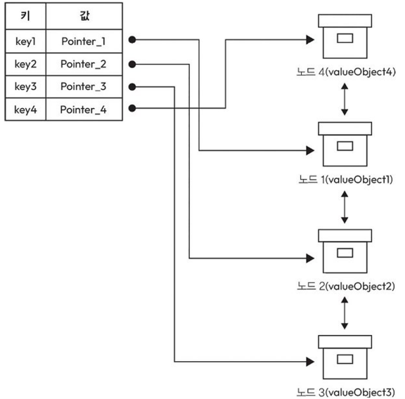

# 6강: 분산 캐싱

복습: No

<aside>
💡

캐싱이 무엇인지, 분산 캐싱은 왜 필요한지

</aside>

## 6.1 캐싱 정의

[주요 개념] 

- 캐시: 자주 접근하는 데이터나 리소스의 복사본을 임시로 저장하는 공간
- 캐싱된 데이터: 캐시에 저장된 데이터 복사본
- 캐시 히트: 요청한 데이터가 캐시에 있는 경우
- 캐시 미스: 요청한 데이터가 캐시에 없는 경우
이 경우, 원본 데이터 소스에서 데이터 가져와야 함
- 캐시 제거: 저장소에 캐시 가득차면 기존 데이터를 삭제해야함
보통 적은 빈도 또는 최근에 사용하지 않은 데이터 삭제함

6.1.1 분산 캐싱 정의

자주 사용하는 데이터를 **여러 서버의 메모리(RAM)에 분산해서 저장**하는 기술
여러 노드의 메인 메모리에 캐시 저장하면 입출력 지연 없이 빠르게 가져올 수 있음

6.1.2 분산 캐싱과 일반 캐싱의 차이점

- 공통점: 둘 다 자주 쓰는 데이터를 캐시에 저장해서 원본 저장소 접근을 줄이고 속도를 높임.
- 일반(로컬) 캐싱: 한 서버 내부의 메모리에 캐시를 저장. 구조와 데이터 일관성 관리가 단순하지만 해당 서버에서만 사용하므로 대규모 확장에는 한계가 있음.
- 분산 캐싱: 여러 캐시 서버(노드)에 데이터를 분산 저장하고 여러 애플리케이션 서버가 공유. 수평 확장이 가능해서 대규모 서비스에 적합.
- 분산 캐싱의 단점: 여러 노드에 데이터가 있으므로 동기화·일관성·캐시 무효화 관리가 더 복잡함.
- 활용: 로컬 캐싱은 소규모/단일 서버, 분산 캐싱은 대규모 웹 서비스·분산 DB·마이크로서비스에 적합.

|  | **일반 캐싱** | **분산 캐싱** |
| --- | --- | --- |
| **적용 범위** | 단일 서버/기기 내부의 로컬 캐시에 저장 | 여러 서버/노드에 캐시를 분산 저장·공유 |
| **아키텍처** | 메모리에 위치한 로컬 캐시에 저장됨 | 여러 캐시 노드가 네트워크로 연결, 데이터를 분산 관리
각 노드는 로컬 캐시를 가질 수 있음 |
| **확장성** | 단일 서버 중심이라 소규모 환경에 적합 | 캐시 노드를 추가하는 수평 확장이 가능해 대규모 환경에 적합 |
| **활용 사례** | 한 서버의 DB 접근 감소, 자주 쓰는 데이터 빠르게 조회 | 대규모 웹 서비스, 분산 DB, 마이크로서비스 등 여러 서버가 데이터를 공유하는 환경 |
| **일관성·동기화** | 한 곳에서 관리하므로 비교적 단순 | 여러 노드의 캐시를 맞춰야 해서 동기화·무효화가 복잡 |

6.1.3 활용 사례

- 웹 애플리케이션: 여러 서버가 함께 사용할 세션, 페이지 구성 요소, 자주 쓰는 데이터를 여러 캐시 노드에 분산 저장하여 빠르게 접근
- DB 쿼리 결과: 자주 실행하는 쿼리 결과를 분산 캐시에 저장해 반복적인 DB 접근과 부하 감소
- 콘텐츠 전송 네트워크(CDN): 여러 지역의 에지 서버에 정적 콘텐츠를 캐싱하여 사용자와 가까운 곳에서 빠르게 제공
- 세션 관리: 세션 정보를 분산 캐시에 저장하여 어느 웹 서버가 요청을 받아도 동일한 세션 정보에 접근할 수 있어 확장에 유리
- API 응답 캐싱: 자주 요청되는 API 결과를 여러 캐시 노드에 저장해 백엔드 호출 감소 + 응답 속도 향상
- 실시간 분석: 자주 조회하거나 계산한 분석 결과를 캐싱하여 대시보드, 실시간 보고서를 빠르게 제공
- 메시지 처리: 처리 과정의 중간 결과 등을 캐싱해 반복 작업을 줄이고 처리 효율 향상

6.1.4 분산 캐싱을 사용할 때 장점

- 성능 개선: 자주 쓰는 데이터를 메모리에서 바로 가져와 응답 속도 향상
- 확장 용이성: 트래픽이 늘면 캐시 노드를 추가하여 수평 확장 가능
- 백엔드 부하 감소: DB·파일 시스템까지 가는 요청을 줄여 백엔드 과부하 방지
- 장애 허용성: 캐시 데이터를 여러 노드에 복제해 특정 노드가 고장 나도 다른 노드에서 처리 가능
- 일관된 접근 속도: 자주 쓰는 데이터는 캐시에서 제공하여 빠른 접근 속도 유지
- 비용 절감: 백엔드가 처리해야 할 작업이 감소하여 서버·인프라 비용 절감
- 사용자 경험 향상: 빠른 응답으로 서비스 체감 속도와 만족도 향상

6.1.5 분산 캐싱의 한계점

- **일관성 유지 어려움**: 여러 캐시 노드의 데이터를 모두 최신 상태로 맞추기 어려움
강한 일관성을 유지하려 하면 지연 증가
- 캐시 무효화 복잡: 원본 데이터가 변경되면 여러 노드의 기존 캐시를 삭제, 갱신해야 함
- 설정·관리 복잡: 데이터 분산, 노드 관리, 동기화 등 단일 캐시보다 **운영이 복잡함**
- 네트워크 부하: 캐시 노드끼리 동기화, 통신하면서 네트워크 비용과 지연 발생
- 오래된 데이터 문제: 동기화가 늦으면 최신이 아닌 캐시 데이터를 반환할 수 있음
- 데이터 분배 어려움: 분배가 잘못되면 특정 캐시 노드에 요청이 몰리는 핫스팟 발생
- 높은 메모리 사용량: 많은 데이터를 메모리에 저장하고 복제하면 RAM 사용량 증가
- 비용 증가: 여러 캐시 노드와 네트워크, 운영 관리에 추가 비용 발생
- 접근 패턴에 따라 효과 낮음: 자주 재사용되지 않는 데이터라면 캐싱해도 캐시 적중률이 낮아 이점이 적음
- **쓰기 많은 환경에 불리**: 데이터가 자주 바뀌면 계속 캐시를 갱신, 동기화해야 해서 읽기 중심 환경보다 효율이 떨어짐

## 6.2 분산 캐시 설계

6.2.1 요구 사항 정의

[기능적 요구 사항]

- put(key, value): 키-값 쌍을 캐시에 추가함
- get(key): 주어진 키로 해당 값을 주회

[비기능적 요구 사항]

- 높은 성능: 캐시 데이터에 빠르게 접근하고 효율적으로 처리해야 함
- 높은 확장성: 데이터, 요청, 사용자 수 늘어나더라도 성능 저하없이 대응할 수 있어야 함
- 높은 가용성: 장애가 발생하거나 노드 동작이 중단되더라도 서비스가 끊기지 않고 안정적으로 작동해야 함

6.2.2 설계 과정

1. 캐싱에 필요한 데이터 구조
    
    해시 맵(해시 테이블): 가장 간단한 구조
    → put, get 연산 매우 빠르게 처리 가능
    
2. 캐시 삭제 정책
    
    캐시 데이터양이 용량에 도달하거나 특정 조건이 충족되었을 때 어떤 항목을 삭제할 지 결정하는 과정
    
    - 삽입 순서 기반(접근 시간 고려 x)
        - 선입선출: 가장 오래된 캐시부터 삭제
        - 후입선출: 가장 최신 캐시 삭제
        ex) 스토리 추천: 가장 최근에 추천한 스토리 삭제, 이전에 추천하지 않은 캐시는 저장
    - 접근 기반
        - 가장 최근에 사용한 항목 제거
        ex) 가장 최근에 열었던 문서(MRU) → 당분간 안 열 가능성 높다고 판단
        - 가장 오래된 항목 제거(LRU)
        ex) 웹 브라우저 → 가장 오랫동안 접근하지 않은 웹 페이지는 삭제
        - 최소 사용 빈도 제거(LFU): 가장 적게 사용한 항목 제거
        ex) 음악 스트리밍 → 재생 횟수 가장 적은 곡 삭제

LRU 예시)

- 구조: 해시 맵 + 이중 연결 리스트를 함께 사용.
    - 해시 맵: `key → 연결 리스트의 노드 위치`를 저장 → 원하는 데이터를 O(1)에 찾음
    - 이중 연결 리스트: 최근 사용한 데이터는 맨 앞, 가장 오래 사용하지 않은 데이터는 맨 뒤에 위치
- 캐시 미스 + 공간 있음: DB에서 데이터 조회 → 새 노드를 리스트 맨 앞에 추가 → 해시 맵에도 등록
- 캐시 미스 + 캐시 가득 참: 리스트 맨 뒤(LRU)를 삭제 → 해시 맵에서도 삭제 → 새 데이터를 DB에서 가져와 맨 앞에 추가
- 캐시 히트: 해시 맵으로 노드를 바로 찾고 → 해당 노드를 리스트 맨 앞으로 이동하여 최근 사용된 데이터로 표시
- 시간 복잡도: 검색·추가·삭제·최근 사용 갱신을 모두 O(1)에 처리 가능.
1. 시스템 통합하기
    - 방법 1 — 서버 통합형 캐시: 애플리케이션 서버와 같은 머신에 캐시를 배치.
        - App 서버가 늘어나면 캐시도 같이 늘어남 → 시스템 전체 처리 능력 확장하는 데 적합
        - 장점: 같은 머신의 캐시를 사용하므로 네트워크 통신이 거의 없어 매우 빠름, 구조가 단순하고 비용도 적음
        - 단점: App 서버가 죽으면 그 서버의 캐시도 같이 사라짐. App과 캐시가 CPU, 메모리를 공유하고 서로 의존함
        - 적합: 낮은 지연 시간이 중요하고 규모가 비교적 크지 않은 시스템
        
        
        
    - 방법 2 — 스탠드얼론(독립형 캐시): App 서버와 별도로 캐시 서버 클러스터를 구성
        - 여러 App 서버가 독립된 캐시 시스템에 접근.
        - 장점: App 서버와 관계없이 캐시만 따로 확장 가능, 자원 충돌이 없고 장애·변경의 영향도 분리됨.
        - 단점: 네트워크를 통해 접근하므로 약간 느리고, 별도 인프라 비용과 관리 복잡성이 증가
        캐시 노드가 여러 개라면 키를 여러 노드에 분산해야 하며, 일관된 해싱 등을 사용해 어떤 키가 어느 캐시 노드에 있는지 결정
        - 적합: 대규모 서비스, 높은 확장성과 처리량이 필요한 시스템.
        
        
        
    
    |  | **서버 통합형 캐시** | **스탠드얼론(독립형) 캐시** |
    | --- | --- | --- |
    | **구조** | App 서버와 캐시를 같은 머신에 배치 | App 서버와 캐시 서버를 분리 |
    | **성능** | 네트워크 통신이 거의 없어 매우 빠름 | 네트워크 통신이 필요하지만 높은 처리량에 유리 |
    | **확장성** | App 서버와 캐시를 같이 확장 | 캐시만 독립적으로 확장 가능 |
    | **자원 공유** | App과 캐시가 CPU·메모리 공유 | 자원이 분리되어 충돌이 적음 |
    | **유연성** | 구조가 단순하지만 설정·기술 선택이 제한적 | 캐시 기술과 구성을 독립적으로 선택·변경 가능 |
    | **의존성** | App 장애·변경이 캐시에도 영향을 줄 수 있음 | 서로 독립적이라 장애·변경 영향이 적음 |
    | **운영 복잡성** | 배포·관리 쉬움 | 별도 캐시 클러스터 관리로 복잡함 |
    | **비용** | 자원을 공유하므로 저렴 | 별도 캐시 인프라가 필요해 비용 증가 |
    | **네트워크 지연** | 거의 없음 → 낮은 지연에 유리 | 네트워크 접근으로 약간의 지연 발생 |
    | **적합한 경우** | 작은~중간 규모, 속도·단순성 우선 | 대규모 시스템, 확장성·독립성 우선 |
    
    ⇒ 요구 사항, 향후 시스템 성장 염두하고 설계
    
2. 요구 사항에 맞게 설계되었는지 점검하기
    
    기능 → put, get 되는지
    
    비기능
    
    - 높은 성능: 모든 연산 O(1)로 처리
    - 높은 확장성: 캐시를 배포하는 서버 수 늘리고 적절히 나눠 저장하면 요청량, 동시성에도 대응할 수 있음
    - 높은 가용성: 한 서버가 다운되면 해당 서버에 저장된 데이터 전체 사라질 수 있으므로 개선 필요
    ⇒ 데이터 복제를 활용해 해결 (보통 보조 복사본 두 개 추가해 총 세 개를 서로 다른 서버에 저장)
    → 근데 사실 이러면 또 일관성 문제가 발생
    → 그때는 가용성 vs 일관성 선택해야 함

## 6.3 대표적인 분산 캐시 솔루션

6.3.1 레디스(Redis)

- 특징: 문자열, 리스트, 집합, 해시 등 다양한 자료구조를 지원하는 인메모리 데이터 저장소
- 고급 기능: Pub/Sub, 트랜잭션, Lua 스크립팅, 영구 저장 옵션 지원
→ 메시지 브로커, 데이터베이스로도 활용 가능
- 활용 사례
    - 웹 애플리케이션 캐싱: 자주 요청 데이터 캐시 저장해서 빠르게 제공
    - 실시간 분석: 데이터 빠르게 처리하고 분석해야 하는 환경에서 활용
    - 세션 저장소: 사용자 세션 데이터 효율적으로 관리
    - 리더보드 및 카운팅: 순위 계산이나 실시간 데이터 집계 솔루션
- 확장성: 샤딩을 통해 데이터를 여러 노드에 나눠 저장하여 확장
- 커뮤니티: 사용자층이 크고 문서와 커뮤니티 지원이 풍부함

6.3.2 멤캐시드(Memcached)

- 특징: 단순하고 가벼운 인메모리 키-값 캐시
- 활용
    - 웹 애플리케이션 캐싱: 자주 요청 데이터 캐시 저장해서 빠르게 제공
    - 세션 저장소: 사용자 세션 데이터 효율적으로 관리
    - 데이터베이스 결과 캐싱: DB 쿼리 결과 캐시에 저장해 반복 요청 처리 속도 향상
    - 단순 키-값 분산 시스템: 단순한 데이터 저장이 필요한 분산 시스템에서 효과적
- 장점: 구조와 사용법이 단순하고 빠르며 다양한 프로그래밍 언어와 쉽게 연동
- 확장성: 캐시 클러스터에 노드를 추가하여 수평 확장 가능
일관된 해싱을 이용해 데이터를 여러 캐시 노드에 분산 저장
- 커뮤니티: 오래 사용되어 안정적이고 널리 지원됨

6.3.3 레디스와 맴캐시드 중 어떤 것을 선택해야 할까??

- 사용 목적
    - Redis: 다양한 자료구조와 기능 → 복잡하고 다양한 용도에 적합
    - Memcached: 단순한 키-값 캐싱 → 빠르고 간단한 캐싱에 적합
- 데이터 보존
    - Redis: 영구 저장 옵션 지원
    - Memcached: 메모리 기반(RAM)이라 기본적으로 영구 저장되지 않음
- 데이터 구조
    - Redis: 문자열, 리스트, 집합, 해시 등 다양한 구조 지원
    - Memcached: 단순한 키-값 중심
- 사용 편의성
    - Redis: 기능이 많아 상대적으로 복잡하고 학습 필요
    - Memcached: 단순하고 직관적이라 구축·운영이 쉬움